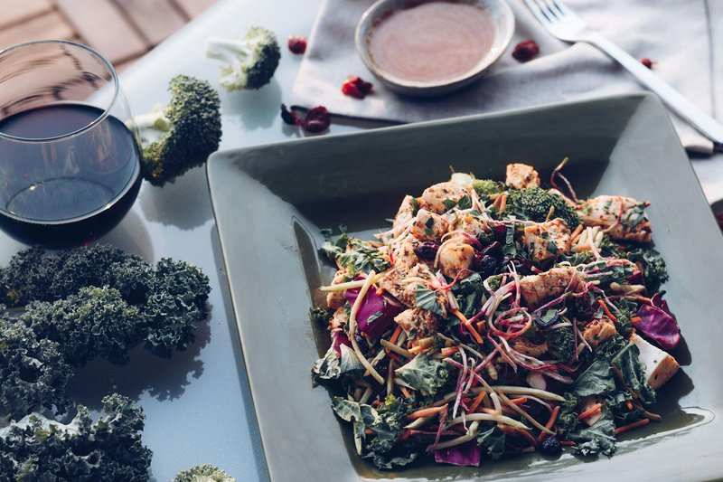

# Broccoli-Bacon Salad

*Crisp raw broccoli florets, shards of smoky bacon, and sweet pops of dried cranberry tossed in a creamy, sweet-tangy dressing. The smell hints at brunch and the bite is all crunch and contrast, savoury, sweet, salty, and sharp folded into a single forkful.*

**Serves:** 6

**Prep Time:** 20 minutes

**Cook Time:** 10 minutes

## Overview
Broccoli-bacon salad is a fixture of American potlucks, summer cookouts and church suppers, especially across the Midwest and South where it earned the affectionate nickname "broccoli crunch". Its origins sit somewhere in 1980s home cooking when raw vegetable salads bound in creamy dressings became a casserole-era staple, and it has stuck around because the formula is so satisfying. Broccoli is treated like a salad leaf here rather than a hot vegetable, broken into bite-sized florets that stay assertively crunchy and grassy under the dressing. Crisp bacon adds smoke and salt, red onion brings a clean sharpness, sunflower seeds a nutty crunch, and dried cranberries little pockets of chewy sweetness. The dressing is the secret: a glossy emulsion of mayonnaise, cider vinegar and just enough sugar to round things out, coating every floret without weighing them down. A short rest in the fridge softens the broccoli just slightly and lets it absorb the dressing. Pairs with grilled chicken, pulled pork, hamburgers or a baked ham.

## Ingredients

### Salad
- 600 g broccoli (about 2 medium heads), florets cut small, stalks peeled and diced
- 200 g streaky bacon, cut into 1 cm pieces
- ½ small red onion, very finely diced
- 75 g sunflower seeds
- 75 g dried cranberries
- 75 g mature Cheddar cheese, diced small (optional)

### Dressing
- 200 g good-quality mayonnaise
- 2 tbsp cider vinegar
- 2 tbsp caster sugar (or 1 ½ tbsp honey)
- 1 tsp Dijon mustard
- ¼ tsp fine sea salt
- Freshly ground black pepper

## Method

### Stage 1 - Cook the bacon
1. Heat a dry frying pan over medium heat. Add the chopped bacon and cook for 8 to 10 minutes, stirring occasionally, until deeply golden and crisp.
2. Transfer to kitchen paper to drain and cool completely. It needs to be cold and crunchy when it hits the salad.

### Stage 2 - Prep the broccoli
1. Cut the broccoli into small, bite-sized florets, roughly 2 cm across. Anything bigger will feel raw and unwieldy.
2. Peel the tough outer skin from the stalks, then dice the tender cores into small pieces and add to the florets. Nothing goes to waste.

### Stage 3 - Whisk the dressing
1. In a small bowl whisk together the mayonnaise, cider vinegar, sugar, Dijon, salt, and several grinds of black pepper.
2. Taste. It should be assertively tangy and sweet, since the broccoli is bland on its own. Adjust as needed.

### Stage 4 - Toss
1. In a large bowl combine the broccoli, red onion, sunflower seeds, cranberries, and the optional Cheddar.
2. Pour over the dressing and fold gently with a spatula until every floret is glossy and coated.
3. Scatter over the cooled bacon and fold through just before serving so it stays crisp.

### Stage 5 - Rest and serve
1. Cover and refrigerate for at least 30 minutes, ideally an hour, before serving. This lets the broccoli soften slightly and the flavours come together.
2. Give it one last gentle stir and serve cold.

## Notes
- **Crunch is the point:** Do not blanch the broccoli. Raw is what gives this salad its character.
- **Bacon at the end:** Stir in the bacon close to serving so it stays crisp rather than going soggy in the dressing.
- **Sweetness:** Cider vinegar and sugar are non-negotiable in classic versions. Honey or maple syrup works beautifully too.
- **Lighter version:** Replace half the mayo with full-fat Greek yoghurt or buttermilk for a lighter, tangier salad.
- **Nut swap:** Toasted pecans or almonds work instead of sunflower seeds if you prefer.

## Storage
- Keep covered in the fridge for up to 2 days.
- The broccoli will continue to release a little water, so drain off any liquid and refresh with a small spoon of mayo before serving leftovers.
- Do not freeze.
