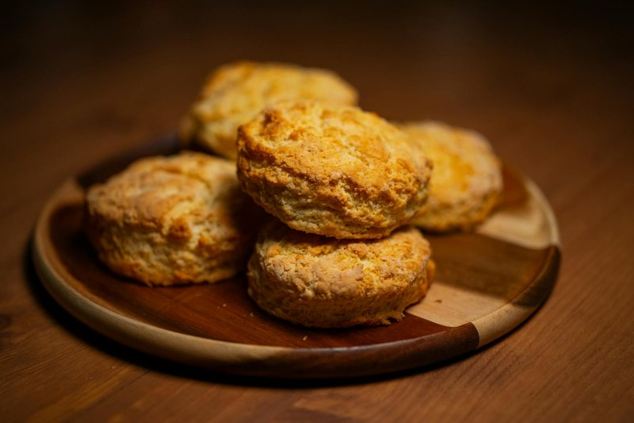

# Buttermilk Biscuits

*The American flaky soft biscuit - short by butter, leavened by baking powder and buttermilk, baked tall and gold. Eaten warm at breakfast with butter, jam or sausage gravy; split for ham biscuits at brunch; piled into Southern sides at dinner. Different to the British biscuit (a cookie); closer in spirit to a scone, but more layered and less sweet.*

**Serves:** 8 (makes 8-10 biscuits)

**Prep Time:** 15 minutes

**Cook Time:** 15 minutes

## Overview
Cold butter cuts into flour with leavening and salt; remains in pea-sized pieces. Cold buttermilk hydrates to a shaggy dough. The dough turns out, pats flat, folds three times (lamination), pats out again, stamps with a sharp cutter (no twisting). Baked at high heat 12-15 minutes until tall, gold and steam-puffed.

## Ingredients

- 400 g plain flour (plus more for dusting)
- 2 tablespoons baking powder
- 1 teaspoon baking soda
- 1 teaspoon salt
- 1 tablespoon caster sugar (optional, for slight sweet edge)
- 200 g cold unsalted butter (cubed)
- 300 ml cold buttermilk (more as needed)
- 2 tablespoons melted butter (for brushing)

## Method

### Stage 1 - Dry mix
1. Whisk flour, baking powder, baking soda, salt and sugar (if using) in a wide bowl.

### Stage 2 - Cut in butter
1. Add cold cubed butter.
1. Rub with fingertips or pulse with a pastry cutter until the butter is in pea-sized pieces, with some bits left larger. Coarse, not fine.

### Stage 3 - Liquid
1. Pour in cold buttermilk in a stream while folding with a butter knife.
1. Stop as soon as the dough comes together to a shaggy mass - slightly tacky, with visible butter pieces.

### Stage 4 - Laminate
1. Tip onto a lightly floured surface.
1. Pat into a 2 cm thick rectangle.
1. Fold in thirds (like a letter). Rotate 90°.
1. Pat to 2 cm. Fold in thirds again. Repeat once more - 3 folds total.

### Stage 5 - Cut
1. Pat to 2 cm thick. Stamp out 6 cm rounds with a sharp cutter pressed straight down. Do not twist.
1. Re-roll scraps lightly for the final 2-3.

### Stage 6 - Bake
1. Heat oven to 220°C (200°C fan).
1. Place biscuits on a lined baking tray, sides almost touching (helps them rise tall, not spread).
1. Brush tops with melted butter.
1. Bake 12-15 minutes until tall, gold and the sides have separated into visible flaky layers.

### Stage 7 - Serve
1. Brush again with melted butter while hot.
1. Eat warm with butter and jam, or sausage gravy, or split into ham biscuits.

## Notes
- **Cold everything:** Cold butter creates the layers; cold buttermilk keeps the gluten dormant. Warm dough gives flat, dense biscuits.
- **Don't twist the cutter:** Twisting seals the edges and prevents rise. Press straight down.
- **3 folds:** This is the lamination. Skipping it gives crumbly biscuits; doing it gives tall flaky ones.

## Storage
- Best fresh, eaten warm.
- Keep 24 hours wrapped at room temperature; refresh 4 minutes in a 180°C oven.
- Freeze unbaked stamped biscuits 2 months. Bake from frozen, adding 3 minutes.
