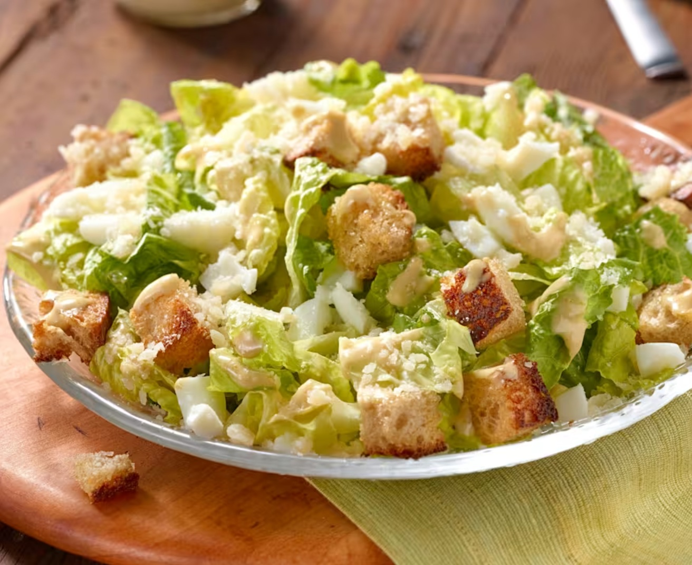

# Caesar Salad

*Romaine, garlic croutons, anchovy-spiked dressing, and shaved parmesan. Invented in Tijuana in the 1920s by Caesar Cardini; the original had no chicken - that was an American addition decades later. The dressing should taste of anchovy and garlic; if it doesn't, it's just a Caesar-flavoured salad.*

**Serves:** 4

**Prep Time:** 15 minutes

**Cook Time:** 10 minutes

## Overview
The 20th century's most argued-over salad: crisp romaine, garlicky olive-oil croutons, shavings of parmesan, all coated in a thick anchovy-and-egg-yolk dressing built around lemon juice and Dijon. Invented in Tijuana in the 1920s by Italian-American restaurateur Caesar Cardini, who supposedly improvised the dish from what he had left in the kitchen one busy Fourth of July night and assembled it tableside. The original had no chicken; that was an American chain-restaurant addition decades later. The dressing must taste of anchovy and garlic; if it doesn't, it's just a Caesar-flavoured salad. Anchovies are non-negotiable. The egg yolk emulsifies the dressing into something almost mayonnaise-thick, and the olive oil dribbles in slowly so the emulsion holds. Romaine is the traditional leaf; iceberg goes soggy under the dressing and butter lettuce collapses.

## Ingredients

### Croutons
- 200 g day-old sourdough (cubed; about 4 thick slices)
- 4 tablespoons olive oil
- 2 garlic cloves (crushed)
- ½ teaspoon salt

### Dressing
- 1 egg yolk
- 2 garlic cloves (crushed)
- 6 anchovy fillets in oil (drained and chopped)
- 1 teaspoon Dijon mustard
- 1 lemon (juice)
- 4 tablespoons grated parmesan cheese
- 100 ml extra virgin olive oil
- salt
- pepper

### Salad
- 2 large heads cos (or romaine lettuce, cleaned, leaves separated)
- 50 g parmesan cheese (shaved with a peeler)

### Optional
- 4 cooked chicken breasts (sliced; for the modern American version)

## Method

### Stage 1 - Croutons
1. Heat the olive oil in a wide frying pan over medium heat.
1. Add the garlic; cook for 30 seconds (don't brown).
1. Add the bread cubes and salt; toss to coat.
1. Cook for 6-8 minutes, stirring often, until golden and crisp on all sides.
1. Drain on a wire rack.

### Stage 2 - Dressing
1. In a bowl, whisk the egg yolk, garlic, anchovies, mustard, lemon juice and parmesan until smooth.
1. Drizzle in the olive oil slowly, whisking, until thick and emulsified.
1. Season with salt (lightly; the anchovies and parmesan are salty) and pepper.

### Stage 3 - Toss
1. In a large bowl, toss the lettuce leaves with most of the dressing.
1. Add the croutons; toss once more.

### Stage 4 - Serve
1. Pile onto plates.
1. Top with parmesan shavings, an extra grind of pepper, and any remaining dressing.
1. (Add sliced chicken on top if going for the modern version.)

## Notes
- **Anchovies are non-negotiable:** They don't taste fishy in the dressing; they taste of savoury depth. Skipping them gives a flat salad.
- **Day-old bread for croutons:** Stale bread fries crisper. Fresh bread soaks up the oil.
- **Raw egg yolk:** Use the freshest pasteurised egg if you're concerned. Or substitute 2 tablespoons mayo for the egg yolk.

## Storage
- Eat immediately. Dressing keeps 2 days refrigerated; assemble fresh.
