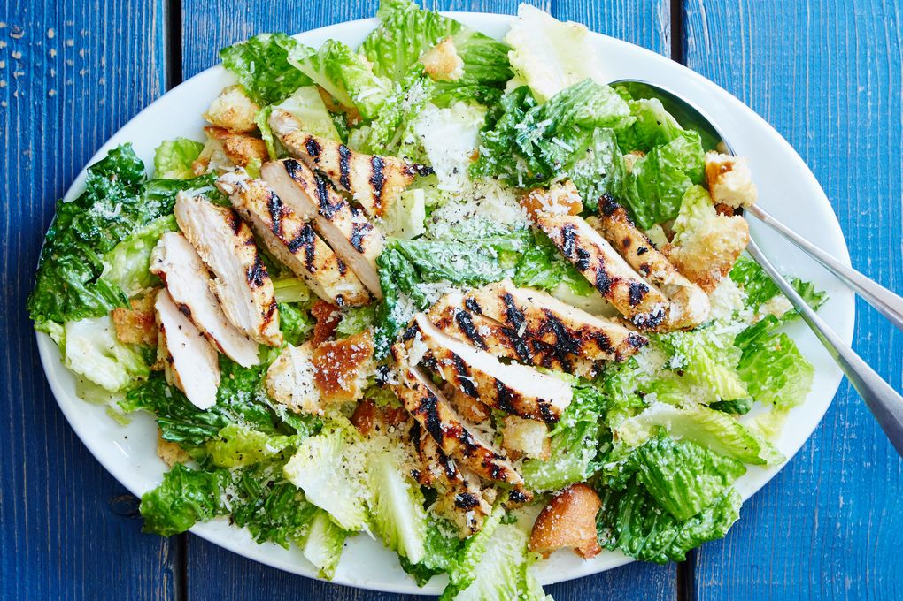

# Chicken Pancetta Caesar Salad

*This salad, created by Caesar Cardini from Caesar's Palace in Los Angeles, is an absolute classic that works wonderfully either as a starter or a main meal.*

**Serves:** 4

**Prep Time:** 15 minutes

**Cook Time:** 15 minutes

## Overview
The 1990s American main-course Caesar: the original Tijuana salad upgraded with grilled chicken breast and crisp pancetta to turn a starter into a proper lunch. Cos romaine carries the anchovy-and-egg-yolk dressing, garlic croutons add crunch, shaved parmesan goes generously, and a soft-boiled egg cut into wedges sits on top for extra richness. The dish is not Roman despite its Italian-sounding name; it was invented in Tijuana in the 1920s by Italian-American Caesar Cardini, and the chicken-and-bacon variation became the canonical Anglo-American lunchtime salad in the 1980s and 1990s. Anchovies are non-negotiable in the dressing. The pancetta wants to be properly crisp, broken into shards across the top so each forkful gets a bite. The chicken is grilled or pan-seared (not poached), sliced across the grain into thick strips, and laid warm over the cold leaves at the last moment.

## Ingredients
### Protein
- 2 chicken fillets (medium, sliced)
- 300 g pancetta

### Greens and vegetables
- 2 cos lettuces
- 4 thick slices wholemeal bread
- 25 g Parmesan cheese (grated)
- 50 g Parmesan cheese (flakes)

### Dressing
- 15 g anchovy fillets (drained and chopped)
- 2 tsp capers
- 2 tsp Worcestershire sauce
- ½ tsp Dijon mustard
- Dash of Tabasco sauce
- ½ lemon (juice)
- ½ garlic clove (crushed)
- 2 tbsp Parmesan cheese (finely grated)
- 1 egg (boiled 90 seconds, shelled)
- 150-300 ml extra virgin olive oil
- Freshly ground black pepper

### For pan-frying
- 4 tbsp olive oil

## Method

### Stage 1 - Prepare croutons
1. Preheat oven to 200°C.
1. Remove crusts from bread and cut into 1 cm cubes.
1. Place in a roasting tin, sprinkle with olive oil and a little pepper.
1. Bake, turning every minute, until golden and crispy (~5 mins).
1. Toss in grated Parmesan and set aside to cool.

### Stage 2 - Cook protein
1. Fry chicken breasts in 2 tbsp olive oil until golden; set aside.
1. Add 1 tbsp olive oil to the pan and fry pancetta until crispy; set aside.

### Stage 3 - Make dressing
1. Place dressing ingredients in a blender, using 150 ml oil.
1. Purée until thick and creamy.
1. Add more oil gradually if needed until emulsified and able to coat the back of a spoon.

### Stage 4 - Assemble salad
1. Break lettuce into separate leaves.
1. Toss lettuce leaves in dressing, ensuring all are coated.
1. Divide between salad bowls and top with chicken, pancetta, croutons, and half of the Parmesan flakes.
1. Sprinkle with remaining Parmesan and serve.

## Notes
- **Soft-boiled egg:** Boil for exactly 90 seconds for a runny yolk; this creates the rich, creamy dressing base.
- **Anchovies:** Essential for authentic flavour; use good-quality fillets. Their saltiness is key to the dressing.
- **Parmesan:** Freshly grate or chip flakes; pre-grated loses flavour qualities.
- **Croutons:** Make ahead and store in an airtight container; they crisp up as they cool.

## Serving
Serve immediately as a starter or light main course. Accompany with crusty bread to mop up the dressing.

## Storage
- Best eaten immediately; do not prepare ahead as lettuce wilts.
- Leftover dressing keeps refrigerated for 2-3 days in an airtight container.
- Do not freeze.
