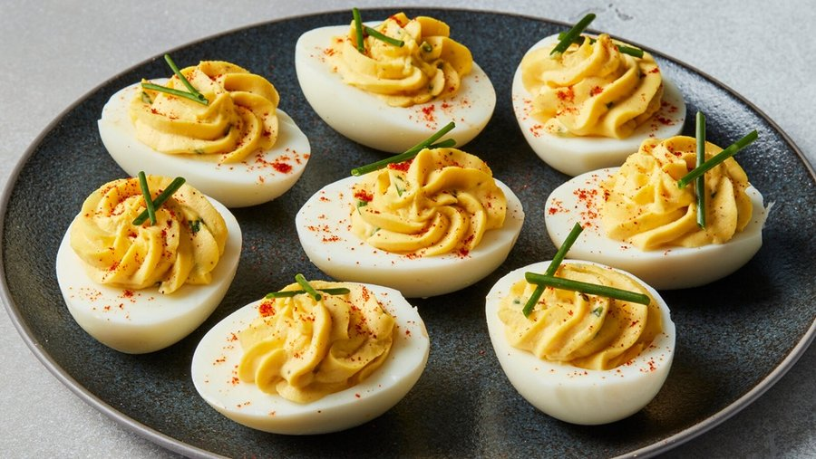

# Deviled Eggs

*Glossy halves of cold hard-boiled egg cradling a swirl of creamy, mustard-tangy yolk filling, dusted with a fine red haze of paprika. They smell faintly of vinegar and mayonnaise, taste rich and just a little sharp, and disappear from a platter faster than almost anything else at the table.*

**Serves:** 6 (12 halves)

**Prep Time:** 15 minutes

**Cook Time:** 10 minutes

## Overview
Deviled eggs are one of America's most enduring party foods, a fixture of Easter brunches, Thanksgiving tables, summer barbecues, and Sunday potlucks from coast to coast. The dish itself is much older than its American identity. Stuffed eggs flavoured with mustard, vinegar, and spices appear in Roman writings and remained popular across medieval Europe, but the term "deviled", meaning seasoned hot and spicy, took hold in eighteenth-century England and crossed the Atlantic with Anglo settlers. By the twentieth century, the American version had crystallised into the formula we recognise today: hard-boiled eggs split lengthwise, yolks scooped out and whipped smooth with mayonnaise, mustard, and a splash of vinegar, then piped or spooned back into the whites and finished with a dusting of paprika. The taste is luxurious in its simplicity. Creamy and rich, with a gentle tang and just enough mustard heat to justify the name, set against the cool, slightly springy bite of the white. Difficulty is genuinely low, but two details lift them from good to memorable: cooking the eggs just enough so the yolks are fully set but never grey-ringed, and seasoning the filling assertively, since cold dulls flavour. They are best made the day they will be eaten, although the eggs themselves can be boiled and peeled a day ahead.

## Ingredients

### Eggs
- 6 eggs (large), at least a week old (older eggs peel more easily)
- 1 tsp white vinegar (for the cooking water)

### Filling
- 4 tbsp good-quality mayonnaise
- 1 tsp Dijon mustard
- ½ tsp yellow American mustard
- 1 tsp white wine vinegar (or pickle brine)
- ¼ tsp fine sea salt
- ⅛ tsp freshly ground black pepper
- 1 tsp finely chopped chives (optional, mixed in)

### To finish
- Smoked (or sweet paprika), for dusting
- Finely snipped chives
- Optional: cornichon slices, capers, or crispy bacon crumbs

## Method

### Stage 1 - Boil and cool the eggs
1. Place the eggs in a single layer in a saucepan, cover with cold water by 2 cm, and add the vinegar (it helps any cracked whites set quickly).
2. Bring to a gentle boil over medium heat. As soon as the water reaches a rolling boil, lower the heat and simmer for exactly 9 minutes.
3. Drain and immediately transfer the eggs to a large bowl of iced water. Leave for at least 10 minutes. The cold shock makes peeling easier and prevents the dreaded grey ring around the yolk.

### Stage 2 - Peel
1. Tap each egg gently on the counter to crack the shell all over, then roll under your palm to loosen.
2. Peel under a thin stream of cold running water, starting from the wider end where the air pocket sits. Pat dry with a clean cloth.

### Stage 3 - Halve and prepare the yolks
1. Slice each egg cleanly in half lengthwise with a sharp knife, wiping the blade between cuts for tidy edges.
2. Pop the yolks gently into a bowl and arrange the whites, cut side up, on a serving platter.

### Stage 4 - Make the filling
1. Mash the yolks thoroughly with a fork until crumbly, then push them through a fine sieve into a clean bowl for a really silky filling (a worthwhile step).
2. Add the mayonnaise, both mustards, vinegar, salt, pepper, and the chives if using. Stir until completely smooth and creamy.
3. Taste and adjust. The filling should be a touch more seasoned than feels right, since chilling mutes the flavour.

### Stage 5 - Pipe and finish
1. Transfer the filling to a piping bag fitted with a star nozzle, or use a small spoon if you prefer a rustic look.
2. Pipe or spoon the filling generously into each egg white half, mounding slightly above the rim.
3. Dust with paprika and finish with a scatter of snipped chives. Add a single caper, a slice of cornichon, or a few crumbles of bacon on top if you like.

## Notes
- **Older eggs peel better:** Very fresh eggs cling to their shells. Use eggs that have been in the fridge for at least a week.
- **Perfect yolk:** A 9-minute simmer plus an ice bath gives fully set, brightly yellow yolks with no green ring.
- **Smooth filling:** Pushing the yolks through a sieve transforms the texture, which is what makes good deviled eggs taste so professional.
- **Flavour variations:** Add 1 tsp curry powder for a vintage twist, a spoon of finely chopped pickles for tang, or a smear of hot sauce under the filling.
- **Travel tip:** For potlucks, pipe the filling into the whites on arrival. The whites can be ferried face down on a damp towel and the filling in a piping bag in a separate bag.

## Storage
- Keep covered in the fridge for up to 2 days, though they are at their best within hours of being made.
- Store assembled eggs in a single layer, lightly covered with clingfilm. Press the film gently against the surface to keep them from drying out.
- Do not freeze. The whites turn rubbery on thawing.
