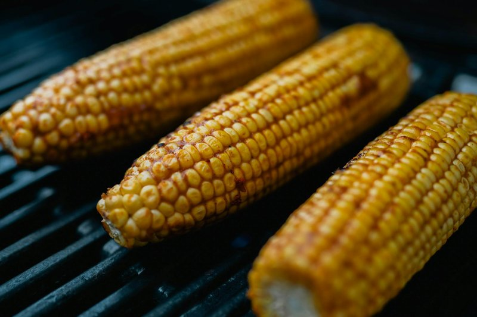

# Grilled Corn on the Cob

*Sweet kernels blistered black in patches by an open flame, glossy with melted garlic butter and a green flurry of chives. The smell is pure American summer, charred sugar and smoke drifting across the yard, and the first bite snaps and bursts with juice tempered by salty butter and a sharp squeeze of lime.*

**Serves:** 6

**Prep Time:** 10 minutes

**Cook Time:** 12 minutes

## Overview
Grilled corn on the cob is the unofficial flag of an American summer cookout. Whether it appears alongside ribs in Kansas City, brisket in central Texas, or burgers on a Midwestern back porch, the technique is essentially the same: husk the cob, lay it directly over hot coals or a hard gas flame, and turn it until the kernels darken and pop with sugar caramelisation. The flavour is straightforward but layered. Heat converts the corn's starches and sugars into something almost popcorn-like in aroma, while a slick of garlic butter melts into every crevice and a squeeze of lime cuts cleanly through the richness. Difficulty is low, but the line between perfectly grilled and overcooked is narrow, since corn can dry out quickly once the kernels begin to wrinkle. The trick is high direct heat for a short time, and constant turning so each side picks up colour without burning through. American corn culture has always borrowed generously from its neighbours, and any conversation about grilled corn eventually circles to elote, the Mexican street-food version slathered in mayo, cotija, chilli, and lime. The recipe here keeps to the cleaner butter-and-chive backyard style, but elote is just a brush away in the notes. Serve hot, straight off the grill, with extra butter and napkins, because nobody eats this neatly and nobody minds.

## Ingredients

### Corn
- 6 fresh sweetcorn cobs, husks and silk removed
- 1 tbsp neutral oil (rapeseed or sunflower)
- ½ tsp fine sea salt

### Garlic butter
- 100 g unsalted butter, softened
- 3 garlic cloves, very finely grated
- 2 tbsp chives, finely chopped
- 1 tbsp flat-leaf parsley, finely chopped
- ½ tsp flaky sea salt
- Freshly ground black pepper

### To serve
- 2 limes, cut into wedges
- Extra chives
- Flaky sea salt

## Method

### Stage 1 - Make the garlic butter
1. In a small bowl, beat the softened butter with the grated garlic, chives, parsley, salt, and a few grinds of black pepper until smooth and well combined.
2. Set aside at room temperature so it stays spreadable. If making ahead, scrape onto a sheet of clingfilm, roll into a log, and chill, then bring back to room temperature before grilling.

### Stage 2 - Prep the corn
1. Strip the husks and silk from each cob. Snap or trim the stalks so they fit your grill.
2. Lightly brush each cob with neutral oil and season with a pinch of fine salt.

### Stage 3 - Grill
1. Heat a barbecue, griddle pan, or gas grill to a high direct heat. You want to hear a sizzle the moment the corn touches the bars.
2. Lay the cobs directly over the heat. Cook for 10 to 12 minutes total, turning every 2 minutes with tongs, until the kernels are deeply golden with dark charred patches on every side.
3. The kernels should look glossy and plump rather than wrinkled. If they begin to dry, move them to a cooler part of the grill to finish.

### Stage 4 - Butter and serve
1. Transfer the hot cobs to a platter.
2. Immediately slather each one with a generous spoonful of the garlic butter, letting it melt into the kernels.
3. Scatter over extra chives and a pinch of flaky salt.
4. Serve with lime wedges for squeezing.

## Notes
- **Elote variation:** Brush the grilled cobs with mayonnaise instead of butter, roll in crumbled cotija or feta, dust heavily with chilli powder and smoked paprika, then finish with chopped coriander and lime.
- **No barbecue:** A cast iron griddle pan on high heat works beautifully indoors. Open a window, it will smoke.
- **Boil-then-grill:** For very large or slightly older cobs, boil for 4 minutes first to guarantee tenderness, then grill purely for colour and char.
- **Husk-on method:** If you prefer steamed corn with a hint of smoke, soak the cobs in water for 20 minutes with husks on and grill for 20 minutes, turning occasionally. Husks char, kernels steam.
- **Buy fresh:** Sweetcorn loses sugar to starch within hours of being picked. Buy on the day, and use the same day if possible.

## Storage
- Best eaten straight off the grill while hot.
- Leftover cobs can be wrapped in foil and refrigerated for up to 2 days. Reheat in a hot pan or strip kernels for salads, soups, or salsas.
- Stripped kernels freeze well for up to 3 months.
