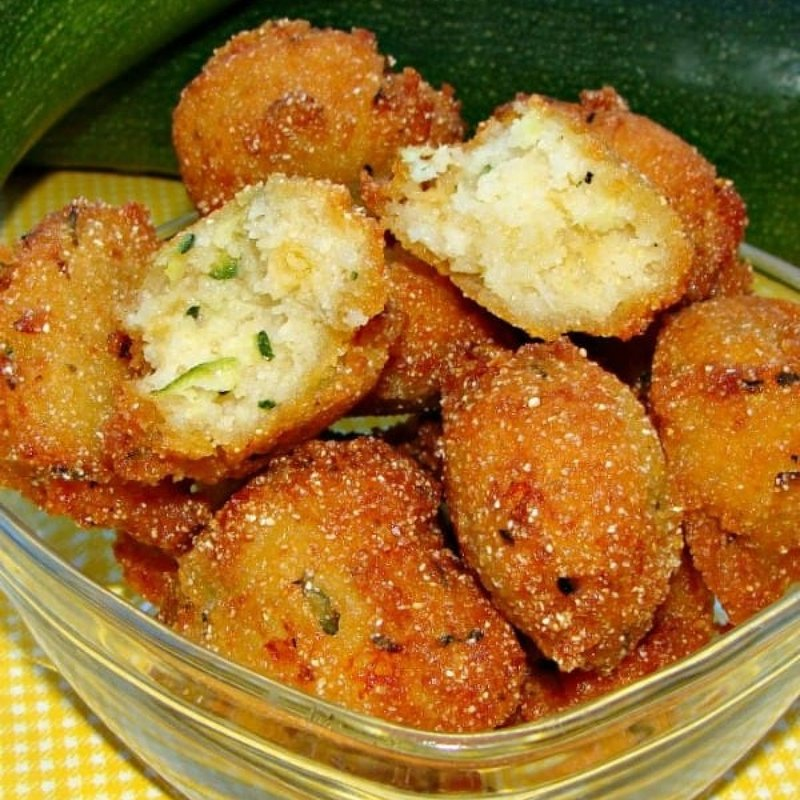

# Hush Puppies

*Southern cornmeal fritters: golf-ball scoops of buttermilk-cornmeal batter with onion and a pinch of cayenne, dropped into hot oil and fried gold.*

**Serves:** 6

**Prep Time:** 10 minutes (plus 15 minutes resting)

**Cook Time:** 15 minutes

## Overview
The Southern fish-fry sidekick: golf-ball scoops of buttermilk-cornmeal batter with finely chopped onion and a pinch of cayenne, dropped into hot oil and fried gold. The name supposedly comes from frying-camp cooks tossing fried bits of batter to barking dogs ("hush, puppy"), though the story is probably apocryphal. Hush puppies turn up at every Southern fish fry from Louisiana through the Carolinas, served piping hot in a basket alongside fried catfish, slaw and a wedge of lemon. The cornmeal is fine, not coarse; coarse cornmeal stays gritty in the centre. A 2:1 ratio of cornmeal to plain flour gives the proper texture (denser than a doughnut, lighter than a corn dodger). The batter wants a 15-minute rest so the cornmeal hydrates fully and the inside cooks through evenly; skip the rest and the centres come out raw. Fried at 170°C; hotter and the outside burns before the inside sets.

## Ingredients

- 200 g fine yellow cornmeal
- 100 g plain flour
- 2 teaspoons baking powder
- ½ teaspoon baking soda
- 1 teaspoon salt
- 1 teaspoon caster sugar
- ½ teaspoon cayenne pepper (optional)
- ½ teaspoon ground black pepper
- 1 onion (small, very finely chopped, about 100 g)
- 1 egg (large, lightly beaten)
- 280 ml buttermilk
- 1 litre vegetable oil for deep frying

## Method

### Stage 1 - Batter
1. Whisk cornmeal, flour, baking powder, baking soda, salt, sugar, cayenne, pepper in a wide bowl.
1. Stir in the chopped onion.
1. Whisk the egg and buttermilk together; pour into the dry; fold to a thick scoopable batter.
1. Rest 15 minutes - the cornmeal needs to hydrate.

### Stage 2 - Heat oil
1. Heat oil to 170°C in a deep heavy pan.

### Stage 3 - Fry
1. Using two teaspoons or a small ice cream scoop, drop walnut-sized blobs of batter into the hot oil.
1. Fry in batches of 5-6, 3-4 minutes total, turning, until deep gold and crisp.
1. Lift onto a rack with kitchen paper.

### Stage 4 - Serve
1. Eat hot, with fried catfish or shrimp, BBQ, or alongside coleslaw and pickles.

## Notes
- **Fine cornmeal:** Coarse cornmeal gives gritty, dry hush puppies. Look for fine or medium - yellow cornmeal (corn flour in the UK, polenta if it's labelled "fine ground").
- **Don't overmix:** Lumps are fine. Overmixing develops gluten and gives chewy hush puppies.
- **Hot oil, small scoops:** Big scoops at low heat give pale, raw centres. Walnut-sized at 170°C gives even gold.

## Storage
- Best fresh. Re-crisp at 200°C 5 minutes if needed.
- Don't refrigerate - texture goes wrong.
