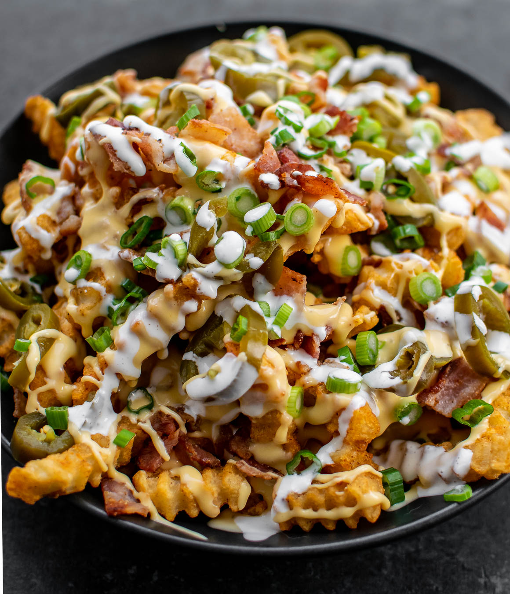

# Loaded Fries

*America's bar-and-diner classic: hand-cut fries piled high and smothered with melted cheddar, crumbled bacon, jalapeños, sour cream, spring onions and ranch dressing.*

**Serves:** 4 (sharing portion)

**Prep Time:** 25 minutes (plus 30 minutes potato soaking)

**Cook Time:** 25 minutes

## Overview
Loaded fries are the iconic American sharing-plate / bar-food classic: hand-cut medium-thick potato batons twice-fried for crispness, piled into a serving boat and smothered with melted cheddar (or a cheddar-Monterey Jack blend for the proper Tex-Mex feel), topped with crumbled crispy bacon, diced fresh or pickled jalapeños, dollops of sour cream, spring onions, ranch dressing drizzled across and a sprinkle of Cajun or seasoned salt. The dish became iconic in American chain restaurants in the 1990s-2000s (TGI Friday's, Chili's, Applebee's), spread to every American bar and diner, and has become the canonical American sharing appetiser alongside nachos, potato skins and buffalo wings. Distinguished from British "dirty fries" by the Tex-Mex leaning (cheddar/Monterey Jack rather than mature cheddar; jalapeños rather than pickles; ranch dressing rather than gravy) and from Canadian poutine (which is cheese-curds-and-gravy specific). The cheese must properly melt over the hot fries; sprinkled cold, it won't bind. The combination of cheese, bacon, jalapeños, sour cream and ranch is the canonical profile: don't skip any.

## Ingredients

### Fries
- 1.2 kg floury potatoes (Russet, Idaho; peeled and cut into 1 cm × 8 cm fries)
- Vegetable oil for deep-frying (about 1.5 litres)

### Cheese topping
- 200 g sharp cheddar cheese (grated)
- 100 g Monterey Jack or pepper jack cheese (grated)
- 50 g cream cheese (optional; cubed)

### Other toppings
- 8 rashers thick-cut smoked bacon (cooked crispy; crumbled)
- 2 fresh jalapeños (sliced into rounds; or 100 g pickled jalapeños)
- 200 g sour cream
- 6 spring onions (finely sliced)
- 4 tablespoons ranch dressing
- 100 g diced fresh tomato (optional)
- 50 g sliced black olives (optional)
- 1 small bunch fresh coriander (chopped)
- 1 medium ripe avocado (cubed; or a dollop of guacamole)

### Seasoning
- 2 teaspoons flaky sea salt
- 1 teaspoon Cajun seasoning (or smoked paprika + cumin)
- 1 teaspoon ground black pepper

### Optional toppings
- Hot sauce (Frank's RedHot, sriracha)
- BBQ sauce
- Crumbled blue cheese
- Sliced pickled jalapeños in addition to fresh

## Method

### Stage 1 - Soak and prep the potatoes
1. Cut potatoes into 1 cm × 8 cm batons.
2. Soak in cold water 30 minutes; drain and pat dry.

### Stage 2 - Cook the bacon
1. Heat a heavy pan over medium heat.
2. Cook bacon 5-6 minutes per side till crispy.
3. Drain on kitchen paper; crumble.

### Stage 3 - First-fry the fries
1. Heat oil to 160°C (320°F).
2. Fry potatoes in batches 5-6 minutes till just cooked but pale.
3. Lift out; drain; cool 10 minutes.

### Stage 4 - Second-fry the fries
1. Heat oil to 190°C (375°F).
2. Fry potatoes in batches 3-4 minutes till crispy golden.
3. Drain on kitchen paper.
4. Sprinkle with salt, Cajun seasoning and pepper while hot.

### Stage 5 - Build the loaded fries
1. Preheat the oven (or grill/broiler) to high (220°C / 425°F).
2. Pile the hot fries into an oven-safe dish or pile on a baking sheet.
3. Scatter the grated cheeses generously over.
4. Place in the hot oven for 3-4 minutes till the cheese is fully melted and bubbly (or under a hot grill for 1-2 minutes).

### Stage 6 - Add toppings
1. Take the fries out of the oven.
2. Scatter crumbled bacon over.
3. Add sliced jalapeños.
4. Dollop sour cream over (don't spread; let it sit in dollops).
5. Drizzle ranch dressing across.
6. Scatter diced tomato, sliced olives, spring onions, chopped coriander and cubed avocado.

### Stage 7 - Serve immediately
1. Bring the loaded fries to the table.
2. Provide forks and napkins.
3. Eat sharing-style with hands.
4. Provide hot sauce on the side.

## Notes
- **Twice-fry the potatoes:** essential American technique.
- **Properly melt the cheese:** under hot oven or grill; not just sprinkled.
- **Multiple toppings:** the loaded-ness is the point.
- **Cajun seasoning gives the American profile:** distinguishes from British dirty fries.
- **Eat immediately:** the cheese cools and toppings warm the fries - both compromise within 5 minutes of serving.

## Variations
**Buffalo loaded fries:** swap the ranch for buffalo sauce (Frank's RedHot + butter); top with blue cheese crumbles. Classic American bar variation.
**Chili-cheese loaded fries:** add a generous spoonful of chili con carne over the top.
**Pulled pork loaded fries:** pulled pork in BBQ sauce over the top; common BBQ-restaurant variation.
**Vegetarian loaded fries:** skip the bacon; add caramelised onions, mushrooms and extra cheese.

## Serving
In a wide deep dish or on a baking sheet for sharing. As an appetizer at any American bar, sports bar, diner or grill. Drink: cold American beer (Coors, Bud, craft IPA), margarita, or large soda.

## Storage
- Best eaten immediately.
- Plain fries (without toppings) reheat in a hot oven 5 minutes.
- Assembled loaded fries don't reheat well; eat within an hour.
- Components keep separately for 3 days; assemble fresh.
