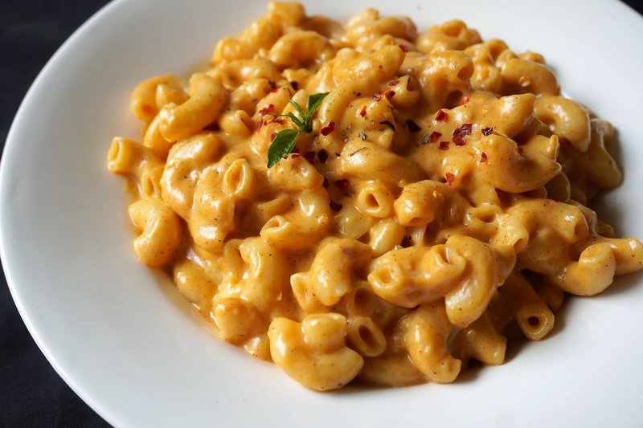

# Mac and Cheese

*America's baked pasta side: short pasta in a roux-thickened cheddar béchamel, topped with buttered breadcrumbs and baked till bubbly and deep gold.*

**Serves:** 6

**Prep Time:** 20 minutes

**Cook Time:** 30 minutes

## Overview
America's baked pasta side and a Southern Sunday-dinner institution: short pasta (elbows are canonical; cavatappi or shells substitute) folded through a roux-thickened cheddar béchamel, tipped into a baking dish, topped with buttered breadcrumbs and baked till bubbly and deep gold. The dish has English roots (Thomas Jefferson reputedly brought the idea back from France and served it at Monticello in the 1790s), but the American Southern version became the canonical one through the early 20th century. Two non-negotiables. The cheese must be properly aged sharp cheddar (orange, ideally; this is one of the few dishes where the colour matters as much as the flavour), not pre-shredded from a bag; pre-shredded cheese has anti-caking starch that prevents proper melting. And the pasta wants to come out just past al dente; soft pasta in a long bake turns into mush. A pinch of mustard powder and cayenne sharpens the cheese sauce against the richness.

## Ingredients

- 400 g elbow macaroni (or short tubular pasta - cavatappi, ditalini)
- 1 tablespoon salt (for the pasta water)
- 60 g unsalted butter
- 60 g plain flour
- 800 ml whole milk (warmed)
- 1 teaspoon English mustard powder
- ½ teaspoon smoked paprika
- ¼ teaspoon cayenne
- 1 teaspoon salt
- ½ teaspoon ground black pepper
- 350 g mature cheddar cheese (grated)
- 100 g Gruyère cheese (or Monterey Jack, grated)
- 50 g Parmesan cheese (finely grated)

### Topping
- 50 g panko breadcrumbs
- 25 g unsalted butter (melted)
- 30 g Parmesan cheese (finely grated)

## Method

### Stage 1 - Pasta
1. Bring a large pot of water to a hard boil; add salt.
1. Cook pasta 2 minutes less than the packet time (it'll finish in the oven).
1. Drain; rinse briefly with cool water to stop the cook.

### Stage 2 - Béchamel
1. Melt the butter in a wide heavy pot over medium heat.
1. Whisk in the flour; cook 90 seconds (a pale roux).
1. Slowly whisk in the warm milk in 4-5 additions, smoothing each before the next.
1. Bring to a gentle simmer; cook 4-5 minutes, stirring, until thickened to coat a spoon.

### Stage 3 - Season
1. Stir in mustard powder, paprika, cayenne, salt, pepper.
1. Off the heat, add the cheddar, Gruyère and 50 g of the Parmesan in three additions, whisking each batch smooth.

### Stage 4 - Combine
1. Add the drained pasta to the cheese sauce; fold to coat.
1. Taste; adjust salt.

### Stage 5 - Bake
1. Heat oven to 200°C (180°C fan).
1. Tip the pasta into a buttered 28 x 22 cm baking dish.
1. In a small bowl, toss panko, melted butter and the topping Parmesan.
1. Scatter evenly over the pasta.
1. Bake 25 minutes until deep gold and bubbling at the edges.

### Stage 6 - Rest
1. Rest 5 minutes (the sauce sets slightly).
1. Serve hot.

## Notes
- **Cheese choice:** Cheddar gives flavour; Gruyère or Jack add stretch; Parmesan adds depth and a sharp top note. Pre-shredded supermarket cheese is coated in anti-caking starch that gives a grainy sauce - grate your own.
- **Warm the milk:** Whisking cold milk into a hot roux gives lumps. Warm milk dissolves smoothly.
- **Cook pasta short:** It finishes in the oven; full-cooked pasta turns mushy.

## Storage
- Refrigerate 3 days. Reheat at 180°C until heated through; add a splash of milk if dry.
- Freezes 2 months. Thaw overnight; reheat at 180°C 30 minutes.
