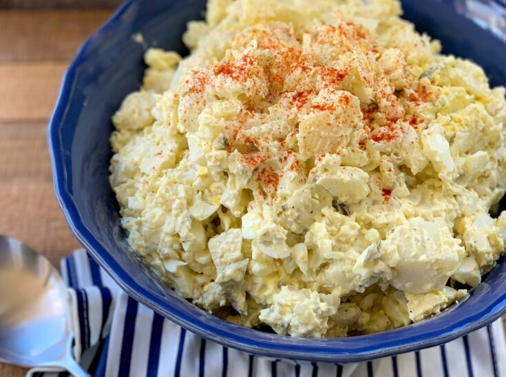

# Classic American Potato Salad

*Cool chunks of tender potato bound in a creamy, tangy mayo-mustard dressing, flecked with crunchy celery and sharp red onion. A whisper of dill pickle and a dusting of smoky paprika make this the quintessential cookout side, just as comforting straight from the fridge as it is on a paper plate beside ribs.*

**Serves:** 6

**Prep Time:** 20 minutes

**Cook Time:** 20 minutes

## Overview
Few dishes feel as woven into American summer as potato salad. It appears at backyard barbecues, church potlucks, and Fourth of July tables from Maine to Texas, and although every family insists their version is the only correct one, the bones are reassuringly consistent: waxy potatoes, hard-boiled eggs, a generous slick of mayonnaise, and the bright bite of mustard and pickle. The taste is creamy and cool, savoury with a gentle sweet-sour tang, punctuated by crisp celery and the sting of raw onion. It smells faintly of vinegar and paprika, like a 1950s deli counter on a hot afternoon. The texture is the real prize. Potatoes should be tender enough to yield to a fork but still hold their shape, so the salad reads as chunky rather than mashed. Difficulty is low, which is part of its charm. The only real technique is seasoning the warm potatoes so they drink in the vinegar before the mayo goes on, a small step that separates a flat salad from a great one. Make it the day before if you can. A night in the fridge lets the flavours marry, the onion mellow, and the dressing settle into every crevice, which is exactly what you want when you pull it out alongside burgers, pulled pork, or grilled chicken.

## Ingredients

### Salad
- 1 kg waxy potatoes (Charlotte, Maris Peer or Yukon Gold), peeled and cubed
- 4 eggs (large)
- 2 celery sticks, finely diced
- ½ small red onion, finely diced
- 3 tbsp dill pickles, finely chopped
- 2 tbsp fresh dill (or flat-leaf parsley), chopped

### Dressing
- 200 g good-quality mayonnaise
- 2 tbsp Dijon mustard
- 1 tbsp yellow American mustard
- 2 tbsp white wine vinegar (or pickle brine)
- 1 tsp caster sugar
- ½ tsp fine sea salt
- ½ tsp freshly ground black pepper

### To finish
- Smoked paprika, for dusting
- Snipped chives (or extra dill)

## Method

### Stage 1 - Cook the potatoes and eggs
1. Place the cubed potatoes in a large pan, cover with cold water, and add a generous pinch of salt.
2. Bring to a steady simmer and cook for 10 to 12 minutes, until a knife slides through easily but the cubes still hold their shape.
3. While they cook, lower the eggs into a separate pan of simmering water and cook for 9 minutes, then transfer to iced water.
4. Drain the potatoes and spread them on a tray to steam dry for a couple of minutes.

### Stage 2 - Season while warm
1. While the potatoes are still warm, sprinkle over 1 tbsp of the vinegar or pickle brine and a pinch of salt. Toss gently so each cube absorbs the seasoning.
2. Let them cool to room temperature on the tray. This stops the mayo from splitting later.

### Stage 3 - Build the dressing
1. In a large bowl, whisk together the mayonnaise, both mustards, the remaining vinegar, sugar, salt, and pepper until smooth and glossy.
2. Peel and roughly chop the cooled eggs.

### Stage 4 - Combine
1. Add the cooled potatoes, chopped eggs, celery, red onion, pickles, and dill to the dressing.
2. Fold gently with a spatula until everything is coated, taking care not to break up the potatoes too much.
3. Taste and adjust with more salt, pepper, or a splash of pickle brine if it needs lift.

### Stage 5 - Chill and finish
1. Cover and refrigerate for at least 1 hour, ideally overnight.
2. Before serving, stir once more, dust the top with smoked paprika, and scatter over chives or extra dill.

## Notes
- **Potato choice:** Waxy varieties are essential. Floury bakers turn to mash when stirred and ruin the texture.
- **Warm seasoning trick:** Hitting the potatoes with vinegar while warm is the single biggest upgrade you can make to homemade potato salad.
- **Egg doneness:** A 9-minute egg gives a fully set yolk that crumbles nicely without being chalky.
- **Make ahead:** This salad genuinely improves overnight. Stir in a spoonful of fresh mayo before serving if it looks dry.
- **Lighter version:** Replace half the mayo with full-fat Greek yoghurt for a tangier, lighter dressing.

## Storage
- Keep covered in the fridge for up to 3 days.
- Do not freeze. Mayonnaise splits and potatoes turn watery on thawing.
- Always serve chilled, and do not leave out for more than 2 hours at a picnic, especially in warm weather.
