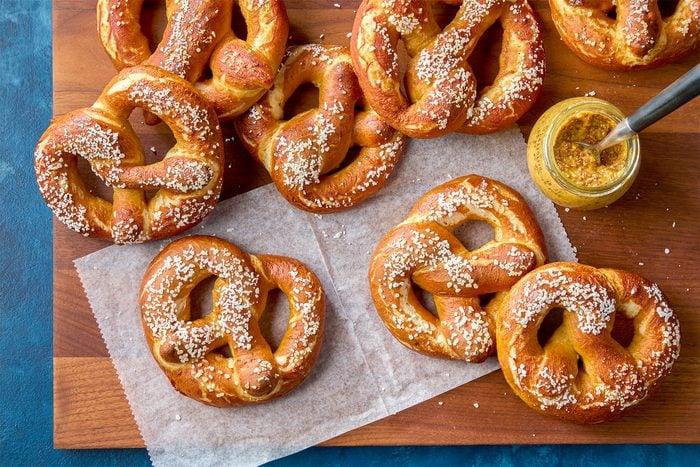

# Soft Pretzels

*The Philadelphia-Bavarian pretzel: large knotted bread with a chewy malty interior and a dark burnished crust. Bath-dunked in soda water before baking.*

**Serves:** 6 (makes 6 pretzels)

**Prep Time:** 30 minutes (plus 1 hour rising)

**Cook Time:** 15 minutes

## Overview
A yeasted bread dough rises for 1 hour. Divided into 6 ropes (50 cm each); each rope knots into the classic pretzel shape. Each pretzel dips for 15 seconds into a baking-soda bath (boiling water + soda), this gives the colour and characteristic flavour. Salt scattered; baked at 220°C until darkly burnished.

## Ingredients

### Dough
- 500 g plain flour (or strong bread flour)
- 1 sachet (7 g) fast-action yeast
- 1 ½ teaspoons salt
- 1 tablespoon caster sugar
- 30 g unsalted butter (melted)
- 280 ml warm water

### Bath
- 1 ½ litres water
- 4 tablespoons baking soda

### To finish
- 1 egg (large, beaten with 1 tbsp water)
- 2-3 tablespoons coarse pretzel salt (or coarse sea salt)
- 30 g unsalted butter (melted, for brushing after baking)

## Method

### Stage 1 - Dough
1. Whisk flour, yeast, salt, sugar.
1. Add melted butter and warm water; mix to a soft dough.
1. Knead 8-10 minutes until smooth and elastic.
1. Cover; rise 1 hour until doubled.

### Stage 2 - Shape
1. Knock back; divide into 6 equal pieces.
1. Roll each piece into a long rope, 50 cm long, slightly fatter in the middle than the ends.
1. To shape: form a U with the rope on the work surface. Cross the two ends over the middle of the U (left over right then right over left to make a twist). Bring the twisted ends down and press onto the bottom of the U.
1. Lay shaped pretzels on lined baking trays.

### Stage 3 - Heat oven
1. Heat oven to 220°C (200°C fan).
1. Bring the bath water to a hard boil in a wide pan; add baking soda carefully (it foams).

### Stage 4 - Bath
1. Lower each pretzel into the simmering bath with a slotted spoon for 15 seconds.
1. Lift onto the tray.

### Stage 5 - Bake
1. Brush each pretzel with the egg wash.
1. Sprinkle generously with pretzel salt.
1. Bake 12-15 minutes until deep mahogany brown.

### Stage 6 - Finish
1. Brush hot pretzels with melted butter immediately out of the oven.

### Stage 7 - Serve
1. Eat warm with yellow mustard, a beer cheese dip, or just plain.

## Notes
- **Baking soda bath:** This is the secret of pretzel colour and flavour. Don't skip it. Industrial bakeries use lye (more aggressive); home bakers use baking soda - close enough.
- **Pretzel salt:** Big, flaky, non-melting. Coarse sea salt is the substitute. Fine salt dissolves into the surface; doesn't give the crystal contrast.
- **Eat warm:** Pretzels are 50% better the moment they come out. Day-old pretzels turn into bread.

## Storage
- Best fresh, eaten warm.
- Keep 24 hours wrapped at room temperature.
- Reheat at 180°C for 4 minutes.
