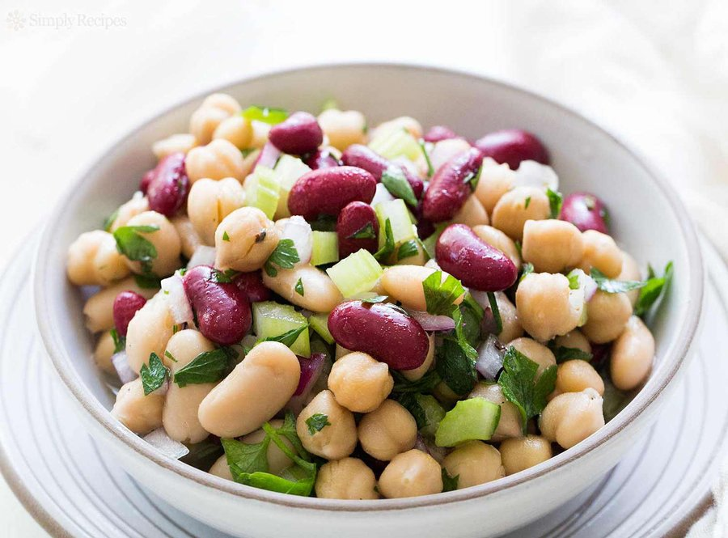

# Three-Bean Salad

*American picnic-table classic: glossy kidney beans, creamy cannellini and snappy green beans tumbled in a bright sweet-sour vinaigrette laced with sharp red onion.*

**Serves:** 8

**Prep Time:** 15 minutes

**Cook Time:** 5 minutes

## Overview
Three-bean salad is one of those quietly enduring American classics that has been served at potlucks, church suppers and Memorial Day cookouts since at least the 1950s. It rose to ubiquity through community cookbooks and the back of tinned-bean labels and has held on because it ticks every potluck virtue: it travels well, gets better as it sits, costs almost nothing and feeds a crowd without fuss. The flavour is built on contrast: soft starchy beans soaking up an assertive sweet-sour vinaigrette of cider vinegar, sugar and oil, while crunchy green beans and the pungent bite of red onion keep the texture lively. The sweetness can surprise first-timers, but that gentle candy-vinegar note is the point: it's what defines the salad and makes it sing alongside grilled meats, fried chicken, hot dogs and barbecue. Use good tinned pulses, rinsed thoroughly, and give the salad plenty of time in the fridge so the beans drink in the dressing: made the day before, it transforms from a tidy mix of beans into something deeper and more harmonious, and it keeps for days.

## Ingredients

### Beans
- 200 g tib chickpeas, drained and rinsed 
- 400 g tin red kidney beans, drained and rinsed
- 400 g tin cannellini beans, drained and rinsed
- ½ small red onion, finely diced
- 1 green pepper (finely diced, optional but traditional)
- 2 tbsp flat-leaf parsley, finely chopped

### Vinaigrette
- 80 ml cider vinegar
- 60 ml light olive oil (or rapeseed oil)
- 60 g caster sugar
- 1 tsp Dijon mustard
- ¾ tsp fine sea salt
- ½ tsp freshly ground black pepper
- ¼ tsp celery seed (optional, very traditional)

## Method

### Stage 1 - Whisk the vinaigrette
1. In a large bowl whisk the cider vinegar and sugar together until the sugar has fully dissolved. This step matters, as undissolved sugar leaves a gritty edge.
2. Whisk in the oil, mustard, salt, pepper, and celery seed if using, until glossy and emulsified.

### Stage 2 - Combine
1. Add the drained kidney beans, cannellini beans, chickpeas, red onion, green pepper if using, and parsley to the bowl.
2. Fold gently with a spatula until every bean is coated.

### Stage 3 - Marinate
1. Cover and refrigerate for at least 4 hours, ideally overnight. Stir once or twice during chilling if you remember.
2. Taste before serving. Adjust with a splash more vinegar, a pinch more salt, or a dusting of sugar to balance.

### Stage 4 - Serve
1. Stir well, lift the salad into a serving bowl with a slotted spoon (leaving most of the marinade behind), and finish with a final scatter of parsley.

## Notes
- **Bean swaps:** Black beans, green beans, butter beans, all work in place of cannellini. The classic version uses kidney, cannellini, and fresh green, but it is forgiving.
- **Sugar level:** This salad is meant to be noticeably sweet-sour, almost pickle-like. Reduce sugar by a tablespoon if you prefer it sharper.
- **No celery seed:** It adds a lovely vintage note, but the salad is still excellent without it.
- **Make ahead:** This is one of the rare salads that genuinely improves over 2 to 3 days in the fridge.
- **Vegan and gluten-free:** Naturally both, with no substitutions needed.

## Storage
- Keep covered in the fridge for up to 5 days. The flavour deepens daily.
- Do not freeze. The beans go grainy and the green beans turn limp.
- Bring to cool room temperature for 10 minutes before serving for the best flavour.
