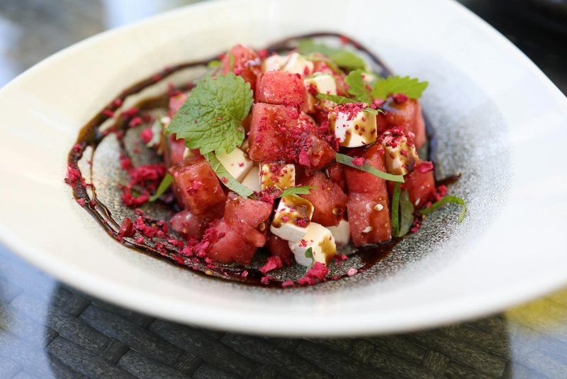

# Watermelon-Feta Salad

*American summer salad: cold cubes of watermelon meet salty crumbles of feta, lifted by torn mint, a sharp hit of lime and finely sliced red onion.*

**Serves:** 6

**Prep Time:** 15 minutes

**Cook Time:** 0 minutes

## Overview
Watermelon and feta sounds, on paper, like a culinary trick that shouldn't work. It came to prominence in the United States through chefs influenced by eastern Mediterranean and Greek traditions, where briny cheese paired with sweet fruit has been quietly understood for centuries. By the early 2000s it was a staple of American summer entertaining, on magazine covers and barbecue spreads from California to the Hamptons. The flavour is built on three opposing notes: the candied sweetness of ripe watermelon, the salty almost sheepy tang of crumbled feta, and the green cooling sting of fresh mint. A squeeze of lime and a slow trickle of peppery olive oil tie it together, while finely sliced red onion adds a sharp savoury bite that keeps the salad from leaning too sweet. With no cooking involved, success depends entirely on ingredient quality: properly ripe watermelon and real Greek feta packed in brine, not the dry crumbled supermarket variety. Assemble just before serving; watermelon weeps quickly once cut and salted.

## Ingredients

### Salad
- 1200 g ripe watermelon, rind and seeds removed, cut into 2 cm cubes
- 200 g Greek feta in brine, drained and crumbled into chunks
- ½ small red onion, very thinly sliced
- 1 large handful fresh mint leaves, torn
- 1 small handful flat-leaf parsley leaves (optional)

### Dressing
- 3 tbsp extra virgin olive oil
- 2 tbsp fresh lime juice
- 1 tsp lime zest
- ½ tsp flaky sea salt
- Freshly ground black pepper

### To finish
- Extra mint leaves
- A pinch of chilli flakes (optional)

## Method

### Stage 1 - Prep the watermelon
1. Slice the watermelon in half, then cut into wedges. Run your knife between the flesh and the rind to release.
2. Cut the flesh into roughly 2 cm cubes and tip into a colander set over a bowl to let any excess juice drain off while you prepare the rest.

### Stage 2 - Tame the onion
1. Place the sliced red onion in a small bowl and cover with cold water. Leave for 10 minutes, then drain and pat dry. This softens its raw bite without losing the crunch.

### Stage 3 - Whisk the dressing
1. In a small bowl whisk the olive oil, lime juice, lime zest, salt, and a generous grind of black pepper until emulsified.

### Stage 4 - Assemble
1. Transfer the drained watermelon to a wide, shallow serving platter.
2. Scatter over the red onion, torn mint, and parsley if using.
3. Crumble the feta in irregular chunks across the top.
4. Drizzle the dressing evenly over the salad just before serving.

### Stage 5 - Finish
1. Top with a few extra whole mint leaves and a pinch of chilli flakes if you like a gentle warmth against the sweetness.
2. Serve immediately, while everything is still cold and crisp.

## Notes
- **Choosing watermelon:** Look for a heavy fruit with a creamy yellow patch on one side. That patch shows it ripened on the vine.
- **Feta matters:** Greek feta in brine has the right balance of salt and creaminess. Avoid pre-crumbled bags, which are dry and chalky.
- **Cucumber variation:** Add 200 g of cubed, seeded cucumber for extra crunch and a fresher profile.
- **Make it a meal:** Pile over a bed of rocket and add toasted pistachios for a light lunch.
- **Avoid dressing too early:** Salt draws water from watermelon almost immediately. Dress and serve within minutes.

## Storage
- Best eaten the day it is made. Leftovers will become watery within hours.
- If you must store it, keep undressed components separate and combine just before serving.
- Do not freeze.
