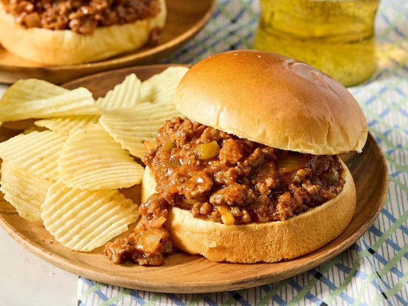

# Sloppy Joe

*The American school-lunch sandwich: spiced beef mince in a tangy tomato sauce piled into a soft burger bun, served with chips and a pickle. Sweet, sharp, savoury, comforting; eaten over the plate so the sauce runs into a pool you mop up at the end. Lunchtime, not dinner; weeknight, not weekend.*

**Serves:** 4

**Prep Time:** 10 minutes

**Cook Time:** 30 minutes

## Overview
The American school-cafeteria sandwich grown into a proper weeknight dinner. You brown beef mince hard with onion and green pepper until it's deeply caramelised on the bottom of the pan, stir in garlic for a moment, then build the sauce around it: ketchup and tomato purée for body, brown sugar and Worcestershire for sweetness and depth, mustard and cider vinegar for the sharp counter, paprika for the warmth across the back, a splash of beef stock to loosen the lot. You simmer for fifteen minutes or so until the sauce clings to the meat rather than pooling around it (sloppy is allowed, soupy isn't). Taste at the end and adjust: more vinegar if the sweetness has run away, more sugar if the tang is too sharp, more salt if it needs grounding. Pile generous spoonfuls into toasted soft burger buns and eat over the plate, dill pickle in one hand, chips on the side, the small pool of sauce that escapes mopped up at the end with the last corner of bun.

## Ingredients

- 600 g beef mince (15-20% fat)
- 2 tablespoons vegetable oil
- 1 onion (large, chopped)
- 1 green bell pepper (small, chopped)
- 4 garlic cloves (crushed)
- 4 tablespoons tomato ketchup
- 2 tablespoons tomato puree
- 2 tablespoons soft brown sugar
- 2 tablespoons Worcestershire sauce
- 1 tablespoon yellow mustard
- 1 tablespoon cider vinegar
- 1 teaspoon smoked paprika
- 1 teaspoon ground black pepper
- 1 teaspoon salt (to taste)
- 200 ml beef stock

### To serve
- 4 soft burger buns (split, lightly toasted)
- Dill pickles
- Chips (fries)

## Method

### Stage 1 - Brown
1. Heat the oil in a wide heavy pan over medium-high.
1. Add beef mince; brown hard 6-7 minutes, breaking up clumps.
1. Pour off excess fat.

### Stage 2 - Aromatics
1. Push the meat to one side; add onion and pepper to the cleared half.
1. Cook 8 minutes until soft.
1. Add garlic; cook 30 seconds.
1. Mix everything together.

### Stage 3 - Sauce
1. Stir in ketchup, tomato puree, brown sugar, Worcestershire, mustard, vinegar, paprika, pepper.
1. Add stock; bring to a simmer.
1. Reduce heat; cook 15-18 minutes, stirring occasionally, until thick and the sauce coats the meat (not pooled).

### Stage 4 - Season
1. Taste; adjust salt, sugar (if too sharp), or vinegar (if too sweet).

### Stage 5 - Serve
1. Toast the buns lightly cut-side up under the grill.
1. Pile a generous scoop of sloppy meat onto each bottom bun; close.
1. Serve with chips and pickles on the side.

## Notes
- **Sloppy but not soupy:** The sauce should cling to the meat, not pool around it. Cook off any excess.
- **Brown sugar + vinegar:** The defining sweet-sour balance. Adjust to taste; the dish should hit both ends.
- **Sturdy buns:** Soft burger buns hold up; brioche goes soggy fast. Toast them; helps with absorption.

## Storage
- The meat keeps 4 days refrigerated; reheats well.
- Freezes 3 months. Heat in a pan with a splash of stock.
