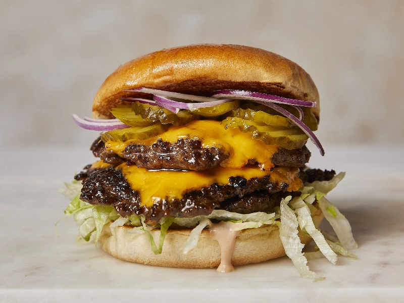

# Smashburger

*Crackling beef pressed onto a screaming-hot griddle, lacy brown edges curling around molten American cheese. The smell is pure diner: seared fat, toasted bun, and onions caramelising in the rendered tallow.*

**Serves:** 4

**Prep Time:** 10 minutes

**Cook Time:** 15 minutes

## Overview
The smashburger is the American griddle cook's answer to a thick pub patty: take a loose ball of fatty ground beef, slap it onto a ripping hot flat-top, and press it paper thin so every square millimetre of meat hits the steel. What you get back is a patty with a brittle, almost potato-chip-like crust on the underside and a juicy, just-cooked interior, all in the space of ninety seconds. The technique came out of small Midwestern diners in the mid-twentieth century, but the modern revival is often credited to George Motz and the wave of regional burger documentation that followed. The Maillard reaction is the entire point here. A thick patty cooked rare on the inside has a thin band of seared flavour; a smashed patty is almost all crust. Pair that with cheap, salty American cheese that melts into the crags, a pillowy potato bun toasted in beef fat, and a sharp pickle, and you have one of the most satisfying things you can cook at home in under twenty minutes. Difficulty is low, but two details matter: the pan must be properly hot before the beef touches it, and you must only press once, in the first ten seconds. Anything more and you squeeze out the juices you worked to keep.

## Ingredients

### Patties
- 600 g ground beef chuck, ideally 20% fat
- Flaky sea salt
- Freshly ground black pepper
- 4 slices American cheese

### To assemble
- 4 soft potato buns, split
- 30 g unsalted butter, softened
- 1 white onion (small), very thinly sliced
- 4 dill pickle chips per burger
- 2 tbsp yellow mustard
- 4 tbsp tomato ketchup

## Method

### Stage 1 - Prep
1. Divide the beef into 8 loose balls of about 75 g each. Do not pack them tightly; just cup them in your palm.
2. Slice the onion as thin as you can manage and keep it loose on a plate.
3. Butter the cut faces of the buns.

### Stage 2 - Toast the buns
1. Heat a heavy cast-iron pan or flat-top over medium heat.
2. Press the buttered buns cut-side down until deep golden, about 1 minute. Set aside.

### Stage 3 - Smash
1. Turn the heat to high and let the pan get properly hot, about 3 minutes. A drop of water should evaporate instantly.
2. Place 2 beef balls into the dry pan, spaced apart. Immediately top each with a small pinch of sliced onion.
3. Using a sturdy spatula and a second spatula or heavy can on top for leverage, press each ball flat to roughly 12 cm wide and 5 mm thick. Press hard, once, for about 10 seconds.
4. Season the top of each patty with salt and pepper.
5. Cook undisturbed for 90 seconds, until the edges are lacy and dark brown and juices bead on top.
6. Slide the spatula firmly under each patty, scraping up the crust, and flip. Lay a slice of cheese on one patty, then stack the second patty on top to make a double.
7. Cook a further 30 seconds for the cheese to melt.

### Stage 4 - Build
1. Spread mustard on the bottom bun, ketchup on the top.
2. Lay pickle chips on the bottom bun, then the double-stack patty.
3. Cap with the top bun and press gently. Serve immediately.

## Notes
- **Fat matters:** 80/20 chuck is the minimum. Lean beef will not crisp and will taste dry.
- **Do not move the patty:** once smashed, leave it alone. Lifting too early tears off the crust you are trying to build.
- **Pan temperature:** if the beef does not hiss aggressively the second it hits the pan, the pan is not hot enough.
- **Parchment trick:** lay a square of baking parchment between the spatula and the beef when you smash to stop sticking.

## Storage
- Cooked patties keep 2 days in the fridge but lose their crust. Reheat briefly in a hot pan, do not microwave. Build burgers fresh, never assembled and stored.
