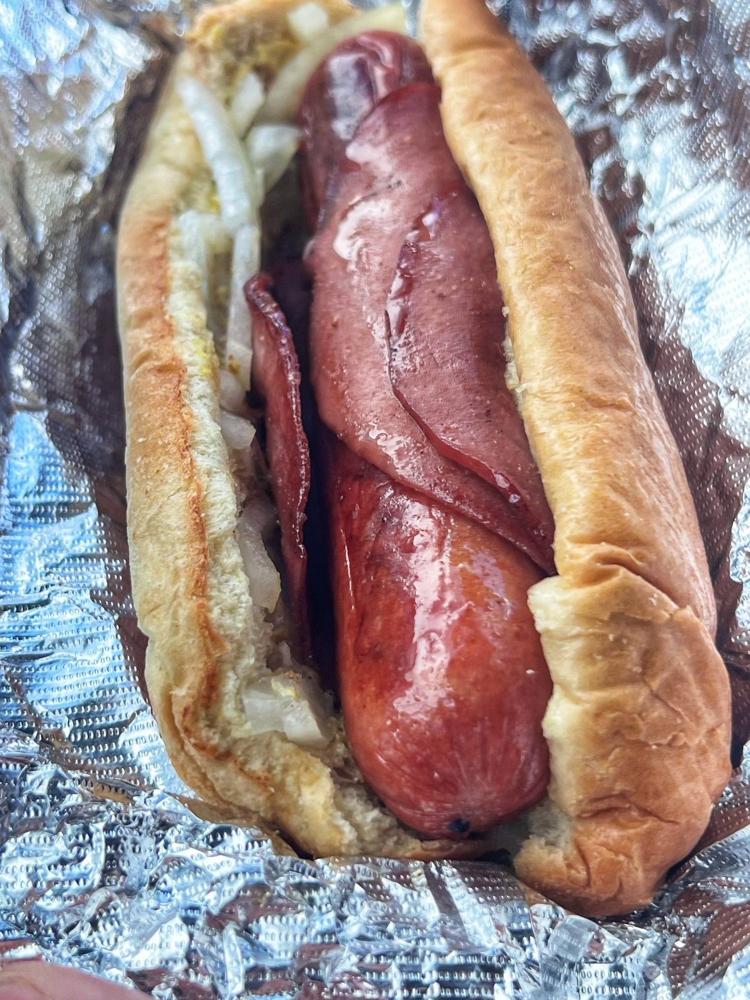

# Baltimore Hot Dog

*Baltimore's bologna-wrapped hot dog: a fried hot dog wrapped in a slice of fried bologna, tucked into a soft white bun with yellow mustard. The Maryland working-class lunchtime classic; the dish that uses BOTH the everyday deli meat AND the pantry-staple sausage of American food, doubled up.*

**Serves:** 4

**Prep Time:** 10 minutes

**Cook Time:** 15 minutes

## Overview
The Baltimore hot dog (sometimes called a "bologna dog" or a "Maryland dog") is one of the most distinctive and most working-class hot-dog variants in America: a standard frankfurter pan-fried till the casing browns, then wrapped tightly in a slice of fried bologna (the round American luncheon meat, fried hard till the edges curl up and char), tucked into a soft white bun with a stripe of yellow mustard. The dish doubles up two cuts that American food historically used to feed factory workers and dock crews on a tight budget (Baltimore has a long industrial port history): the frankfurter and the bologna sausage, both originally German-immigrant inventions, both deeply working-class proteins. Sold at Lexington Market food stands, Polock Johnny's, and the few surviving Baltimore-area lunch counters.

## Ingredients

### Dogs and bologna
- 4 standard all-beef or pork-and-beef frankfurters
- 4 thick slices of bologna (about 4mm thick each; the round American deli kind, not chunky Italian mortadella)
- 2 tablespoons vegetable oil
- 1 tablespoon butter (for toasting buns)

### Buns
- 4 soft white hot dog buns

### Toppings
- Yellow mustard (the only traditional condiment)
- Sweet pickle relish (optional)
- Chopped raw onion (optional)

### To serve
- A cold Natty Boh (National Bohemian, the traditional Baltimore beer)
- Crab chips on the side (Baltimore-area Old Bay-seasoned potato chips)
- Dill pickle spear

## Method

### Stage 1 - Fry the bologna
1. Heat the oil in a wide pan over medium-high heat.
2. Lay the bologna slices flat in the hot pan.
3. The edges will curl up into a bowl shape, that's the right look; some Baltimore stands cut a small slit at the edge to control the curl.
4. Cook 2 minutes per side till the edges are deeply browned and crispy and the middle has slightly puffed.
5. Remove to paper towels.

### Stage 2 - Fry the dogs
1. In the same pan (with the bologna fat), add the frankfurters.
2. Fry 4-5 minutes, turning, till the casing is deeply browned and slightly split.
3. Remove.

### Stage 3 - Wrap the dog in the bologna
1. Lay each piece of fried bologna flat (or cup-shaped, depending on curl).
2. Place a fried frankfurter inside.
3. Wrap the bologna around the dog as tightly as the slight curl allows.
4. The bologna doesn't need to fully encircle, partial wrapping is fine; it'll hold its shape in the bun.

### Stage 4 - Toast the buns
1. In the same pan, melt the butter.
2. Toast the bun cut sides 60 seconds till lightly golden.

### Stage 5 - Build
1. Place each bologna-wrapped dog in a toasted bun.
2. A zigzag of yellow mustard down the length.
3. Optional: a spoon of sweet pickle relish.
4. Optional: a heap of chopped raw onion.

### Stage 6 - Serve immediately
1. Crab chips on the side; cold Natty Boh.
2. A pickle spear if you want it.

## Notes
- **Fry the bologna hard:** flabby warm bologna ruins the dish. The bologna needs to be a structural element, not a wet wrapper.
- **Cup-shape from the curl is fine:** lean into the bologna's natural curl. It cradles the dog.
- **Yellow mustard only:** no ketchup. Baltimore is strict on this.
- **Same pan for bologna + dogs:** the bologna fat seasons the dogs.

## Variations
**With cheese:** add a slice of American cheese inside the bologna wrap before adding the dog.
**With chili:** ladle a small spoon of beef chili over the assembled dog for a Baltimore chili-bologna dog.
**Spicier:** use spicy beef bologna (Lebanon bologna for the smoky-acidic Pennsylvania Dutch variant).
**Open-face on rye:** swap the bun for a slice of toasted rye; eat with a fork-and-knife.

## Serving
At Lexington Market in Baltimore. At a working-class diner in Highlandtown or Dundalk. At home with a Natty Boh and a baseball game on.

## Storage
- Best fresh.
- Fried bologna keeps refrigerated 2 days; re-fry briefly to re-crisp.
- Cooked dogs refrigerate 3 days.
- Don't assemble in advance.
