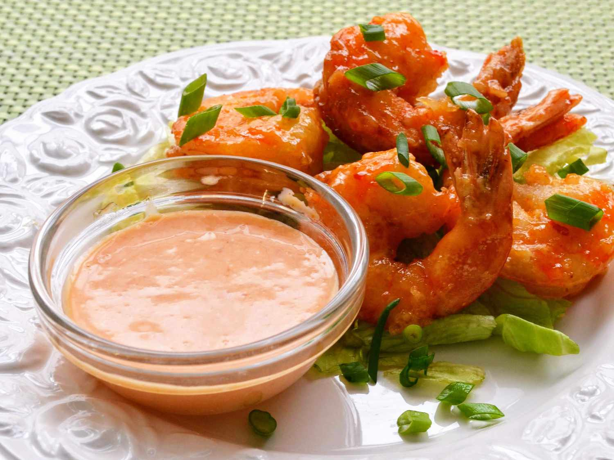

# Bang Bang Sauce

*The creamy pink sauce. Mayo, sweet chilli sauce, sriracha. Three ingredients, two minutes, infinite uses. Born in American sit-down restaurants as a dip for crispy shrimp; works on chicken tenders, fries, burgers, salads, anything that wants a sweet-spicy creamy hit.*

**Serves:** Makes ¾ cup

**Prep Time:** 3 minutes

**Cook Time:** None

## Overview
The creamy pink dip that turns up in every American sit-down chain restaurant: three ingredients (mayonnaise, Thai sweet chilli sauce, sriracha), two minutes, infinite uses. Mayo gives the body, sweet chilli sauce brings the sweet-tart-mild-spice base, sriracha tops the heat to whatever level you want. The sauce was born in the early 2000s as the dip for "bang bang shrimp" at the American Bonefish Grill chain (the dish was supposedly inspired by Sichuan bang bang chicken, though the resemblance is faint), and has since spread across diner menus and home kitchens as a sweet-spicy creamy hit for fries, chicken tenders, burgers, fish tacos, salads, anywhere mayonnaise might otherwise go. Use a proper Thai sweet chilli sauce (Mae Ploy or similar from any Asian grocer); American sweet-chilli imitations lack the proper sweetness. Keeps a couple of weeks in the fridge.

## Ingredients

- ½ cup whole-egg mayonnaise (Kewpie excellent; Best Foods or Hellmann's also fine)
- 2 tablespoons sweet chilli sauce (Thai-style, the orange one)
- 1 tablespoon sriracha (adjust for heat preference)

## Method

### Stage 1 - Mix
1. Combine all three in a small bowl or jar.
2. Stir with a spoon until completely smooth and uniformly pink. About 30 seconds.

### Stage 2 - Taste and adjust
1. Taste. For more sweetness, add another teaspoon of sweet chilli sauce. For more heat, add another teaspoon of sriracha.
2. Transfer to a sealed jar if not using straight away.

## Notes
- **Mayonnaise choice**: whole-egg mayo gives the right richness. American salad-dressing-style mayo (Miracle Whip) is too sweet and tangy and clashes with the sweet chilli.
- **No sweet chilli sauce?**: 2 tablespoons of honey + ½ teaspoon of rice vinegar gives a similar profile. Less complex but workable.
- **Vegan version**: vegan mayo works as a direct swap. Most sweet chilli sauces and sriracha brands are already vegan.

## Serving
The default: a dipping sauce for crispy fried shrimp, chicken tenders, popcorn chicken, calamari. Drizzled over: tacos (fish, shrimp), burgers, salad bowls. Smeared into: chicken wraps, brioche-bun sandwiches, sushi-style hand rolls. Stirred into: cold pasta salads as a dressing.

## Storage
- In a sealed jar in the fridge for up to 3 weeks.
- The colour deepens slightly over time; flavour stays the same.
- Don't freeze, mayonnaise separates on thawing.
