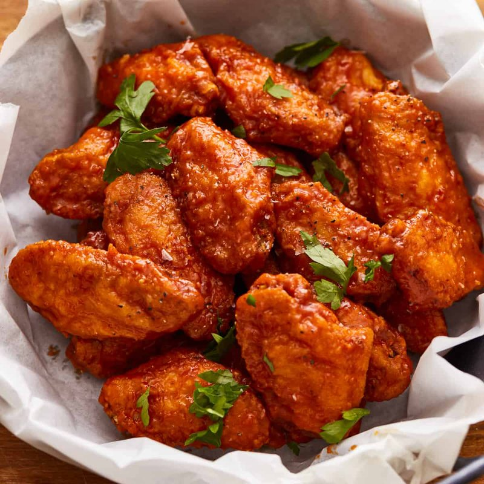

# Buffalo Wings

*The American bar snack: deep-fried wings tossed in glossy hot-sauce butter, served with celery sticks and blue-cheese dip. Born in Buffalo.*

**Serves:** 4 (about 24 wings)

**Prep Time:** 15 minutes (plus 1 hour drying)

**Cook Time:** 25 minutes

## Overview
The American bar snack born at the Anchor Bar in Buffalo, New York in 1964: deep-fried chicken wings tossed in glossy hot-sauce butter, served with celery sticks and blue-cheese dip to cool the burn. The wing-and-blue-cheese pairing is the traditional American combination, and skipping either side misses what makes Buffalo wings what they are. The drying step is the single most important technique; wings patted bone-dry, dusted with baking powder and salt, rested uncovered on a rack for an hour give the proper shatter-crisp skin (where wet wings give soggy results no matter how hot the oil). The double-fry is the other traditional move (a gentle fry to cook the meat through, a hot fry to crisp the skin) with a brief rest between. The sauce is equal parts melted butter and Frank's RedHot whisked smooth with vinegar and cayenne; substitute hot sauces taste off because Frank's is what the original used. Served immediately while the sauce is still glossy.

## Ingredients

### Wings
- 1.2 kg chicken wings (separated into drumettes and flats, tips discarded or saved for stock)
- 2 teaspoons baking powder (NOT baking soda)
- 1 ½ teaspoons salt
- ½ teaspoon ground black pepper
- 1 litre neutral oil (for frying)

### Buffalo sauce
- 100 g unsalted butter (melted)
- 120 ml Frank's RedHot (or any Louisiana-style hot sauce)
- 1 teaspoon white vinegar
- ½ teaspoon Worcestershire sauce
- ½ teaspoon cayenne pepper (for extra heat, optional)

### Blue-cheese dip
- 100 g blue cheese (Roquefort or Stilton; crumbled)
- 100 ml soured cream
- 50 g mayonnaise
- 1 tablespoon white-wine vinegar
- 1 garlic clove (crushed)
- A pinch of salt

### To serve
- 4 celery sticks (cut into 7 cm batons)
- 2 carrots (cut into batons; optional)

## Method

### Stage 1 - Dry the wings
1. Pat the wings VERY dry with paper towels (wet wings won't crisp).
1. Toss in a bowl with baking powder, salt and pepper.
1. Spread on a wire rack over a tray; rest uncovered in the fridge 1 hour (or up to overnight, the longer the drier).

### Stage 2 - Blue-cheese dip
1. Mash half the blue cheese with the soured cream and mayonnaise to a smooth-ish base.
1. Stir in the rest of the cheese, vinegar, garlic and salt.
1. Chill while you fry.

### Stage 3 - Buffalo sauce
1. Whisk the melted butter, hot sauce, vinegar, Worcestershire and cayenne in a wide bowl.
1. The sauce should be glossy and emulsified.

### Stage 4 - Fry stage one
1. Heat oil to 160°C.
1. Lower wings in 8 at a time; fry 10 minutes, they'll cook through but stay pale.
1. Lift onto a wire rack to rest 5 minutes.

### Stage 5 - Fry stage two
1. Bring oil up to 190°C.
1. Re-fry wings 8 at a time, 4-5 minutes, they should turn deep gold and crackling crisp.
1. Lift onto a fresh rack.

### Stage 6 - Toss
1. While still hot, drop the wings into the buffalo sauce.
1. Toss until evenly coated.

### Stage 7 - Serve
1. Pile on a platter with celery sticks and carrot batons.
1. Blue-cheese dip in a bowl in the centre.
1. Eat with fingers, then napkins.

## Notes
- **Baking powder NOT baking soda:** the aluminium-free baking powder raises skin pH and helps draw moisture, giving a crispier skin. Soda gives a soapy taste.
- **Two-stage fry is the secret:** single-fry wings come out either underdone or burnt. Low first cooks through; high second crisps.
- **Toss at service, not before:** wings sauced too early go soggy. Sauce-toss immediately before plating.
- **Blue cheese vs ranch:** Buffalo, NY tradition is blue cheese. Ranch is a coastal heresy. Pick your side.

## Storage
- Best within 10 minutes of saucing.
- Plain fried wings (pre-saucing) keep 24 hours refrigerated; re-crisp in a 200°C oven 8 minutes; toss in fresh sauce.
- Don't refrigerate sauced wings, the coat goes gummy.
