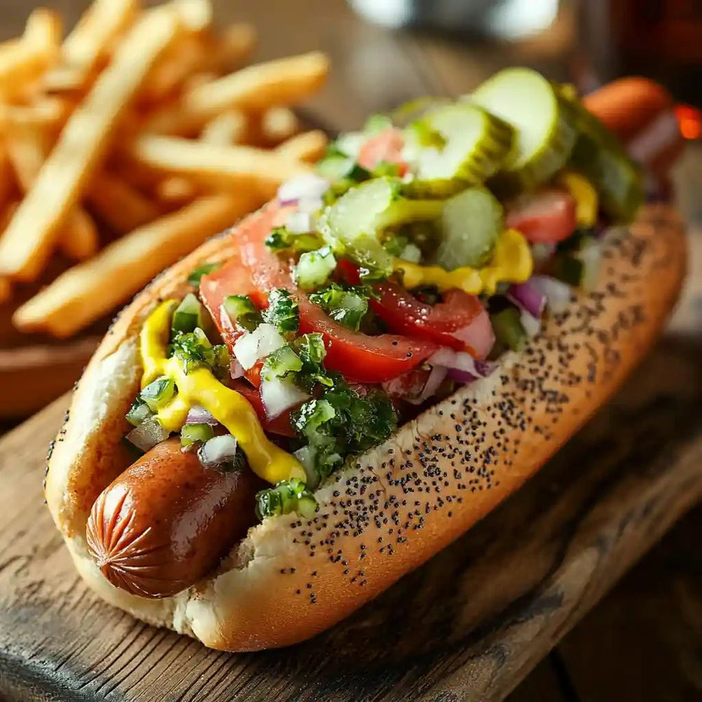

# Chicago Hot Dog

*Chicago's "dragged through the garden" hot dog: an all-beef Vienna dog on a steamed poppy seed bun with mustard, neon-green relish, onion, tomato, dill pickle, sport peppers and celery salt. No ketchup, ever.*

**Serves:** 4

**Prep Time:** 15 minutes

**Cook Time:** 10 minutes

## Overview
The Chicago hot dog is the most assertively regional hot dog in America, with a near-religious set of rules built up over a century of street-cart culture. Portillo's, Gene & Jude's, Superdawg and a thousand neighbourhood stands all serve their version. The canonical Chicago-style is also called "dragged through the garden" because of the heap of vegetables on top: an all-beef Vienna-style frankfurter (steamed or simmered, never boiled), tucked into a poppy seed bun (steamed too, never toasted), then dressed in a strict order. Yellow mustard, fluorescent neon-green sweet pickle relish (the colour comes from blue dye #1 added to standard relish), chopped white onion, two thick tomato slices, a long dill pickle spear, two pickled sport peppers (small mild Italian-style peppers, not jalapeños), and a sprinkle of celery salt. The one rule that's literally non-negotiable in Chicago: never put ketchup on a hot dog after the age of seven. Restaurants will openly mock customers who ask.

## Ingredients

### The dog and bun
- 4 all-beef Vienna-style frankfurters (Vienna Beef brand is canonical; failing that any all-beef natural-casing dog)
- 4 poppy seed hot dog buns (S. Rosen's is the Chicago canonical brand)

### Toppings (per dog)
- Yellow mustard (NOT Dijon, NOT honey, NOT anything else)
- 2 tablespoons neon-green sweet pickle relish (Vienna brand or any standard sweet relish + 1 drop blue food colouring per cup if you want the Chicago neon look)
- 2 tablespoons finely chopped white onion
- 2-3 thick tomato wedges (cut a Roma tomato lengthwise into 4)
- 1 dill pickle spear (long, cut from a quarter of a kosher dill)
- 2 pickled sport peppers (small mild Italian green peppers)
- Pinch of celery salt
- Absolutely no ketchup

### To serve
- Crinkle-cut fries
- A cold can of soda
- Italian beef sandwich on the side (the canonical Chicago meal)

## Method

### Stage 1 - Steam the dogs
1. Bring a wide pan of water to a gentle simmer.
2. Add the frankfurters and warm 5-6 minutes (do not boil hard; they split).
3. Lift out with tongs.

### Stage 2 - Steam the buns
1. Place the buns in a steamer basket (or over a colander above simmering water) for 30 seconds till soft and pliable.
2. Or microwave wrapped in a damp paper towel 15 seconds.
3. Never toast a Chicago bun.

### Stage 3 - Build (in order)
1. Place steamed dog in steamed bun.
2. A zigzag of yellow mustard down the length of the dog.
3. A heap of neon-green relish along one side of the dog.
4. A line of chopped white onion along the other side.
5. Two thick tomato wedges tucked in next to the dog.
6. A long pickle spear running parallel to the dog.
7. Two sport peppers perched on top.
8. A pinch of celery salt sprinkled over everything.

### Stage 4 - Serve
1. Cradle the bun so all the toppings stay put.
2. Eat from the side (the only way that works mechanically).
3. With crinkle-cut fries and a cold soda.

## Notes
- **All-beef Vienna dog:** the canonical Chicago hot dog brand is Vienna Beef; the all-beef no-pork construction defines the bite.
- **Poppy seed bun:** the dish doesn't read as Chicago without it.
- **Neon-green relish:** standard sweet relish works, but the radioactive-green colour is the visual signature.
- **Celery salt:** the secret ingredient. Don't skip.
- **NO KETCHUP:** treated with religious seriousness in Chicago. Don't argue.

## Variations
**Chicago char dog:** dog grilled directly over flame instead of steamed (Gene & Jude's style).
**Combo:** add a beef tamale on top of the dog in the bun (the Maxwell Street Polish-Mexican mash-up).
**Polish-Chicago:** swap the Vienna beef dog for a Maxwell Street-style Polish sausage (smoked, garlicky).
**Mini Chicago dogs for parties:** small frankfurters, slider buns; all the same toppings scaled down.

## Serving
At a Chicago hot dog stand. At home with crinkle fries and a can of pop. As a backyard barbecue showstopper that polarises the ketchup-fans.

## Storage
- Best eaten immediately.
- Relish, mustard, peppers all keep in their jars indefinitely.
- Cooked dogs refrigerate 3 days.
- Don't assemble in advance; the bun goes soggy.
