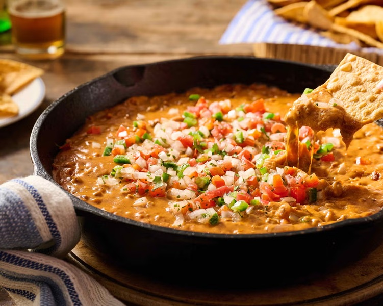

# Chili Cheese Dip

*The Super Bowl skillet dip: seasoned ground beef and beans bubbling under a melted-cheese cap, finished under the broiler. Eat with tortilla chips.*

**Serves:** 6-8 (as a sharing dip)

**Prep Time:** 10 minutes

**Cook Time:** 35 minutes

## Overview
Chili cheese dip is the American sharing-skillet that comes out of the oven on Super Bowl Sunday and at every back-deck football party from October to February: seasoned ground beef and beans bubbling under a thick cap of melted cheese, finished under the broiler till the edges crisp. You brown the beef hard in an oven-safe skillet with onion and garlic, then bloom chilli powder, cumin, oregano and smoked paprika in the fat so the spices toast rather than just dissolve. Tomato passata, kidney beans and a splash of stock simmer in for twenty minutes to thicken, then a generous handful each of cheddar and Monterey Jack scatters across the top. Under a hot grill for the final few minutes, the cheese bubbles to the centre and crisps round the edges into the traditional American "queso fundido" finish. Finished with sliced spring onion, pickled jalapeños and a few dollops of sour cream. Eat hot with tortilla chips, ideally still in the skillet on a wooden board at the centre of the coffee table.

## Ingredients

### Beef base
- 2 tablespoons neutral oil
- 1 onion (large, finely diced)
- 4 garlic cloves (minced)
- 500 g lean ground beef (15% fat)
- 2 tablespoons chilli powder
- 1 tablespoon ground cumin
- 1 teaspoon dried oregano
- 1 teaspoon smoked paprika
- 1 teaspoon salt
- ½ teaspoon ground black pepper
- 1 tin (400 g) chopped tomatoes
- 1 tin (400 g) kidney beans (drained and rinsed)
- 100 ml beef stock
- 2 tablespoons tomato purée

### Topping
- 200 g mature cheddar cheese (grated)
- 100 g Monterey Jack cheese (or mozzarella; grated)
- 2 spring onions (sliced thin)
- 1 fresh jalapeño (sliced into rings)
- 100 g soured cream
- A handful of fresh coriander (chopped)

### To serve
- A large bowl of tortilla chips (salted)

## Method

### Stage 1 - Brown beef
1. Heat the oil in a wide oven-safe skillet (a 28 cm cast-iron is ideal) over medium-high heat.
1. Add the onion; cook 5 minutes till translucent.
1. Add the garlic; 30 seconds.
1. Add the ground beef; break up with a spoon; brown 6-8 minutes.

### Stage 2 - Spice
1. Stir in the chilli powder, cumin, oregano, smoked paprika, salt and pepper.
1. Cook 1 minute till fragrant.

### Stage 3 - Simmer
1. Pour in the chopped tomatoes, kidney beans, beef stock and tomato purée.
1. Stir; bring to a simmer.
1. Reduce heat to medium-low; cook 18-20 minutes till thickened.

### Stage 4 - Cheese cap
1. Heat the grill / broiler to high.
1. Smooth the surface of the chilli; scatter the grated cheddar and Monterey Jack evenly across.

### Stage 5 - Broil
1. Slide the skillet under the grill 4-5 minutes; the cheese should melt, bubble and turn gold-spotted.

### Stage 6 - Top and serve
1. Scatter the sliced spring onion, jalapeño rings and chopped coriander.
1. Dollop soured cream in the centre (or serve on the side).
1. Bring the skillet straight to the table on a heatproof board.
1. Serve with the big bowl of tortilla chips.

## Notes
- **Lean-ish beef (15% fat):** too lean = dry; too fatty = greasy puddle on top. 15% is the right balance.
- **Bloom the spices in the fat:** dry-toasting briefly with the beef releases the volatile compounds. Skip and the dip tastes flat.
- **Two cheeses, not one:** cheddar for flavour, Monterey Jack for melt. All-cheddar gives an oily separation; all-Jack tastes bland.
- **Cast-iron is the move:** the residual heat keeps the dip molten at the table for 20+ minutes after broiling.

## Storage
- Reheats well in a 180°C oven covered 15 minutes; add fresh cheese on top before reheating to refresh the cap.
- Keeps 4 days refrigerated.
- The base (without cheese topping) freezes 2 months; thaw, reheat, then cheese and broil to order.
