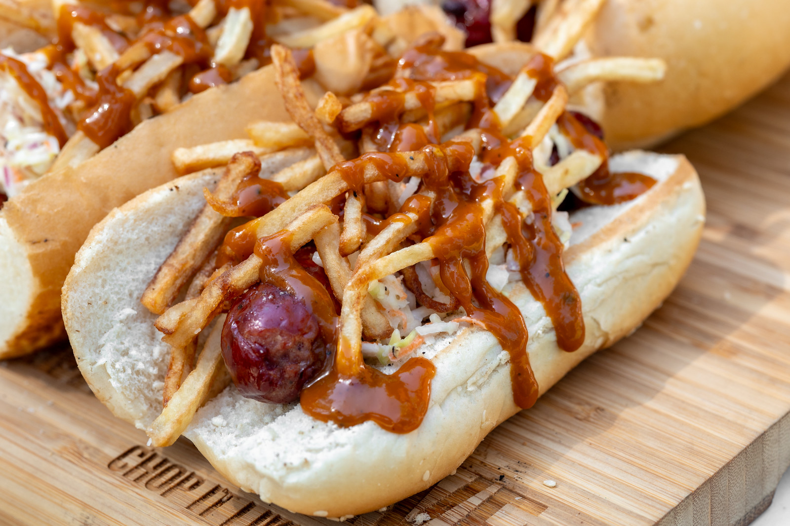

# Cleveland Hot Dog

*Cleveland's Polish-American polish boy hot dog: a grilled Polish kielbasa sausage in a soft bun, topped with a heap of French fries, a generous drizzle of Cleveland-style "Stadium Mustard" hot sauce, and a heap of vinegar-tangy cole slaw. The Cleveland summer-party signature; Stadium Mustard is the traditional city condiment.*

**Serves:** 4

**Prep Time:** 25 minutes

**Cook Time:** 30 minutes

## Overview
The Cleveland hot dog (often called a "Polish Boy") is northeast Ohio's signature street and BBQ-joint sandwich, born out of Cleveland's deep Polish and Eastern European immigrant heritage (Cleveland once had the second-largest Polish-American population in America after Chicago): a grilled kielbasa (Polish smoked sausage) in a soft white bun, then loaded with three things at once, a heap of French fries piled inside the bun on top of the kielbasa, a generous drizzle of barbecue sauce or the traditional Cleveland "Stadium Mustard" hot sauce (the spicy brown mustard sold at Cleveland Browns games since 1969), and a heap of vinegar-based cole slaw. The result is a vertical tower of textures: chewy bun, snappy sausage casing, crispy fries, tangy spicy sauce, cool crunchy slaw. Eat with two hands and a fork standing by for fallout. Created by Virgil Whitmore at a Cleveland street stand in the 1940s; traditional at Hot Sauce Williams, Freddie's BBQ, and Seti's Polish Boys.

## Ingredients

### Sausages and buns
- 4 fresh Polish kielbasa sausages (smoked, about 15cm long; or substitute with knockwurst or any quality smoked Polish-style sausage)
- 4 large soft hot dog or hoagie buns (longer than standard; the kielbasa is bigger than a frankfurter)
- 1 tablespoon vegetable oil

### Fries
- 4 large russet potatoes (peeled, cut into 8mm-thick fries); or 600 g frozen French fries
- Vegetable oil for deep-frying (about 1 litre)
- 1 teaspoon fine sea salt

### Vinegar cole slaw
- 400 g green cabbage (finely shredded)
- 1 large carrot (grated)
- 4 tablespoons mayonnaise
- 4 tablespoons apple cider vinegar
- 2 tablespoons caster sugar
- 1 teaspoon celery seed
- 1 teaspoon fine sea salt
- ½ teaspoon ground black pepper

### Cleveland Stadium Mustard hot sauce
- 100 ml Bertman Stadium Mustard (traditional Cleveland brand) OR 100 ml spicy brown mustard
- 2 tablespoons hot sauce (Frank's RedHot or Tabasco)
- 1 tablespoon white vinegar
- 1 tablespoon Worcestershire sauce
- ½ teaspoon cayenne
- ½ teaspoon ground black pepper

### Optional: BBQ sauce
- 200 ml tangy-sweet BBQ sauce (the alternative to Stadium Mustard for those who prefer sweet over spicy)

### To serve
- A cold Great Lakes Brewing or any Ohio craft beer
- Pickled hot peppers on the side
- A Cleveland Browns game on the television

## Method

### Stage 1 - Make vinegar slaw
1. Whisk mayonnaise, vinegar, sugar, celery seed, salt and pepper.
2. Toss in shredded cabbage and grated carrot.
3. Refrigerate 30 minutes to soften and meld.

### Stage 2 - Mix Cleveland mustard hot sauce
1. Whisk Stadium Mustard (or spicy brown mustard), hot sauce, vinegar, Worcestershire, cayenne, pepper.

### Stage 3 - Fry the potatoes
1. Heat the deep-frying oil to 175°C (350°F).
2. Fry the fries in batches 5-6 minutes till golden and crispy.
3. Drain on paper towels; salt immediately.
4. Keep warm in a low oven.

### Stage 4 - Cook the kielbasa
1. Heat a grill or wide pan to medium-high; brush lightly with oil.
2. Grill or pan-fry the kielbasa 8-10 minutes, turning, till the casing is deeply browned and slightly split, and the sausage is heated through.

### Stage 5 - Warm the buns
1. Briefly toast the bun cut sides in a separate pan or under a hot grill (60 seconds).

### Stage 6 - Build (Cleveland Polish Boy order)
1. Place a grilled kielbasa in each bun.
2. A heap of warm French fries piled ON TOP of the kielbasa inside the bun (this is the structural signature, the fries are part of the sandwich, not a side).
3. A generous drizzle of Cleveland Stadium Mustard hot sauce over the fries.
4. (Or, alternatively: a generous drizzle of BBQ sauce.)
5. A generous heap of vinegar slaw on top of the fries and sauce.
6. The tower should be substantially taller than the bun.

### Stage 7 - Serve immediately
1. Two hands; fork standing by.
2. With pickled hot peppers and a cold Ohio beer.

## Notes
- **Kielbasa, not frankfurter:** the Polish smoked sausage is the structural and flavour signature.
- **Fries INSIDE the bun:** not a side dish. The fries are part of the build.
- **Stadium Mustard:** Cleveland's iconic spicy brown mustard. Substitute spicy brown mustard + hot sauce.
- **Vinegar slaw, not creamy:** the tang cuts the rich kielbasa.
- **Two-hand eating with fork standby:** structural reality.

## Variations
- **BBQ-style:** swap the Stadium Mustard sauce for tangy BBQ sauce (Hot Sauce Williams in Cleveland actually serves both styles).
- **Polish Girl:** the chicken-or-turkey variation (with smoked turkey breast slices in place of kielbasa); a Cleveland lighter alternative.
- **With pulled pork:** add shredded BBQ pulled pork on top of the kielbasa.
- **Spicier:** double the cayenne in the mustard sauce + sliced fresh jalapeño on top.
- **Cleveland-Polish breakfast Boy:** add a fried egg on top of the slaw.

## Serving
- At Hot Sauce Williams in Cleveland. At a Browns game tailgate. At an Ohio summer cookout. With cold beer.

## Storage
- Cleveland mustard sauce refrigerates 1 month.
- Vinegar slaw refrigerates 4 days (gets better).
- Cooked kielbasa refrigerates 4 days; reheat briefly.
- Fries: best fresh; don't store.
- Don't assemble in advance.
