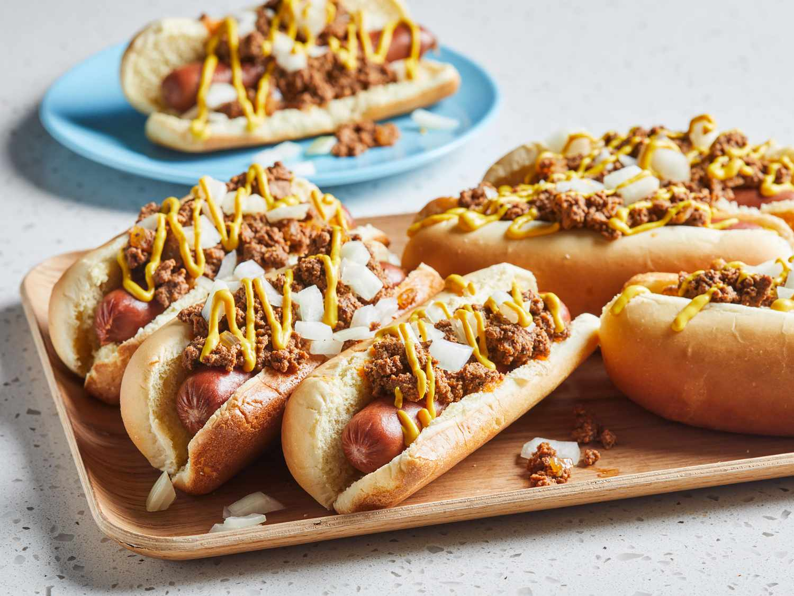

# Coney Island Hot Dog

*The Midwestern-Greek chili dog: a natural-casing frankfurter on a steamed bun topped with smooth beef Coney sauce, yellow mustard and a heap of finely chopped white onion.*

**Serves:** 4

**Prep Time:** 15 minutes

**Cook Time:** 45 minutes (for the sauce)

## Overview
The Coney Island hot dog is one of America's most regionally proud and naming-confused dishes: despite the name, it's not from Coney Island, New York. It was created by Greek and Macedonian immigrants in Detroit and Flint, Michigan, around 1917, who arrived in America via Ellis Island (right next to Coney Island, hence the name) and opened diners serving their take on the American hot dog with a finely-textured, slightly sweet-spiced chili-style meat sauce that's distinct from Texas chili or Cincinnati chili. The sauce ("Coney sauce" or "Coney chili") is made from ground beef simmered with beef heart (the classic version; modern versions skip), tomato paste, cumin, cinnamon, allspice, paprika, garlic, onion powder, mild chilli powder, vinegar and beef stock, cooked till very thick and finely-textured (smoothly grindy, not chunky). Spooned generously over a small natural-casing all-beef frankfurter in a steamed bun, finished with a stripe of yellow mustard and a heap of finely chopped raw white onion. The Detroit "American Coney" / "Lafayette Coney" rivalry has been running on Lafayette Boulevard since 1917.

## Ingredients

### Coney sauce (makes enough for 8 dogs)
- 500 g ground beef (80/20)
- 200 g ground beef heart (optional; the traditional Detroit version; substitute with extra ground beef)
- 1 large onion (very finely chopped)
- 4 garlic cloves (crushed)
- 4 tablespoons tomato paste
- 1 tin (400 g) chopped tomatoes
- 400 ml beef stock
- 2 tablespoons mild chilli powder
- 1 tablespoon ground cumin
- 1 teaspoon ground cinnamon
- 1 teaspoon ground allspice
- 1 tablespoon paprika
- 1 teaspoon mustard powder
- 1 tablespoon Worcestershire sauce
- 1 tablespoon apple cider vinegar
- 1 tablespoon brown sugar
- 1 ½ teaspoons fine sea salt
- 1 teaspoon ground black pepper

### Dogs and toppings (4 dogs)
- 4 small all-beef natural-casing frankfurters (Koegel's brand is the Detroit traditional)
- 4 soft hot dog buns
- Yellow mustard
- 1 small white onion (very finely chopped, for topping)

### To serve
- Cold soda or beer
- Crinkle-cut fries on the side

## Method

### Stage 1 - Brown the meat
1. Heat a wide heavy pot over medium-high heat.
2. Add ground beef (and beef heart if using); cook 8 minutes, breaking up with a wooden spoon, till deeply browned.

### Stage 2 - Sweat the onion
1. Add chopped onion to the meat; cook 6 minutes till soft.
2. Add garlic; cook 30 seconds.

### Stage 3 - Build the sauce
1. Stir in tomato paste; cook 2 minutes.
2. Add chopped tomatoes, beef stock, chilli powder, cumin, cinnamon, allspice, paprika, mustard powder, Worcestershire, vinegar, brown sugar, salt and pepper.
3. Bring to a gentle simmer.

### Stage 4 - Simmer to fine-textured sauce
1. Reduce heat to lowest; simmer uncovered 35-40 minutes, stirring occasionally.
2. The sauce should thicken substantially and the meat texture should be very finely-textured (smoothly chili-sauce-like).
3. If you want it smoother still, blitz briefly with a stick blender (a few short pulses).

### Stage 5 - Steam the dogs and buns
1. Bring a wide pan of water to a gentle simmer.
2. Add frankfurters; warm 5 minutes.
3. Steam buns briefly to soften.

### Stage 6 - Build the dogs
1. Place a warm dog in a steamed bun.
2. A zigzag of yellow mustard down the length.
3. A generous ladle of warm Coney sauce over the top.
4. A heap of finely chopped raw white onion across the sauce.

### Stage 7 - Serve immediately
1. With crinkle fries and a cold soda.
2. The proper Detroit order is "two with everything" - eaten standing at the counter.

## Notes
- **Coney sauce is finely textured, not chunky chili:** the meat must be very finely broken up. Some Detroit cooks pass it through a food mill.
- **Beef heart is the traditional secret ingredient:** modern versions skip; the texture is subtly different.
- **Small dog, not a footlong:** the Coney is a smaller-dog dish.
- **Chopped onion on top, not in the sauce:** distinct from a Cincinnati chili dog where onion is layered separately.
- **Yellow mustard, not Dijon or brown.**

## Variations
**Cincinnati style ("Coney with a sky"):** layer the dog with chili, then a mound of shredded mild cheddar, then onion. Cincinnati's distinctive variant.
**Detroit "Loose" or "Loose Hamburger":** ladle the sauce over a hamburger bun (no dog), pretty much a sloppy joe.
**Spicier:** double the chilli powder + add 1 teaspoon cayenne.
**Vegetarian Coney sauce:** swap meat for soy crumble or lentils.

## Serving
At American Coney Island or Lafayette Coney Island in Detroit. At Flint diners. At Cincinnati chili parlours (different style, similar genealogy). At home with crinkle fries.

## Storage
- Coney sauce refrigerates 5 days; freezes 3 months; better the next day.
- Cooked dogs refrigerate 3 days.
- Don't assemble in advance.
