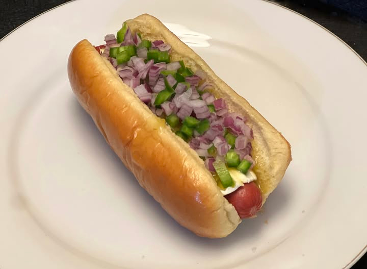

# Denver Hot Dog

*Denver's green-chile hot dog: a grilled frankfurter in a soft bun, smothered in warm Denver-style green chile sauce, topped with chopped red onion, sour cream, and pickled jalapeños. The Mile-High City's hot dog answer to its love of green chile; the traditional Colorado Rockies stadium concourse find.*

**Serves:** 4

**Prep Time:** 15 minutes

**Cook Time:** 30 minutes

## Overview
The Denver hot dog is Colorado's distinctive contribution to the regional hot-dog canon, channelling the city's deep love affair with green chile (Denver and Pueblo both claim the title of the Best Green Chile City in the US, with intense rivalry over which version is traditional): a grilled all-beef frankfurter in a soft white bun, generously smothered in warm Denver-style green chile sauce (a pork-and-roasted-green-chile stew thickened with a touch of flour, distinct from the more brothy New Mexican green chile by the inclusion of ground pork and a heavier garlic-cumin profile), topped with chopped raw red onion, a dollop of sour cream, and a scatter of sliced pickled jalapeños. The sauce should be hot enough that the cold sour cream creates a temperature contrast; the chopped red onion adds sharpness; the jalapeños push the heat further. Sold at Coors Field, Denver concourse stands, and as the "Mile High Dog" at variety of Colorado hot-dog stands.

## Ingredients

### Denver green chile sauce (makes enough for 6-8 dogs)
- 400 g ground pork (or pork shoulder, very finely chopped)
- 500 g roasted Hatch green chillies (or 4 large tins chopped roasted green chiles; or substitute with 6 fresh Anaheim chillies, charred and peeled)
- 1 large onion (chopped)
- 8 garlic cloves (crushed)
- 4 tablespoons vegetable oil
- 3 tablespoons plain flour
- 800 ml chicken stock (or pork stock)
- 1 tablespoon ground cumin
- 1 tablespoon dried oregano
- 1 teaspoon paprika
- 1 teaspoon cayenne (or more, to taste)
- 1 ½ teaspoons fine sea salt
- 1 teaspoon ground black pepper
- 1 tin (400 g) chopped tomatoes (Denver-style includes a small amount of tomato; New Mexico-style omits)

### Dogs and buns
- 4 all-beef frankfurters
- 4 soft hot dog buns
- 1 tablespoon vegetable oil

### Toppings
- 1 small red onion (finely chopped)
- 200 ml sour cream
- 2 fresh jalapeños (sliced thin) OR 100 g pickled jalapeño rings
- Yellow mustard (optional)
- Fresh chopped coriander (optional)

### To serve
- A cold Coors (the Denver beer of record) or a Colorado IPA
- Crinkle fries
- Tortilla chips on the side (for scooping leftover sauce)

## Method

### Stage 1 - Make Denver green chile sauce
1. Heat 2 tablespoons of oil in a heavy pan over medium-high heat.
2. Add ground pork; brown 8 minutes, breaking up.
3. Add chopped onion; cook 6 minutes.
4. Add garlic; 30 seconds.
5. Add remaining 2 tablespoons of oil; sprinkle flour over the mixture and stir 2 minutes (this thickens the sauce).
6. Add chopped roasted green chillies, chopped tomatoes, cumin, oregano, paprika, cayenne, salt, pepper.
7. Pour in chicken stock; bring to simmer.
8. Cook 20-25 minutes till the sauce thickens to a gravy consistency.
9. Taste; adjust salt and heat.

### Stage 2 - Cook the dogs
1. Heat the oil in a grill pan or barbecue.
2. Grill frankfurters 5-6 minutes, turning, till the casing chars in places.

### Stage 3 - Warm the buns
1. Briefly steam buns or toast lightly.

### Stage 4 - Build (Denver-style)
1. Place a grilled dog in each bun.
2. A generous ladle of warm Denver green chile sauce over the dog (the sauce should pool slightly).
3. A heap of chopped red onion.
4. A generous dollop of sour cream.
5. A scatter of jalapeño rounds.
6. Optional: a stripe of yellow mustard; a sprinkle of fresh coriander.

### Stage 5 - Serve immediately
1. With a knife and fork, the sauce makes handheld eating messy.
2. Crinkle fries; cold beer.
3. Tortilla chips for scooping any leftover sauce.

## Notes
- **Denver green chile, not New Mexico-style:** Denver includes ground pork and tomato. New Mexico is brothier and pork-optional.
- **Sour cream + onion + jalapeño:** the traditional garnish trio. Skimping ruins it.
- **Knife and fork:** the sauce demands it.
- **Cayenne adjustable:** Denver chile ranges from mild to scorching. Start moderate, escalate.

## Variations
**Christmas style:** half Denver green chile + half NM red chile sauce on the same dog.
**With shredded cheese:** add grated Monterey Jack or cheddar under the chile sauce.
**Spicier:** double cayenne + fresh chopped serrano chillies.
**Vegetarian green chile:** swap the pork for finely chopped portobello mushrooms; same technique.
**With pulled pork:** add a forkful of pulled pork between the dog and the sauce.

## Serving
At Coors Field during a Rockies game. At a Denver food cart. At home with crinkle fries and a Colorado beer.

## Storage
- Denver green chile refrigerates 5 days; freezes 3 months (better the next day).
- Cooked dogs refrigerate 3 days.
- Don't assemble in advance.
