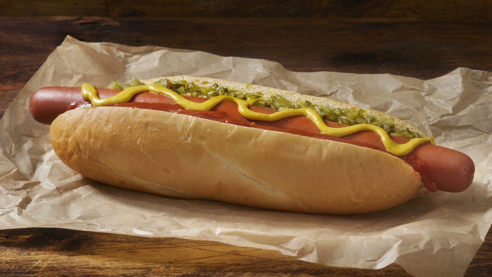

# Dodger Dog

*The Los Angeles Dodgers stadium hot dog: a 10-inch footlong all-pork or beef-and-pork frankfurter, grilled or steamed, in a footlong soft-and-stretchy bun, with yellow mustard, ketchup, chopped raw onion and pickle relish. The Dodger Stadium signature since 1962 and one of America's most-eaten ballpark hot dogs.*

**Serves:** 4

**Prep Time:** 10 minutes

**Cook Time:** 10 minutes

## Overview
The Dodger Dog is the iconic ballpark hot dog of Dodger Stadium in Los Angeles and one of the highest-volume hot dogs in America (approximately 2.5 million Dodger Dogs sold per Dodgers season, more than any other ballpark dog in the country): a 10-inch footlong all-pork or beef-and-pork frankfurter manufactured to the Dodgers' specifications since 1962, served either grilled (the canonical "grilled Dodger Dog" with charcoal scoring on the casing) or steamed, in a soft 10-inch bun engineered to be stretchy enough that the dog can poke out at both ends without tearing the bread. Dressed at the condiment cart with yellow mustard, ketchup, chopped raw white onion, and sweet pickle relish (the four standard ballpark condiments). The dog has its own Spanish-pronunciation variant ("Doyer Dog"), beloved in East LA's Mexican-American community, that swaps in nacho cheese, pickled jalapeños and salsa for the standard toppings. Three details: 10-inch footlong (not standard hot-dog size; this is the structural signature), the dog pokes out both ends of the bun, yellow mustard plus chopped raw onion as the canonical condiment base.

## Ingredients

### Dogs and buns
- 4 footlong (10-inch / 25 cm) all-pork or beef-and-pork frankfurters (Farmer John brand or any quality footlong)
- 4 footlong soft hot dog buns (10-inch length; the buns are deliberately a touch shorter than the dog so it pokes out at both ends)
- 1 tablespoon vegetable oil (for grilling)

### Toppings
- Yellow mustard (Gulden's or French's)
- Ketchup (Heinz)
- 1 medium white onion (chopped very fine)
- 6 tablespoons sweet pickle relish (the standard yellow-green ballpark relish)

### To serve
- Crinkle-cut fries or peanuts
- Cold beer or soda
- A baseball game on the television

## Method

### Stage 1 - Cook the dogs (grilled - the canonical "grilled Dodger Dog")
1. Heat a barbecue or cast-iron grill pan to medium-high.
2. Brush the dogs lightly with vegetable oil.
3. Grill 4-5 minutes per side till the casing scores with deep char marks. Don't burst - just charred grill lines.

### Stage 2 - Alternative: steamed
1. Bring a wide pan of water to a gentle simmer.
2. Add the dogs; warm 6-8 minutes.
3. The steamed version is the standard concourse-stand preparation; the grilled version is the premium "grilled Dodger Dog" sold from the dedicated grill carts at Dodger Stadium.

### Stage 3 - Warm the buns
1. Briefly steam the buns 30 seconds (or wrap in damp paper towel and microwave 15 seconds) till soft and pliable.

### Stage 4 - Build (the canonical Dodger Stadium order)
1. Place a footlong dog in each bun. The dog pokes out at both ends; that's the structural signature.
2. A zigzag of yellow mustard down the length of the dog.
3. A stripe of ketchup down the other side.
4. A heap of chopped raw white onion piled along the dog.
5. A spoonful of sweet pickle relish.

### Stage 5 - Serve
1. With crinkle-cut fries or peanuts.
2. Cold beer.

## Notes
- **Footlong size:** the 10-inch dog is the structural signature. A standard 6-inch dog gives you a different recipe.
- **Dog pokes out the bun:** the bun is deliberately shorter than the dog. Don't try to fix this; it's the look.
- **Grilled vs steamed:** grilled is the premium Dodger Stadium version; steamed is the standard concourse stand. Either is canonical.
- **Yellow mustard, not Dijon:** ballpark mustard only.

## Variations
**Doyer Dog:** the East-LA Mexican-American pronunciation variant. Swap the four standard condiments for nacho cheese sauce, sliced pickled jalapeños, salsa (pico de gallo or salsa roja), and yellow mustard. The dog is the same footlong; the toppings rebuild it as a Mexican-American hot dog.
**With chili:** add a ladle of beef chili and a heap of grated cheddar (the "Chili Cheese Dodger").
**Bacon-wrapped:** wrap each footlong in 2 strips of bacon before grilling.
**Steamed (concourse stand) vs grilled (premium grill cart):** both canonical; pick by your access.

## Serving
At Dodger Stadium during a Dodgers home game (preferred); at home during a televised game; at a Los Angeles-themed gathering. With cold beer and peanuts.

## Storage
- Best fresh.
- Cooked dogs refrigerate 3 days.
- Don't assemble in advance; the bun goes soggy.
