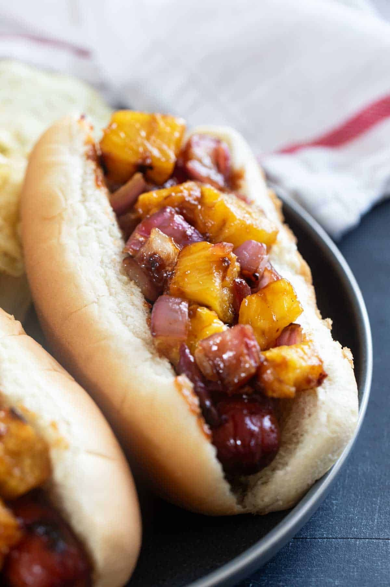

# Hawaiian Hot Dog

*Hawaii's sweet-bread hot dog: a Portuguese sweet sausage (or standard frankfurter) tucked into a King's Hawaiian sweet bread roll with a hole punched through it, drizzled with mango or pineapple fruit sauce, yellow mustard, and chopped Maui onion. The Honolulu street-food specialty; the Hawaiian sweet-bread roll makes the whole thing.*

**Serves:** 4

**Prep Time:** 15 minutes

**Cook Time:** 10 minutes

## Overview
The Hawaiian hot dog is the islands' distinctive take on the American hot dog, built around three Hawaiian food traditions: the King's Hawaiian sweet bread roll (the slightly-sweet egg-and-milk-enriched Portuguese-influenced bread that's become emblematic of Hawaiian baking since being commercialised in the 1960s), the Portuguese sweet sausage (linguiça or a similar spiced pork sausage brought to Hawaii by 19th-century Portuguese immigrant whalers and now made by local Hawaiian sausage companies), and the fresh tropical-fruit sauces that draw on the islands' mango, pineapple and papaya abundance. The dog sits in a sweet-bread roll with a tunnel punched through the centre (the traditional Hawaiian presentation; the bread is denser and sweeter than American buns and structurally holds the dog inside without splitting open). Topped with a drizzle of mango or pineapple sauce (or both), chopped Maui sweet onion (the traditional Hawaiian onion variety), yellow mustard, and a scatter of fresh cilantro or chopped scallion. Sold at Honolulu food carts, beach-side concession stands across Oahu and Maui, and at family parties everywhere on the islands.

## Ingredients

### Bread and dogs
- 4 large King's Hawaiian sweet bread rolls (or substitute with brioche buns; the slight sweetness is essential)
- 4 Portuguese-style sweet sausages OR 4 all-beef frankfurters
- 1 tablespoon vegetable oil

### Mango-pineapple sauce
- 1 ripe mango (peeled, stoned, chopped); or 200 g frozen mango chunks
- 200 g fresh pineapple (chopped); or use canned crushed pineapple
- 2 tablespoons brown sugar
- Juice of 1 lime
- 1 tablespoon rice vinegar (or apple cider vinegar)
- 1 thumb (3 cm) fresh ginger (grated)
- 1 small fresh red chilli (deseeded, finely chopped; optional)
- ½ teaspoon fine sea salt

### Toppings
- 1 Maui sweet onion (chopped); or substitute Vidalia onion or any sweet onion
- Yellow mustard
- Fresh coriander (cilantro) or chopped scallion
- Optional: sliced fresh jalapeño or pickled jalapeño rings

### To serve
- A cold Kona Big Wave or Maui Brewing beer
- Hawaiian-style poi or taro chips on the side
- Tropical fruit (chopped pineapple, papaya) on the plate

## Method

### Stage 1 - Make mango-pineapple sauce
1. Blitz mango, pineapple, brown sugar, lime juice, vinegar, ginger and chilli (if using) in a small saucepan or blender till mostly smooth.
2. Transfer to saucepan if blended in blender.
3. Cook over medium heat 8-10 minutes, stirring, till slightly thickened to a syrupy texture.
4. Stir in salt; cool slightly.

### Stage 2 - Tunnel the bread
1. The classic Hawaiian hot dog uses a roll with a tunnel, not split open like a standard hot dog bun.
2. Take a King's Hawaiian sweet bread roll; with a long thin knife or chopstick, punch a tunnel through the centre of the roll along its long axis.
3. Wiggle the knife/chopstick to widen the tunnel slightly so a dog can slide in.
4. Alternative: split open like a standard bun if you can't find Hawaiian rolls.

### Stage 3 - Cook the dogs
1. Heat the vegetable oil in a wide pan over medium-high heat.
2. If using Portuguese sweet sausages: cook 8-10 minutes, turning, till browned all over and cooked through.
3. If using frankfurters: bring to a gentle simmer in water 5 minutes, OR pan-fry till the casing browns.

### Stage 4 - Warm the bread
1. Briefly warm the tunneled rolls in a dry pan or low oven (60°C) for 2 minutes to soften the bread.

### Stage 5 - Build
1. Slide a warm sausage into the tunnel of each roll (it should fit snugly, pooching out at one or both ends).
2. Drizzle warm mango-pineapple sauce generously over the top of the dog (it should pool on top and drip down the sides).
3. A heap of chopped Maui sweet onion.
4. A zigzag of yellow mustard.
5. A scatter of fresh coriander or scallion.
6. Optional: jalapeño slices for heat.

### Stage 6 - Serve immediately
1. With taro chips or fresh tropical fruit on the side.
2. Cold Hawaiian beer.

## Notes
- **Hawaiian sweet bread:** the structural and flavour signature. The slight sweetness contrasts with the savoury dog.
- **Tunneled, not split:** the traditional Hawaiian presentation.
- **Mango or pineapple sauce, not ketchup:** the tropical fruit IS the traditional Hawaiian condiment.
- **Portuguese sweet sausage > frankfurter:** if you can find it. Linguiça or a sweet Italian-style sausage works as substitute.

## Variations
- **With pulled kalua pork:** swap the dog for shredded kalua pig (Hawaiian slow-roasted pork).
- **With teriyaki sauce:** add a stripe of teriyaki sauce alongside the fruit sauce.
- **With grilled pineapple ring:** add a charred pineapple ring on top.
- **Spicier:** add chopped Hawaiian chillies or Tabasco hot sauce.
- **Sweet-only (no mustard):** push fully tropical with just fruit sauce + onion + coriander.

## Serving
- At a Honolulu food cart on Kalakaua Avenue. At a Maui beach-side luau-themed gathering. At home with poke alongside.

## Storage
- Mango-pineapple sauce refrigerates 1 week; freezes 3 months.
- Cooked dogs refrigerate 3 days.
- Don't assemble in advance.
