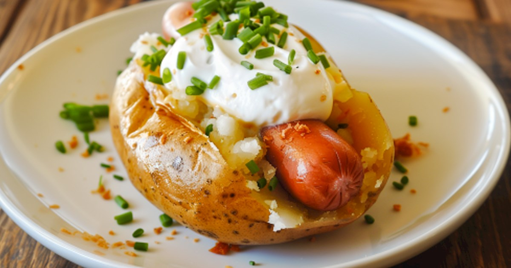

# Idaho Hot Dog

*Idaho's potato-bun hot dog: a hot dog served not in a bread bun but in a baked Idaho potato split open lengthwise, topped with crispy bacon bits, chopped chives, sour cream and shredded cheddar. The Idaho potato-cuisine specialty; a loaded baked potato that happens to contain a hot dog.*

**Serves:** 4

**Prep Time:** 15 minutes

**Cook Time:** 1 hour 20 minutes (mostly potato bake)

## Overview
The Idaho hot dog is the state's distinctive take on the hot dog, leaning hard into Idaho's identity as America's potato state (Idaho produces about a third of all American potatoes, particularly the russet baking potato that bears the state name): the dog isn't in a bread bun at all. Instead, a large russet Idaho baking potato is baked till the skin crisps and the inside fluffs, then split lengthwise (not fully apart, like opening a book), the inside fluffed with a fork, and a hot dog laid into the trough. Topped with crispy bacon bits, chopped chives or spring onion, a generous dollop of sour cream, and a handful of shredded sharp cheddar. The result is a "loaded baked potato with a hot dog inside" rather than a "hot dog with potato toppings". Eat with a knife and fork. Sold at Idaho state fairs, potato-themed restaurants in Boise, and as a regional gimmick across the Mountain West.

## Ingredients

### Potatoes and dogs
- 4 large russet baking potatoes (about 350-400 g each)
- 2 tablespoons vegetable oil
- 2 teaspoons coarse salt (for the potato skin)
- 4 all-beef or pork-and-beef frankfurters

### Toppings
- 200 g streaky bacon (chopped, fried till crispy)
- 1 small bunch chives (chopped); or 4 spring onions (sliced thin)
- 200 ml sour cream
- 200 g shredded sharp cheddar
- 4 tablespoons butter (small pat per potato)
- Salt and ground black pepper
- Optional: chopped fresh dill, chopped pickled jalapeños

### To serve
- Knife and fork (this is eaten plated, not handheld)
- A cold beer or a glass of milk
- Side of pickled vegetables

## Method

### Stage 1 - Bake the potatoes
1. Preheat the oven to 220°C (425°F).
2. Wash and dry the potatoes thoroughly.
3. Prick each potato 6-8 times with a fork (lets steam escape; prevents bursts).
4. Rub each potato with vegetable oil; sprinkle generously with coarse salt.
5. Place directly on the oven rack (no tray; the air circulation around the potato crisps the skin uniformly).
6. Bake 60-75 minutes till the skin is crispy and a knife slides in without resistance.

### Stage 2 - Fry the bacon
1. While the potatoes bake: cut bacon into 5mm pieces.
2. Fry in a dry pan over medium heat 6-8 minutes till deeply crispy.
3. Drain on paper towels.

### Stage 3 - Cook the dogs
1. Bring a pan of water to a simmer.
2. Add frankfurters; warm 5-6 minutes.
3. (Or grill / pan-fry briefly for char marks.)

### Stage 4 - Split and fluff potatoes
1. Take each baked potato out of the oven.
2. With a sharp knife, slice lengthwise through the top but not all the way through (cut about three-quarters of the way down; the potato should open like a book).
3. Squeeze the ends gently to push the cut open and expose the inside.
4. Fluff the inside with a fork, breaking up the cooked flesh.
5. Add a small pat of butter; let it melt in.
6. Salt and pepper the inside.

### Stage 5 - Build
1. Lay a warm hot dog along the length of the opened potato (the dog sits in the trough you've just created).
2. Sprinkle shredded cheddar over the dog and the surrounding fluffed potato (the warmth melts it).
3. A generous dollop of sour cream on top.
4. A heap of crispy bacon bits.
5. A scatter of chopped chives or spring onion.
6. Optional: chopped dill, pickled jalapeños.

### Stage 6 - Serve immediately
1. Plate with a knife and fork; this is not a handheld dish.
2. Cold beer or a glass of milk.

## Notes
- **Large russet potato:** not a small or waxy potato. The russet's starchy fluffy interior is essential for the proper "bed for the dog" texture.
- **Bake the skin crispy:** don't microwave. The crispy skin is structural.
- **Knife-and-fork dish:** treat as a loaded baked potato, not a hot dog.
- **Full topping set:** the bacon + chives + sour cream + cheddar combo is what makes it Idaho-style. Skimping ruins it.

## Variations
- **With chili:** ladle beef chili over the dog before adding the toppings.
- **With broccoli-cheddar:** add steamed broccoli florets to the topping pile.
- **With sweet potato:** swap the russet for a sweet potato; gives a slightly sweeter base.
- **Vegetarian:** swap the dog for a Beyond Sausage or a grilled portobello strip; or just skip the dog and double the bacon.
- **With BBQ pulled pork:** swap the dog for pulled pork.

## Serving
- At an Idaho state fair. At a Boise potato-themed restaurant. At home as a "loaded baked potato dinner that includes a hot dog."

## Storage
- Baked potatoes refrigerate 4 days; reheat in oven 15 minutes at 180°C.
- Cooked dogs refrigerate 3 days.
- Fried bacon refrigerates 5 days; reheat briefly to re-crisp.
- Don't assemble in advance.
