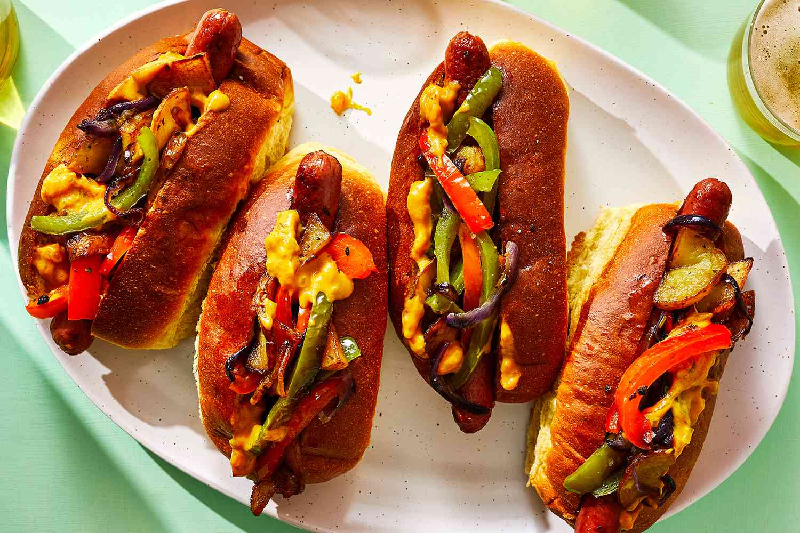

# Italian Hot Dog (Newark Style)

*Newark's deep-fried hot dog in pizza bread: a fried natural-casing dog tucked into hollowed Italian pizza bread with fried potatoes, peppers and onions, and a stripe of mustard.*

**Serves:** 4

**Prep Time:** 25 minutes

**Cook Time:** 25 minutes

## Overview
The Italian hot dog is a Newark, New Jersey, Italian-American invention dating from 1932 (Jimmy Buff's, founded by James "Jimmy Buff" Racioppi on Newark's First Avenue, is the canonical originator and still operates today): a deep-fried natural-casing all-beef hot dog tucked into a hollowed-out half of round Italian pizza bread (also called pizza bread or pizza-roll bread - a fluffy round 20cm flat bread, halved through the middle and the soft inside scooped out to make a pocket). Layered with deep-fried sliced potatoes (the canonical Newark Italian dog has fried potatoes inside, not French fries beside), deep-fried sliced bell peppers (red and green), deep-fried sliced onions, and a stripe of yellow mustard or ketchup. The bread is meant to absorb the oils from the fried fillings, becoming richly saturated. Sold at Jimmy Buff's, Tommy's, Charlie's Famous and the few other surviving Newark-area Italian-hot-dog stands.

## Ingredients

### Dogs and bread
- 4 large natural-casing all-beef hot dogs (or 8 standard-size for an "all the way" two-dog version)
- 2 rounds Italian pizza bread (about 20cm wide, 4cm thick), halved through the middle (giving 4 pocket-shells)
- Or substitute: 4 half-rounds of soft Italian focaccia, similar size, hollowed out

### Deep-fried fillings
- 2 medium potatoes (peeled, sliced 5mm thick, then halved into half-moons)
- 1 green bell pepper (sliced)
- 1 red bell pepper (sliced)
- 1 large onion (sliced into half-moons)
- Vegetable oil for deep-frying (about 1.5 litres)

### Build
- 4 tablespoons yellow mustard
- 4 tablespoons ketchup (optional)
- Salt
- Black pepper

### To serve
- Cold beer (Newark style: Pabst or Schaefer)
- A side of pickled hot peppers (peperoncini) on the side
- Napkins (a lot of them)

## Method

### Stage 1 - Prep ingredients
1. Slice all the vegetables; pat dry with paper towels (wet vegetables splatter when fried).
2. Hollow out the bread: halve each round through the middle, then scoop out the soft white interior from each half to create a deep pocket. (Save the scooped bread for breadcrumbs.)

### Stage 2 - Heat oil
1. Heat oil to 180°C (360°F) in a deep heavy pot.

### Stage 3 - Fry potatoes
1. Fry potato slices 4-5 minutes till deep golden and crisp.
2. Drain on paper towels; salt immediately.

### Stage 4 - Fry peppers and onions
1. Lower the oil temperature slightly to 170°C.
2. Fry peppers 3 minutes till softened and lightly charred at edges; drain.
3. Fry onions 3 minutes till translucent and slightly browned; drain.
4. Salt and pepper.

### Stage 5 - Fry hot dogs
1. Raise oil back to 180°C.
2. Lower hot dogs into the oil.
3. Fry 3-4 minutes till the casing crisps and slightly bubbles. The dogs should be deeply browned with the natural casing splitting slightly.
4. Drain.

### Stage 6 - Build the Italian hot dog
1. Take a hollowed-out half-round of pizza bread.
2. Stand or hold it cut-side-up to fill the pocket.
3. Layer in: a fried hot dog (or two, for "all the way" double-dog version) along the bottom; a heap of fried potatoes; a heap of fried peppers; a heap of fried onions.
4. A zigzag of yellow mustard.
5. (Optional: ketchup, but Jimmy Buff's serves it without - the mustard is canonical.)

### Stage 7 - Serve immediately
1. Hand it over hot, with lots of napkins.
2. Pickled peperoncini on the side.
3. Cold beer.

## Notes
- **Round Italian pizza bread, hollowed:** the structural signature. Substituting a standard sub roll changes the dish.
- **Everything deep-fried:** dogs AND potatoes AND peppers AND onions. The bread absorbs the cumulative oil.
- **Newark-style mustard, not ketchup:** Jimmy Buff's mustard-only.
- **Eat with two hands and many napkins:** structural.

## Variations
**With sausage:** swap the hot dog for a fried Italian sausage (sweet or hot).
**Combo:** one hot dog AND one sausage in the same pocket.
**With prosciutto:** add a slice of prosciutto inside (less canonical but excellent).
**With hot peppers in the build:** add chopped pickled cherry peppers inside.
**Cheesesteak-Italian crossover:** add provolone melted over the fillings before topping with the dog.

## Serving
At Jimmy Buff's, Tommy's or Charlie's Famous in Newark. At a North Jersey lunch counter. At home with cold beer.

## Storage
- Best immediately while everything is crisp.
- Fried fillings refrigerate 2 days; reheat in a hot oven (200°C) for 5 minutes to re-crisp.
- Don't store assembled.
