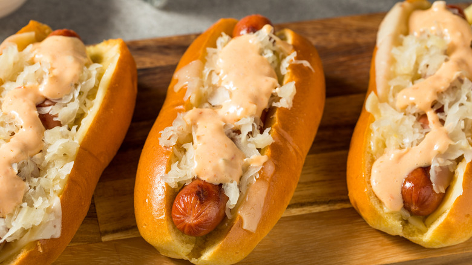

# Kansas City Hot Dog

*Kansas City's Reuben-style hot dog: an all-beef natural-casing frankfurter in a sesame-seed bun, topped with a heap of warm sauerkraut and melted Swiss cheese, with a zigzag of brown mustard or thousand-island dressing. The Kansas City riff on the German-Jewish deli flavour combination, scaled for ballpark and BBQ-joint snacking.*

**Serves:** 4

**Prep Time:** 10 minutes

**Cook Time:** 15 minutes

## Overview
The Kansas City hot dog is the city's distinctive contribution to the regional-hot-dog canon and a Reuben-sandwich-flavoured riff on the standard frankfurter: an all-beef natural-casing dog (Kansas City's strong beef supply makes all-beef the default), in a sesame seed bun (the canonical KC bun, distinct from the plain or poppy-seed buns of other cities), topped with a generous heap of warm sauerkraut, slices of melted Swiss cheese, and a zigzag of either spicy brown mustard or thousand-island dressing (the latter pushes it fully Reuben-direction). The dog channels the same flavour logic as the Reuben sandwich (corned beef + kraut + Swiss + Russian dressing on rye), with the hot dog standing in for the corned beef and the sesame bun standing in for the rye. Sold across Kansas City BBQ joints, Royals games at Kauffman Stadium, and the city's German-Czech-influenced delis. Three details: sesame seed bun (the visual signature), Swiss cheese melted by the warm sauerkraut, brown mustard or thousand-island (not yellow).

## Ingredients

### Dogs and buns
- 4 all-beef natural-casing frankfurters
- 4 sesame seed hot dog buns
- 2 tablespoons butter (for toasting buns)

### Warm sauerkraut
- 400 g sauerkraut (drained well, squeezed gently)
- 2 tablespoons butter
- 1 small onion (finely chopped)
- 1 teaspoon caraway seeds
- ½ teaspoon ground black pepper

### Cheese
- 4 slices Swiss cheese (Emmenthal or Gruyère also work)

### Toppings
- Spicy brown mustard (Gulden's)
- Thousand-island dressing (homemade or store-bought; optional alternative to mustard)

### Optional Reuben add-ons (full Reuben-dog mode)
- 4 tablespoons thousand-island dressing
- Chopped fresh chives
- Caraway seeds for sprinkling

### To serve
- Crinkle-cut fries
- A cold Boulevard wheat beer (the Kansas City beer)
- Dill pickle spears

## Method

### Stage 1 - Prep sauerkraut
1. Drain sauerkraut in a sieve; gently squeeze out excess liquid (don't over-squeeze; some moisture stays).
2. Melt butter in a small pan over medium heat.
3. Add chopped onion; cook 5 minutes till soft.
4. Add drained sauerkraut, caraway seeds, pepper.
5. Warm through 6-8 minutes.
6. Keep warm.

### Stage 2 - Cook the dogs
1. Bring a pan of water to a gentle simmer.
2. Add frankfurters; warm 5-6 minutes.
3. Or grill briefly over a hot pan for char marks.

### Stage 3 - Toast the buns
1. Butter the bun cut sides.
2. Toast cut-side-down in a wide pan 90 seconds till golden.

### Stage 4 - Build (Kansas City order)
1. Place a warm dog in each toasted bun.
2. A slice of Swiss cheese laid over the dog.
3. A generous heap of warm sauerkraut on top (the heat melts the cheese).
4. A zigzag of spicy brown mustard.
5. (Or: a zigzag of thousand-island for the full Reuben-dog mode; some KC stands use both.)

### Stage 5 - Serve immediately
1. With crinkle fries and a cold beer.
2. Pickle spear on the side.

## Notes
- **Sesame seed bun:** the KC visual signature.
- **Swiss cheese over the dog, sauerkraut on top:** so the cheese melts under the warm kraut.
- **Brown mustard or thousand-island:** never yellow.
- **Caraway in the sauerkraut:** the German-Czech accent.

## Variations
**Full Reuben Dog:** swap the sauerkraut for chopped pastrami + sauerkraut + Swiss + thousand-island. Same idea, beefier.
**With smoked sausage:** swap the hot dog for KC-style smoked sausage (a thicker beef-pork blend).
**Spicier:** add a teaspoon of caraway-spiced brown mustard mixed with horseradish.
**Cheese melted under the broiler:** for extra-melty.

## Serving
At Kauffman Stadium during a Royals game. At a Kansas City BBQ joint as the secondary order alongside burnt ends. At home with fries and beer.

## Storage
- Warmed sauerkraut refrigerates 5 days; freezes 2 months.
- Cooked dogs refrigerate 3 days.
- Don't assemble in advance.
