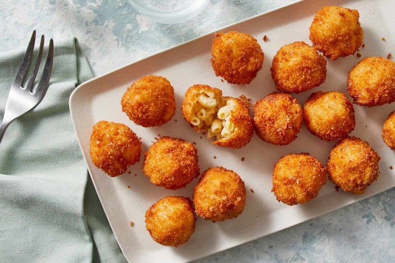

# Mac 'n' Cheese Bites

*Bar-snack fritter: cold leftover mac-and-cheese cubed, dredged in seasoned breadcrumbs and deep-fried till the shell shatters and the inside oozes.*

**Serves:** Makes 24 bites (serves 4-6 as a snack)

**Prep Time:** 30 minutes (plus 4 hours chilling)

**Cook Time:** 20 minutes (in batches)

## Overview
Make a stiff mac-and-cheese - sharp cheddar, parmesan, a touch of mustard, just enough béchamel to bind, no more. Spread in a parchment-lined 20×20 cm tin; level; chill 4+ hours till firm. Lift out; cut into 3 cm cubes. Each cube dips in flour → egg → seasoned panko. Deep-fries 2-3 minutes at 175°C until amber-gold. Drains briefly. Eats hot with ranch or chipotle mayo.

## Ingredients

### Mac and cheese
- 300 g macaroni
- 50 g unsalted butter
- 40 g plain flour
- 500 ml whole milk (warm)
- 250 g mature cheddar (grated)
- 50 g parmesan (finely grated)
- 1 teaspoon Dijon mustard
- ½ teaspoon ground white pepper
- ½ teaspoon salt
- ¼ teaspoon ground nutmeg

### Breading
- 100 g plain flour
- 2 large eggs (beaten with 2 tablespoons milk)
- 200 g panko breadcrumbs
- 1 teaspoon paprika
- 1 teaspoon garlic powder
- ½ teaspoon salt

### Frying
- 800 ml neutral oil

### To serve
- Ranch dressing or chipotle mayonnaise
- Hot sauce

## Method

### Stage 1 - Make the mac
1. Cook macaroni 1 minute LESS than the packet says (it'll cook more during frying).
1. Drain; rinse cold; toss with a tiny drizzle of oil so it doesn't clump.

### Stage 2 - Cheese sauce
1. Melt the butter in a saucepan over medium heat; whisk in the flour; cook 1 minute (roux).
1. Slowly whisk in warm milk; bring to a simmer; cook 3 minutes till thickened.
1. Off heat; whisk in both cheeses, mustard, white pepper, salt and nutmeg.
1. Fold in the macaroni until uniformly coated.

### Stage 3 - Chill
1. Tip into a parchment-lined 20 × 20 cm tin; level the surface with a spatula.
1. Cover; chill at least 4 hours (overnight is better - the mac firms enough to cut clean).

### Stage 4 - Cut
1. Lift out using the parchment.
1. Cut into 3 cm cubes (you should get 24).

### Stage 5 - Bread
1. Set up three plates: flour; beaten egg + milk; panko mixed with paprika, garlic powder and salt.
1. Dredge each cube in flour, dip in egg, roll in panko, pressing to coat.
1. For extra crisp: double-bread (back into egg + panko a second time).

### Stage 6 - Fry
1. Heat oil to 175°C.
1. Lower 6-8 bites at a time; fry 2-3 minutes till deep amber-gold.
1. Lift onto a wire rack.

### Stage 7 - Serve
1. Pile in a basket with parchment.
1. Provide ranch or chipotle mayo for dipping, plus hot sauce on the side.

## Notes
- **Make the mac FIRM:** too saucy = cubes that fall apart. Use just enough béchamel to bind; don't make it creamy. Cold-firmed mac slices clean.
- **Chill at least 4 hours:** under-chilled mac collapses during breading. Overnight is the sweet spot.
- **Hot oil:** 175°C minimum. Cool oil = greasy, mushy bites.
- **Double-bread for the bar version:** the iconic thick crunch on bar mac-bites comes from two coats of breadcrumbs.

## Storage
- Best within 15 minutes of frying.
- Pre-breaded cubes freeze 2 months; fry from frozen +1 minute.
- Cooked bites reheat in a 200°C oven 5 minutes; never microwave.
