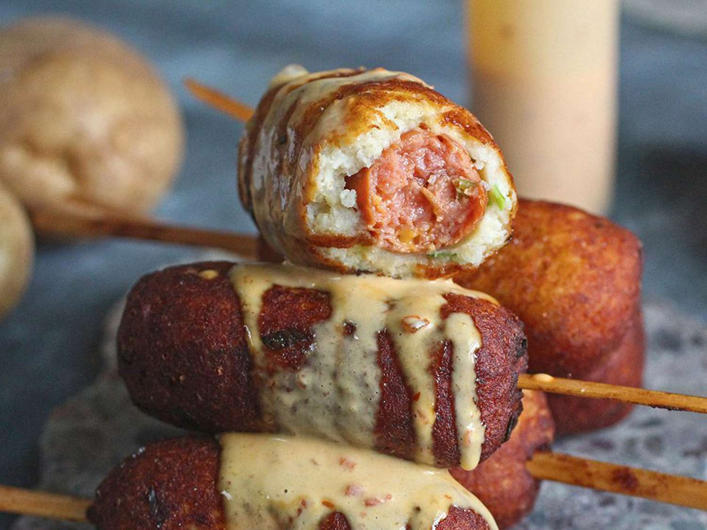

# Potato Dog

*The flat-top-grill hot dog: a steamed or grilled frankfurter in a soft bun, topped with deep-fried sliced potatoes, fried sweet bell peppers, fried onions, and yellow mustard. The diner-counter and food-truck classic; the simpler cousin of the Newark Italian hot dog without the deep-fried bread vessel.*

**Serves:** 4

**Prep Time:** 20 minutes

**Cook Time:** 20 minutes

## Overview
The potato dog is the American diner-counter and roadside food-truck answer to the more elaborate Newark Italian hot dog (see [Italian hot dog](italian-hot-dog.md) for the New Jersey deep-fried-everything version): a standard hot dog in a standard soft bun, but the toppings get the Italian-American deep-fried-vegetables treatment. Sliced waxy potatoes, sliced bell peppers, and sliced onions all cooked together on a flat-top griddle or in a deep pan with oil till the potatoes crisp and the vegetables caramelise, then piled generously on top of the dog. The look is a tower of fried vegetables; the eating involves a fork to manage the overflow. Found at New Jersey-adjacent diners, Pennsylvania mining-town lunch counters, and food trucks that emphasise the working-class hot-dog tradition.

## Ingredients

### Dogs and buns
- 4 all-beef or pork-and-beef frankfurters
- 4 soft hot dog buns
- 2 tablespoons butter (for toasting buns; optional)
- 1 tablespoon vegetable oil

### Fried potato-pepper-onion
- 3 medium waxy potatoes (peeled, sliced 5mm thick, then halved into half-moons)
- 1 green bell pepper (sliced thin)
- 1 red bell pepper (sliced thin)
- 1 large onion (sliced into half-moons)
- 4 garlic cloves (crushed; optional)
- 4 tablespoons vegetable oil (for the flat-top)
- 1 teaspoon paprika
- 1 ½ teaspoons fine sea salt
- 1 teaspoon ground black pepper
- 1 teaspoon dried oregano

### Toppings
- Yellow mustard
- Ketchup (optional)
- Sliced pickled hot peppers (optional)

### To serve
- Cold beer or soda
- Crinkle fries (yes, even with the potato topping, double-potato is fine)

## Method

### Stage 1 - Par-cook the potatoes
1. Bring a pan of salted water to the boil.
2. Add potato slices; boil 4-5 minutes till they're tender but still firm.
3. Drain VERY thoroughly; pat dry with paper towels (wet potato won't crisp).

### Stage 2 - Fry potatoes till crispy
1. Heat 3 tablespoons of oil in a wide pan or flat-top griddle over medium-high heat.
2. Add the par-cooked potato slices; spread in a single layer.
3. Fry 3-4 minutes per side till deeply golden and crispy at the edges.
4. Sprinkle with paprika, salt and pepper.

### Stage 3 - Add peppers and onions
1. Push the potatoes to one side of the pan.
2. Add remaining tablespoon of oil; add sliced peppers and onions.
3. Cook 6-8 minutes till the vegetables soften and lightly char at the edges.
4. Add garlic (if using); cook 30 seconds.
5. Sprinkle with oregano.
6. Toss everything together; keep warm.

### Stage 4 - Cook the dogs
1. Bring a pan of water to a gentle simmer.
2. Add frankfurters; warm 5-6 minutes.
3. Or grill on the flat-top alongside the vegetables for char marks.

### Stage 5 - Toast the buns
1. Briefly toast the bun cut sides on the flat-top (15 seconds) or in a separate pan with butter.

### Stage 6 - Build
1. Place a dog in each bun.
2. A heap of the fried potato-pepper-onion mixture on top of the dog (be generous; the tower IS the point).
3. A zigzag of yellow mustard.
4. Optional: ketchup, pickled hot peppers.

### Stage 7 - Serve immediately
1. With a fork standing by, the overflow is real.
2. Cold beer.

## Notes
- **Par-boil then fry:** raw potato in the topping pile gives the wrong texture. Par-boiling first cooks the inside; frying crisps the outside.
- **Bell peppers + onions trio:** potato alone is bland. The three together give the proper Italian-American diner flavour.
- **Pile high:** the tower of fried vegetables IS the dish.

## Variations
- **With Italian sausage:** swap the hot dog for a sliced fried Italian sausage.
- **With cheese:** add a slice of melty provolone or American cheese under the topping.
- **With chopped hot peppers:** add chopped pickled cherry peppers for heat.
- **Vegetarian:** swap the dog for a grilled portobello strip or a fried halloumi finger.
- **With chili:** add a ladle of beef chili under the potato mixture for a chili-potato hybrid.

## Serving
- At a New Jersey diner. At a Pennsylvania food truck. At home with cold beer.

## Storage
- Potato-pepper-onion mixture refrigerates 3 days; reheat in a hot pan or oven to re-crisp.
- Cooked dogs refrigerate 3 days.
- Don't assemble in advance.
