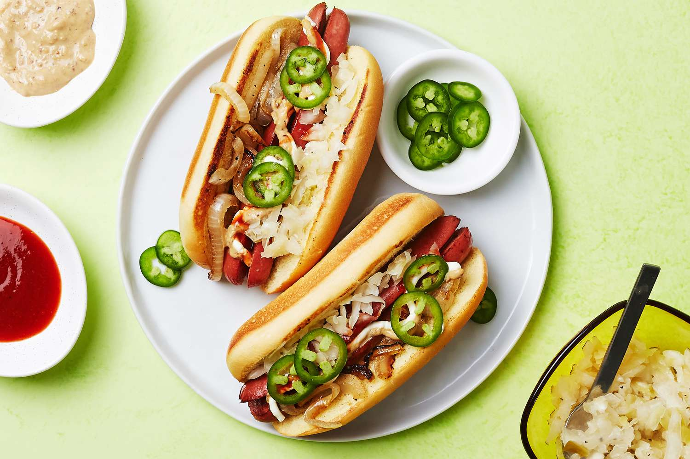

# Seattle Hot Dog

*Seattle's distinctive cream-cheese hot dog: a grilled bratwurst (or all-beef frankfurter) in a toasted bun, smeared with a generous layer of cream cheese, topped with caramelised onions, sliced raw jalapeños, chopped raw cabbage and a drizzle of sriracha. The Pioneer Square late-night street-cart classic; the Pacific Northwest's quietly weird answer to the hot dog.*

**Serves:** 4

**Prep Time:** 15 minutes

**Cook Time:** 15 minutes

## Overview
The Seattle hot dog (also called the "Seattle Dog" or "Dave's Dog" after street vendor Dave's Dawgs in the 1990s) is the Pacific Northwest's distinctive contribution to the regional-hot-dog canon and a fixture of Seattle late-night street food, particularly around Pioneer Square, Capitol Hill and after Mariners games at T-Mobile Park: a grilled bratwurst or all-beef frankfurter (Seattle vendors tend to use a thicker brat-style sausage rather than a slender frankfurter) on a toasted bun, with the defining ingredient that polarises everyone outside the region — a thick smear of softened cream cheese on the bun before the dog goes in. Topped with caramelised onions (slowly cooked on the cart's flat-top), sliced raw jalapeños, chopped raw cabbage (the Seattle take on slaw — just raw cabbage, no dressing), and a zigzag of sriracha hot sauce. Locals call it a love-it-or-hate-it situation; everyone tries it at least once. Three details: cream cheese (essential signature), bratwurst or chunky beef dog (not a slender frankfurter), raw cabbage (not slaw).

## Ingredients

### The dog and bun
- 4 bratwurst sausages or chunky all-beef frankfurters
- 4 hot dog buns (sturdy, slightly larger than standard)
- 2 tablespoons butter (for toasting buns)
- 1 tablespoon vegetable oil

### Caramelised onions
- 2 large yellow onions (thinly sliced)
- 2 tablespoons butter
- 1 tablespoon olive oil
- 1 teaspoon brown sugar
- 1 teaspoon fine sea salt

### Toppings
- 200 g cream cheese (softened to room temp; spreadable)
- 2 fresh jalapeños (thinly sliced into rounds)
- 200 g raw green cabbage (finely shredded)
- Sriracha hot sauce
- Optional: chopped fresh chives

### To serve
- Local IPA or pale ale
- Kettle chips

## Method

### Stage 1 - Caramelise onions (start first; takes longest)
1. Melt butter with olive oil in a wide pan over medium-low heat.
2. Add sliced onions, brown sugar and salt.
3. Cook slow, stirring occasionally, 25-30 minutes till deeply golden and soft.
4. If they start to catch, add a tablespoon of water and reduce heat.
5. Keep warm.

### Stage 2 - Cook the sausages
1. Heat the vegetable oil in a wide pan over medium-high heat.
2. Cook the bratwursts 8-10 minutes, turning, till browned all over and cooked through (internal temp 72°C / 160°F).
3. Or grill them over medium-high heat for the same time.

### Stage 3 - Toast the buns
1. Spread soft butter on the bun cut sides.
2. Toast cut-side-down in a wide pan 90 seconds till golden.

### Stage 4 - Build the dogs
1. Open the toasted bun.
2. Spread a thick generous layer of softened cream cheese on both halves (about 2 tablespoons per dog).
3. Place the cooked bratwurst in the bun.
4. A heap of warm caramelised onions on top.
5. A row of jalapeño rounds.
6. A generous heap of shredded raw cabbage.
7. A zigzag of sriracha.
8. Optional: a sprinkle of chives.

### Stage 5 - Serve immediately
1. Eat while the dog is warm and the cream cheese is melty against the heat.
2. With kettle chips and a cold IPA.

## Notes
- **Cream cheese softened at room temperature:** straight from the fridge it won't spread.
- **Bratwurst or chunky dog:** the bigger sausage works against the substantial cream cheese smear.
- **Raw cabbage, not slaw:** just shredded cabbage, no dressing — keeps the bite fresh-crunchy.
- **Caramelise the onions slow:** the sweetness is what makes the whole thing work against the savoury cream cheese.

## Variations
**Chicken-sausage Seattle dog:** swap the bratwurst for a chicken-apple sausage for a lighter version.
**With smoked salmon:** add a slice of smoked salmon on top of the cream cheese (the Pacific NW lean).
**With pickled jalapeños:** instead of raw, for less heat.
**With everything bagel seasoning:** sprinkle over the cream cheese for crossover energy.
**Spicier:** double the jalapeños + extra sriracha.

## Serving
At a Seattle street cart after a Mariners game. At home with kettle chips and an IPA. At a backyard barbecue as the conversation starter.

## Storage
- Best fresh.
- Cream cheese keeps refrigerated 2 weeks.
- Caramelised onions keep refrigerated 1 week; freeze 3 months.
- Cooked sausages refrigerate 3 days.
