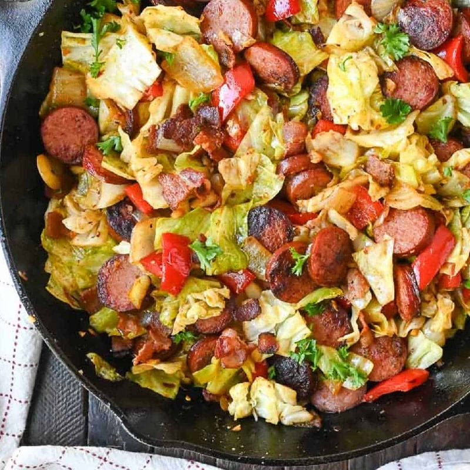

# Southern Fried Cabbage and Sausage

*A one-skillet Southern weeknight: andouille or kielbasa browned in butter, then cabbage joins in two stages with apple cider vinegar, brown sugar and Cajun seasoning. Eats as a side or as a main over rice.*

**Serves:** 4-6

**Prep Time:** 10 minutes

**Cook Time:** 20 minutes

## Overview
A lighter, faster Southern cabbage dish than its heavier bacon-laden sibling: thirty minutes start to finish, one skillet, a side or a main. The cabbage is the centre of attention here rather than the meat. The small technical move is the two-stage cabbage cook: half goes in first under a lid and steams down, the rest joins uncovered to keep its bite, so the finished dish has two textures (soft tender pieces and slightly crisp pieces) rather than uniform mush. Brown sugar cuts the bitter edge that long-cooked cabbage develops; apple cider vinegar brightens the rich fat; Cajun seasoning brings warmth and a small nutmeg pinch deepens it without being identifiable. Andouille or kielbasa rounds provide the smoke and the salt. A Southern home-cooking standard from the Carolinas through Texas where cabbage is a year-round cheap vegetable and smoked sausage is in every fridge; family-specific variants are everywhere but the brown-sugar-and-vinegar balance is the constant.

## Ingredients

- 3 tablespoons unsalted butter (or bacon grease / duck fat)
- 340 g pre-cooked andouille (or kielbasa, sliced into rounds)
- 1 cup chopped yellow onion
- 4 garlic cloves (minced)
- 2 teaspoons brown sugar
- 1 medium head green cabbage (about 900 g, chopped)
- 2 tablespoons apple cider vinegar
- 2 teaspoons Creole Cajun seasoning
- ¼ teaspoon ground nutmeg
- ½ teaspoon crushed red pepper flakes (optional)
- Fresh chopped parsley, to garnish

## Method

### Stage 1 - Sausage
1. Melt the butter in a large skillet over medium heat.
1. Add the sausage rounds; brown 3-5 minutes per side.
1. Transfer to a plate.

### Stage 2 - Aromatics
1. Sauté the onion in the same pan 2-3 minutes until translucent.
1. Add the garlic; cook 1-2 minutes until fragrant.

### Stage 3 - Sweet edge
1. Stir in the brown sugar; cook until dissolved.

### Stage 4 - Cabbage
1. Add half the chopped cabbage with the vinegar.
1. Cover; steam 3-4 minutes.
1. Add the remaining cabbage; continue cooking uncovered 3-4 minutes.

### Stage 5 - Combine and finish
1. Return the sausage to the pan.
1. Add the Cajun seasoning, nutmeg and optional red pepper flakes.
1. Cook 3-5 minutes more, stirring, until everything is tender and the seasoning is even.
1. Taste; adjust salt.

### Stage 6 - Serve
1. Plate hot; garnish with parsley.
1. Serve as a side, or over rice as a main.

## Notes
- **Brown sugar tames the cabbage:** a small amount cuts the bitter edge that long-cooked cabbage develops. Skip for Keto / Whole 30.
- **Apple cider vinegar is the brightness:** balances the rich fats. Skip and the dish reads as flat.
- **Cabbage doneness is preference:** 8-10 minutes total gives a soft, deeply-cooked texture. 5-6 keeps the bite.

## Storage
- Keeps 4 days refrigerated; reheats well in the microwave or a pan.
- Doesn't freeze well, cabbage texture suffers.
