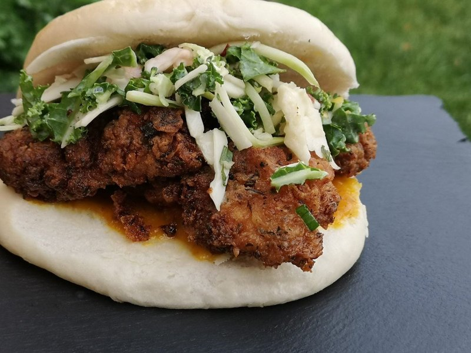

# Spicy Coconut Fried Chicken Sandwich

*Caribbean-inspired fried chicken sandwich by Chef Winslow. Thighs marinate in coconut milk and minced Scotch bonnet, then fry crisp in a seasoned self-rising flour. Mango-Scotch-bonnet sauce on the bun; coleslaw dressed with more coconut milk and vinegar. Served on Jamaican coco bread.*

**Serves:** 3

**Prep Time:** 45 minutes (plus 30 minutes marinating)

**Cook Time:** 30 minutes

## Overview
A Caribbean reimagining of the American fried chicken sandwich, by Chef Winslow: every part of the sandwich carries coconut in some form, and Scotch bonnet runs through the whole thing as the heat carrier. The chicken thighs marinate in coconut milk and minced Scotch bonnet (the coconut tenderises and mellows, the Scotch bonnet penetrates fierce); the coleslaw is dressed not with mayo but with coconut milk and vinegar (lighter, brighter than a classic slaw); and the bun is Jamaican coco bread, which is a soft enriched bread made with coconut milk in the dough, slightly sweet and pillowy. Mango-Scotch-bonnet sauce on the bun is the fourth coconut-and-bonnet ladle. The flavour is unmistakably Caribbean rather than American Southern, sweet, hot, layered, with the coconut mellowness softening what would otherwise be a punishing heat. Smell is coconut milk hitting hot oil. Not difficult; the timing matters because the slaw wants to chill while the chicken marinates and fries. A modern Black-American chef creation from the 2010s-2020s rebooting the fried chicken sandwich format around Caribbean roots, and one of the cleaner examples of how that tradition has expanded the format.

## Ingredients

### Chicken and marinade
- 450 g boneless skinless chicken thighs
- 240 ml coconut milk
- 1 ½ tablespoons minced Scotch bonnet
- 2 tablespoons Citrus-and-Herb (or Greens-and-Garlic Caribbean seasoning)

### Flour dredge
- 2 cups self-rising flour
- 2 tablespoons Citrus-and-Herb (or Greens-and-Garlic Caribbean seasoning)
- Oil for deep-frying

### Coleslaw
- 2 heaping cups coleslaw mix (white + red cabbage + carrot)
- 120 ml coconut milk
- 1 tablespoon white vinegar
- ½ tablespoon Caribbean seasoning

### To build
- 3 Jamaican coco bread
- 3 tablespoons mango-Scotch-bonnet sauce
- 1 tablespoon brown sugar (optional, in the slaw)

## Method

### Stage 1 - Marinate
1. In a bowl combine the chicken with the coconut milk, minced Scotch bonnet and 2 tablespoons seasoning.
1. Toss; refrigerate 30-45 minutes.

### Stage 2 - Coleslaw
1. Whisk together the coconut milk, vinegar and seasoning.
1. Toss with the coleslaw mix.
1. Refrigerate while the chicken cooks.

### Stage 3 - Fry
1. Combine the self-rising flour with 2 tablespoons of the seasoning in a shallow bowl.
1. Heat the frying oil to 175°C / 350°F.
1. Lift each chicken thigh from the marinade; shake off excess; coat thoroughly in the seasoned flour.
1. Fry 5-7 minutes until deep golden and 75°C internal.
1. Drain on paper towels.

### Stage 4 - Assemble
1. Warm the coco bread.
1. Spread mango-Scotch-bonnet sauce on each.
1. Layer in the fried chicken; pile on the coleslaw.
1. Serve immediately.

## Notes
- **Coco bread is essential:** Jamaican coco bread is soft and slightly sweet from coconut milk in the dough. Brioche substitutes; supermarket buns don't.
- **Branded seasoning:** Brawta Caribbean's branded seasonings are what Chef Winslow uses. Standard Jamaican curry powder + jerk seasoning is the substitute.

## Storage
- Fried chicken keeps 2 days refrigerated; reheat in a hot oven, not the microwave.
- Build sandwiches to order.
