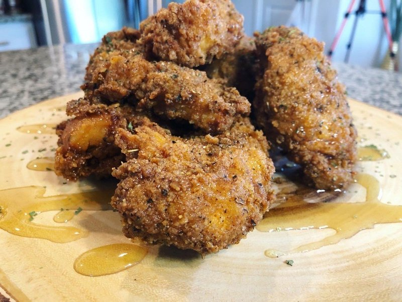

# Super-Crunch Chicken Tenders with d'Ussé Honey Sauce

*A competition-winning fried tender: chicken marinated in Buffalo-and-hot-sauce, dredged in clumpy seasoned flour and fried golden. Drizzled with cognac honey.*

**Serves:** 4

**Prep Time:** 30 minutes

**Cook Time:** 45 minutes

## Overview
A competition-winning fried tender from chef Jessica Fulks where everything is built around a single textural trick: the dredge is intentionally lumpy, made by drizzling a small amount of buffalo-sauce marinade into the seasoned flour so it forms small craggy clumps the tenders pick up when coated. Those clumps fry up into a deeply uneven, shatter-crispy crust that you simply cannot get from a smooth flour dredge, this is the same technique Korean fried chicken uses, and it's the technique fast-food chains can't replicate at scale. Underneath, the chicken stays juicy because it brined briefly in a high-acid hot-sauce mix. The flour itself is heavily seasoned (salt, cracked pepper, garlic powder, cayenne, paprika, dried basil) so flavour penetrates every craggy edge. The honey-D'ussé sauce on top is the unexpected finish: warm honey thinned with cognac (D'ussé is the spec, but any cognac or brandy works), drizzled over the warm tenders so the alcohol carries the honey deep into the crevices. Smell is fried chicken with a faint burnt-sugar-and-spirits lift. Not hard but the clumpy-flour move is critical; smooth your dredge and you have ordinary tenders. A modern Black-American chef creation that's spread across the chef-driven fried chicken scene of the late 2010s and early 2020s.

## Ingredients

- 12 chicken tenders
- 24 ml (Buffalo sauce)[../../sauces/sauce-spicy/buffalo-sauce.md]

### Flour dredge
- 2 ½ cups plain flour
- 2 tablespoons salt
- 2 teaspoons cracked black pepper
- 3 tablespoons garlic powder
- 3 tablespoons cayenne pepper
- 3 tablespoons sweet paprika
- 3 tablespoons dried basil

### Fry
- 1 ½ litres canola (or vegetable oil)

### Sauce
- 300 g (10 oz) pure honey
- 120 ml D'ussé cognac (or any brandy / cognac)

### Garnish
- Dried parsley

## Method

### Stage 1 - Marinate
1. Wash and clean the tenders; pat dry.
1. Toss in the buffalo + hot sauce mix; refrigerate 20-30 minutes.

### Stage 2 - Clumpy flour
1. Combine the flour with the salt, pepper, garlic powder, cayenne, paprika and basil in a shallow bowl.
1. Drizzle in 2 tablespoons of the marinating liquid (yes, raw marinade); use your fingers to fluff into clumps. Don't fully integrate - leave the clumps.

### Stage 3 - Fry
1. Heat the oil in a heavy pot to 175°C / 350°F.
1. Lift each tender from the marinade; let excess drip.
1. Press into the clumpy flour, coating thoroughly. Encourage clumps to stick to the surface - they're the texture.
1. Fry 4-5 tenders at a time (don't crowd) 10-12 minutes until they float and the surface is deep gold.
1. Drain on paper towels.

### Stage 4 - Honey-D'ussé sauce
1. Warm the honey gently in a small pan.
1. Stir in the cognac.
1. Drizzle generously over the warm tenders.
1. Scatter dried parsley.
1. Serve immediately.

## Notes
- **Clumpy flour is the technique:** the small bits of flour that have absorbed marinade are what give the famous crunch. Don't smooth out the dredge.
- **D'ussé substitutes:** any cognac, brandy or even spiced rum works. The point is the warming alcoholic note against the sweet honey.
- **Cook 4-5 at a time:** smaller batches keep the oil temperature stable, which is the difference between deep-gold crunch and soggy beige.

## Storage
- Best the day of frying.
- Reheat at 200°C / 400°F oven for 6-8 minutes; never microwave.
