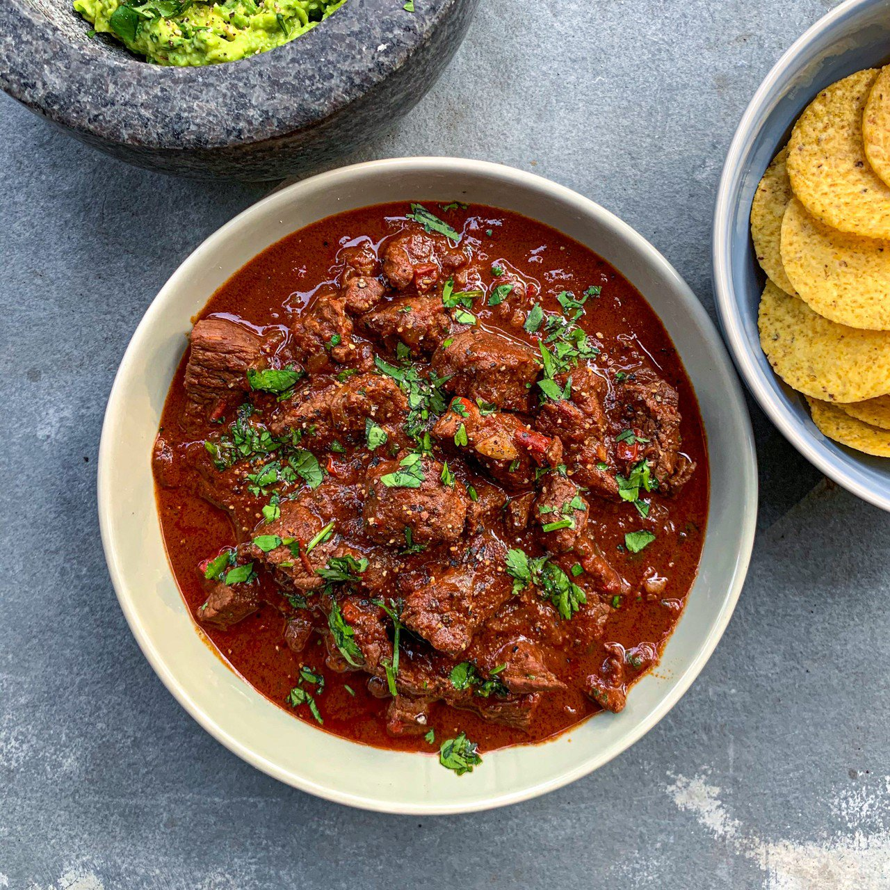

# Texan Chilli con Carne

*The Texas original. Cubed chuck steak (no mince), no beans, no tomatoes — slow-cooked in a deep red sauce built from rehydrated dried chillies, cumin, oregano and beef stock. The state dish, in its purest form: meat, chilli, and time.*

**Serves:** 6-8

**Prep Time:** 30 minutes (plus 20 minutes soaking the chillies)

**Cook Time:** 3 hours

## Overview
The Texan position on chilli is firm: cubed chuck steak (never ground), no beans, no tomato. The flavour comes from the chillies themselves. Dried whole chillies — ancho for sweetness and body, guajillo for fruitiness, chipotle for smoke — are toasted briefly, soaked in hot stock, then blitzed into a deep red paste. Beef chuck is seared in batches, simmered slow with the paste, ground cumin, dried oregano (Mexican if you can find it), garlic and stock. Cooked for three hours until the beef falls apart on the spoon. Finished with masa harina to thicken slightly, and lime juice to lift. Served with simple sides: cornbread, sour cream, pickled jalapeños, raw onion. Beans on the side if you must, never in the pot.

## Ingredients

### The chilli paste
- 4 dried ancho chillies (stems and seeds removed)
- 4 dried guajillo chillies (stems and seeds removed)
- 2 dried chipotle chillies (or 2 chipotle in adobo, see notes)
- 750 ml beef stock (hot)

### The chilli
- 1.5 kg beef chuck steak (cut into 2-3 cm cubes)
- 3 tablespoons sunflower oil
- 2 large onions (chopped)
- 6 garlic cloves (crushed)
- 2 tablespoons ground cumin
- 1 tablespoon dried oregano (Mexican if possible)
- 1 tablespoon smoked paprika
- 2 tablespoons tomato purée (a small amount — strictly speaking non-traditional, but it builds the colour)
- 1 cinnamon stick
- 2 bay leaves
- 750 ml beef stock (additional, to top up)
- 2 tablespoons masa harina (corn flour for tortillas)
- 1 lime (juiced)
- Fine sea salt and black pepper

### To serve
- Cornbread or warm flour tortillas
- Sour cream
- Grated sharp cheddar
- Pickled jalapeños
- Finely chopped raw white onion
- Coriander leaves
- Lime wedges

## Method

### Stage 1 - Toast and rehydrate the chillies
1. Heat a dry heavy frying pan over a medium heat. Toast the dried ancho, guajillo and chipotle chillies for 30 seconds per side — until they smell fragrant and have darkened slightly. Don't let them go past dark brown to black; charred chillies turn the sauce bitter.
2. Tear the toasted chillies into rough pieces and place in a heatproof bowl. Pour over the 750 ml hot beef stock. Cover and leave to soak for 20 minutes, until the chillies are soft and the stock has stained deep red.

### Stage 2 - Blitz the paste
1. Tip the chillies and their soaking stock into a high-powered blender or food processor. Blitz to a smooth, glossy paste — 1-2 minutes. Scrape down the sides if needed.
2. For the smoothest result, push the paste through a fine sieve into a bowl with the back of a spoon. The seeds and tough skin fragments stay in the sieve; the silky paste passes through. Skipping this step is fine for a more rustic finish.

### Stage 3 - Sear the beef
1. Pat the beef cubes dry with kitchen paper — wet beef won't sear. Season generously with salt and pepper.
2. Heat 2 tablespoons of the oil in a large heavy ovenproof pot (Dutch oven ideal) over a high heat. When the oil shimmers, add the beef in 3-4 batches — don't crowd the pan or the meat steams instead of searing.
3. Sear each batch for 4-5 minutes, turning once or twice, until each face has a proper dark crust. Lift onto a plate as you go. The crust is where the flavour lives; rushed sears give thin-tasting chilli.

### Stage 4 - Build the base
1. Drop the heat to medium-low. Add the remaining tablespoon of oil. Tip in the onions and a pinch of salt. Cook gently for 12-15 minutes, stirring often, until the onions are deep gold and starting to caramelise at the edges.
2. Add the garlic, cumin, oregano and smoked paprika. Stir for 90 seconds — the kitchen should smell strongly of toasted spice.
3. Add the tomato purée and stir for another 2 minutes until the purée darkens to a deep brick red.

### Stage 5 - Combine and slow-cook
1. Heat the oven to 140°C fan / 160°C / 320°F (alternatively, keep on the hob at the lowest simmer).
2. Return the seared beef and its resting juices to the pot. Pour in all the chilli paste, the cinnamon stick and bay leaves. Stir to coat every cube.
3. Top up with the additional 750 ml of beef stock — the liquid should just cover the beef. Bring to a low simmer.
4. Cover with the lid (cracked slightly for some evaporation) and slide into the oven. Cook for 2 ½ to 3 hours, stirring once an hour and topping up with hot water if it looks too dry. The beef is ready when it falls apart with gentle pressure from a spoon.

### Stage 6 - Thicken and finish
1. Take the pot out. Fish out the cinnamon stick and bay leaves.
2. In a small bowl, whisk the masa harina with 4 tablespoons of hot chilli liquid until smooth. Stir back into the pot. Return to the hob over a low heat and simmer for 5 minutes — the chilli thickens noticeably as the masa cooks.
3. Stir in the lime juice. Taste: it should be deep, savoury, gently smoky, with the chilli warmth building slowly rather than punching upfront. Adjust salt; add another squeeze of lime if it feels muddy.

### Stage 7 - Serve
1. Ladle into wide warm bowls. Pass the toppings at the table — let everyone build their own with sour cream, cheese, raw onion, pickled jalapeños, coriander, lime.
2. Warm cornbread or flour tortillas on the side for mopping.

## Notes
- **No beans, no tomatoes — really**: this is the Texan canon. Beans go in a side dish (or "frijoles charros" on the side); tomatoes appear in Cincinnati chilli, in chilli with beans, and in lots of other dishes, but the dried-chilli paste is what gives proper Texan chilli its tomato-deep-red colour without any tomato. I've made one concession — 2 tablespoons of tomato purée for the colour-building stage — which purists will object to. Omit if you're strict; the chilli is still good.
- **Chipotle in adobo substitute**: hard-to-find dried chipotles can be replaced with 2 canned chipotles in adobo sauce, finely chopped, added at the blender stage with 1 tablespoon of the adobo sauce.
- **Mexican oregano vs Mediterranean**: they're different plants (Mexican: Lippia graveolens; Mediterranean: Origanum vulgare). Mexican oregano is closer to the marjoram-cumin profile of Mexican cooking. Mediterranean works in a pinch but tastes more like pizza than chilli.
- **Masa harina**: lime-treated corn flour used for tortillas. Find in the Mexican aisle (Maseca brand). Don't substitute polenta or cornmeal — the lime treatment changes the flavour.
- **The next day**: chilli is always better the next day. The flavours marry; the beef relaxes further. Make it a day ahead if you have time.

## Serving
In wide bowls, with toppings passed at the table — sour cream, grated cheddar, chopped raw onion, pickled jalapeños, coriander, lime wedges. Cornbread alongside for mopping. A cold beer (ideally Lone Star, if you're committed) or a margarita on the rocks.

## Storage
- In a covered container in the fridge for up to 4 days. Improves overnight.
- Freezes brilliantly for up to 3 months. Defrost overnight in the fridge, reheat gently over a low heat with a splash of stock if it looks tight.
