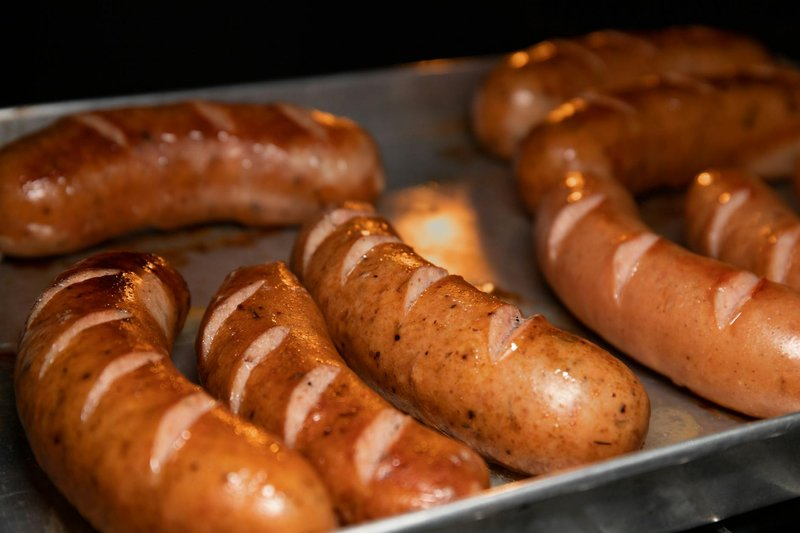

# Texas Hot-Link Sausage

*East Texas BBQ sausage: coarse beef and pork links packed with cayenne and pepper, slow-smoked over post-oak till the casings darken.*

**Serves:** 6

**Prep Time:** 15 minutes (plus 1 hour resting)

**Cook Time:** 2 hours 30 minutes

## Overview
The Texas hot link belongs to East Texas BBQ, a distinct tradition that grew out of the Black-owned grocery store and smokehouse culture of small towns like Pittsburg, Marshall and Tyler. It's a different animal from the Central Texas brisket houses an hour west: meat-market sausage built around aggressive seasoning, heavy on cayenne and black pepper, with a coarser grind than a hot dog and a noticeable beef-and-pork blend. The Pittsburg Hot Link, originating at H.A. Lawrence's in 1898 and still made in the town today, is the most famous version, but every East Texas smokehouse has its own recipe. What unites them is heat (real cayenne heat, not theatre), a deep red colour from sweet and hot paprika, a coarse texture from hand-mixed beef chuck and pork shoulder, and slow smoking over post-oak until the casings turn nearly black. The home cook without a stuffer or smoker can adapt: aggressively seasoned coarse-ground beef and pork either stuffed or formed into skinless coils, then slow-cooked on a covered grill set up for indirect heat with a small handful of wood chunks for smoke. East Texas service is purist: sliced or whole on a sheet of butcher paper with white bread (for the fat), pickles, raw onion, hot sauce and yellow mustard. No barbecue sauce; the seasoning is the seasoning.

## Ingredients

### Sausage mix (for homemade)
- 700 g beef chuck (coarsely ground)
- 500 g pork shoulder (coarsely ground)
- 200 g pork back fat (diced or coarsely ground)
- 18 g salt
- 12 g coarse ground black pepper
- 10 g cayenne pepper
- 15 g sweet paprika
- 8 g hot Hungarian paprika
- 8 g garlic powder
- 6 g onion powder
- 4 g ground mustard
- 4 g dried thyme
- 3 g ground coriander
- 2 g pink curing salt #1 (optional, for traditional cured colour and flavour)
- 100 ml ice water
- 1 ½ m natural hog casings (rinsed)

### To smoke
- Post-oak (or hickory wood chunks, 2-3 fist-sized pieces)

### To serve
- Sliced white bread
- Yellow mustard
- Dill pickle chips
- Sliced raw onion
- Hot sauce

## Method

### Stage 1 - Mix
1. Chill the ground meats and fat in the freezer 20 minutes to firm them; this keeps the mix from smearing.
1. Combine ground beef, pork, fat, salt, pepper, cayenne, both paprikas, garlic and onion powder, mustard, thyme, coriander and pink salt (if using) in a large bowl.
1. Mix thoroughly by hand 2-3 minutes until the meat becomes slightly tacky and starts to bind.
1. Add the ice water; mix briefly to incorporate.
1. Cover and rest in the fridge 1 hour to let the seasonings bloom.

### Stage 2 - Stuff (or skip for skinless coils)
1. Soak hog casings in cool water 30 minutes; flush the insides with running water.
1. Stuff the meat mix into the casings, twisting off into 15-18 cm links.
1. Prick any obvious air bubbles with a needle.
1. Refrigerate uncovered 2-4 hours to dry the surface; this is essential for a good smoke ring and bark.

### Stage 3 - Smoke
1. Set up a kettle grill or smoker for indirect heat at 110-120°C.
1. Add 2-3 post-oak chunks to the coals (or wood chips in a smoker box).
1. Place the links on the cool side; close the lid with the top vent open.
1. Smoke 2-2 ½ hours, turning once at the halfway mark, until the internal temperature reads 70-72°C and the casings are mahogany-dark and beginning to wrinkle.
1. The bark should be firm and burnished, the casing taut.

### Stage 4 - Rest and serve
1. Lift the links onto a tray; rest 10 minutes loosely covered.
1. Slice into thirds on a slight diagonal, or serve whole.
1. Plate on butcher paper or a tray with white bread, mustard, pickles, raw onion and hot sauce.

## Notes
- **Coarse grind is essential:** ask your butcher for the largest die on the grinder, or grind once through the coarse plate at home. Fine grind is a hot dog, not a hot link.
- **Black pepper goes coarse:** use cracked or coarsely ground black pepper. The bite of visible pepper flecks is part of the East Texas signature.
- **Wood matters:** post-oak is the East Texas standard. Hickory works. Avoid mesquite (too aggressive) and fruit woods (too mild).
- **Skinless option:** form the mix into 15 cm logs, wrap tightly in cling film, chill 2 hours, unwrap and smoke directly. Less authentic but no stuffer needed.
- **The bread is the sauce:** white bread is there to soak up the fat and chilli oil. Don't substitute a hearty bread; the soft white slice is the point.

## Storage
- Refrigerate up to 4 days in a sealed container.
- Freeze raw stuffed links up to 3 months, smoked links up to 2 months.
- Reheat sliced links in a covered pan with a splash of water, or wrap whole in foil and warm in a low oven.
