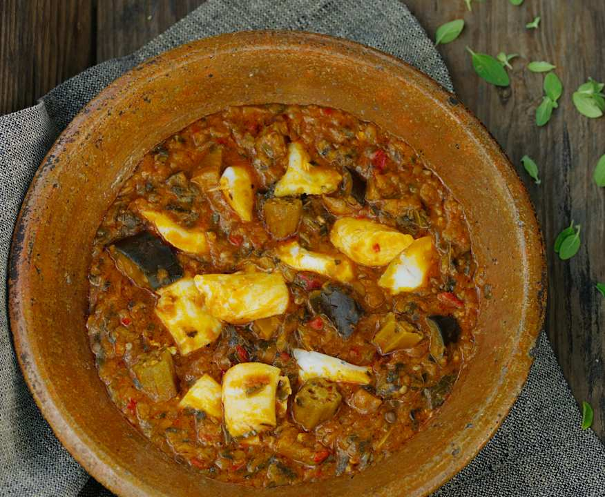

# Calulu

*Angolan dried-fish-and-greens stew, layered with okra, sweet potato leaves, palm oil and onion, simmered slow and eaten with funje.*

**Serves:** 6

**Prep Time:** 30 minutes (plus overnight soaking)

**Cook Time:** 1 hour 30 minutes

## Overview
Calulu is one of Angola's defining stews, a deep-flavoured pot of dried and fresh fish layered with greens, okra, dendê and onion. The dried fish (peixe seco, the salted-and-sun-dried Atlantic catch) is soaked overnight to wake it up, then shredded and built into the stew alongside fresh fish for body. The greens are flexible: sweet potato leaves are traditional, but spinach, kale or amaranth all work, and the okra is non-negotiable for the sauce thickness. Palm oil gives the colour and the savoury backbone, while garlic, onion and tomato pull the layers together. The pot simmers slowly, the greens collapsing into the broth, until the whole thing is glossy and rich. Eat over funje with a chilli sauce alongside. A meat version (calulu de carne) made with dried beef exists but the fish version is older and the everyday one.

## Ingredients

- 200 g dried salted fish (cod or stockfish; soaked overnight in cold water, drained, flaked)
- 600 g firm white fish fillets (corvina, grouper or hake), cut into chunks
- 1 lime, juiced
- 2 tsp salt
- 80 ml red palm oil
- 2 large onions, finely chopped
- 5 garlic cloves, crushed
- 4 ripe tomatoes, chopped
- 1 red chilli, finely chopped
- 1 aubergine, diced into 2 cm cubes
- 300 g okra, sliced into thick rounds
- 400 g sweet potato leaves (or spinach or kale), washed, roughly chopped
- 1 litre water or fish stock
- A small bunch of fresh coriander, chopped

## Method

### Stage 1 - Soak and prep
1. Soak the dried fish overnight in cold water; drain, rinse, flake the flesh away from any bones, set aside.
2. Toss the fresh fish chunks with the lime juice and 1 tsp salt; set aside.

### Stage 2 - Build the base
1. Heat the palm oil in a wide heavy pan over medium heat.
2. Add the onions; cook 8 minutes until soft.
3. Add the garlic, chilli and tomatoes; cook 8-10 minutes until the tomatoes collapse.

### Stage 3 - Aubergine and okra
1. Add the aubergine; cook 5 minutes.
2. Add the okra rounds and stir to coat in the oil.

### Stage 4 - The fish layers
1. Stir in the flaked dried fish.
2. Pour in the water or stock; bring to a simmer.
3. Cover and cook 20 minutes.

### Stage 5 - Greens and fresh fish
1. Stir in the greens in handfuls until they wilt.
2. Lay the fresh fish chunks on top, pressing them down into the sauce.
3. Cover and cook 15-20 minutes more until the fish flakes easily and the stew is glossy.
4. Taste; the dried fish brings salt, so adjust carefully.

### Stage 6 - Finish
1. Stir through most of the coriander.
2. Ladle into bowls over funje.
3. Scatter the remaining coriander.

## Notes
- **Soak the dried fish:** Skip this and the stew is fiercely salty and tough. Overnight in plenty of cold water is essential; change the water once if you can.
- **Layer the fish:** Dried fish goes in early to flavour the broth; fresh fish goes in last so it stays in flakes rather than disintegrating.
- **Okra gives the body:** No flour, no cornflour, no thickener. The okra (and the slow simmer) is what turns the broth glossy.

## Serving
- Serve hot over funje, with a small pot of jindungo chilli sauce and a wedge of lime on the side. A simple onion-and-tomato salad cuts through the richness.

## Storage
- Keeps 3 days refrigerated; the flavour deepens.
- Freezes for 2 months.
- Reheat gently; greens turn olive but the flavour holds.
