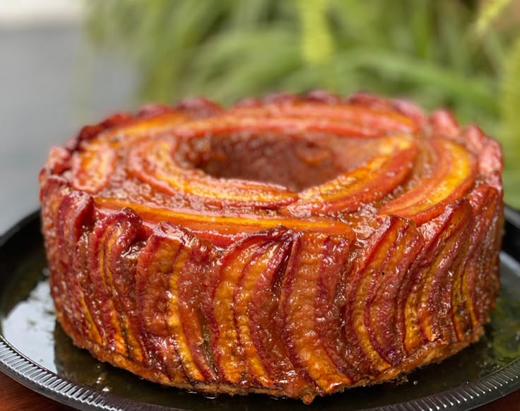

# Bolo de Banana Angolan

*Angolan banana-and-coconut cake: ripe bananas mashed into a butter-and-sugar batter with desiccated coconut and a hint of cinnamon, baked into a moist tea-time cake.*

**Serves:** 8-10

**Prep Time:** 20 minutes

**Cook Time:** 50 minutes

## Overview
Bolo de banana is the easy weekday cake of the Angolan home, a tender, slightly dense loaf that runs on ripe banana, sugar, butter and a generous handful of desiccated coconut. The banana goes in mashed to a coarse puree (lumps are wanted; a perfectly smooth puree gives a flat cake), the coconut gives the chew and the unmistakable Lusophone-Atlantic note, and a teaspoon of cinnamon ties the flavours together. The cake bakes in a loaf tin in just under an hour, comes out a deep golden brown, and is at its best the next day after the flavours settle. Eat with a glass of cold milk or strong black coffee; a thin glaze of lemon icing is optional but worth the extra five minutes.

## Ingredients

### Cake
- 4 very ripe bananas (yellow with brown spots; about 400 g peeled weight)
- 200 g caster sugar
- 150 g unsalted butter, softened
- 3 eggs (large)
- 1 tsp vanilla extract
- 250 g plain flour
- 2 tsp baking powder
- 1 tsp ground cinnamon
- A pinch of salt
- 80 g desiccated coconut (plus 1 tbsp for the top)
- 100 ml whole milk

### Optional glaze
- 100 g icing sugar
- 1-2 tbsp lemon juice

## Method

### Stage 1 - Prep
1. Heat the oven to 175°C (155°C fan).
2. Butter and line a 25 cm loaf tin or a 22 cm round cake tin.

### Stage 2 - Mash the bananas
1. Mash the peeled bananas in a wide bowl with a fork to a coarse puree (a few small lumps are fine).

### Stage 3 - Butter and sugar
1. In a large bowl, cream the butter and sugar with an electric whisk for 4-5 minutes until pale and fluffy.

### Stage 4 - Eggs and banana
1. Add the eggs one at a time, beating well after each.
2. Beat in the vanilla.
3. Stir in the mashed banana (the mixture may look slightly curdled; this is fine).

### Stage 5 - Dry ingredients
1. Sift together the flour, baking powder, cinnamon and salt.
2. Add to the wet mixture in two additions, folding gently with a spatula.
3. Fold in the desiccated coconut.
4. Stir in the milk to loosen to a soft dropping consistency.

### Stage 6 - Bake
1. Spoon into the prepared tin; level the top.
2. Scatter the extra tablespoon of coconut over the surface.
3. Bake 45-55 minutes until deep gold and a skewer comes out clean.

### Stage 7 - Cool
1. Cool in the tin for 10 minutes.
2. Turn onto a rack; cool completely.

### Stage 8 - Optional glaze
1. Whisk the icing sugar with enough lemon juice to make a thick pourable glaze.
2. Drizzle over the cooled cake; leave to set 15 minutes.

## Notes
- **Ripe bananas only:** Yellow-with-brown-spots is the right ripeness; smooth yellow gives a bland cake. The riper the bananas, the deeper the flavour.
- **Don't over-mash:** Coarse-mashed banana with a few lumps gives a moist, textured crumb; perfectly smooth puree gives a denser, flatter cake.
- **Fold in the dry ingredients:** Beating after the flour goes in builds gluten and toughens the cake. A spatula and a folding motion is right.

## Serving
- With a glass of cold milk or strong black coffee. A slice for breakfast, a slice with afternoon tea. A spoon of jam or a slice of fresh banana on top is the home flourish.

## Storage
- Keeps 4 days at room temperature in a tin.
- Freezes 2 months; slice before freezing for easy thaw.
- Better on day two when the flavours settle.
