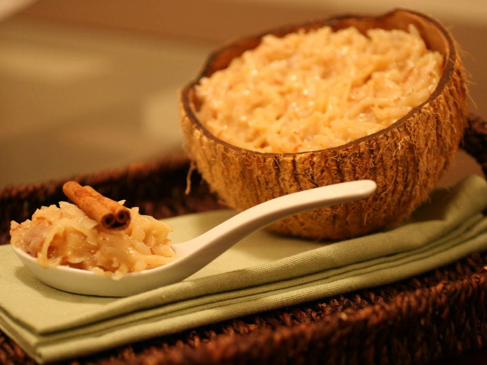

# Cocada Amarela

*Angolan yellow coconut pudding: grated coconut and sugar cooked into a thick syrup, enriched with egg yolks and cinnamon, set in a bowl.*

**Serves:** 8

**Prep Time:** 15 minutes

**Cook Time:** 40 minutes

## Overview
Cocada amarela is the great Angolan dessert and the proudest piece of the Portuguese inheritance, a deep-yellow set pudding of fresh coconut, sugar syrup and egg yolks scented with cinnamon. The name (literally "yellow cocada") points to the colour the egg yolks give it; without them you get the white coconut sweet of Brazil and Mozambique. The technique runs through three stages: sugar dissolved into a clear syrup just shy of soft-ball, fresh grated coconut cooked into that syrup until it absorbs the sweetness, and warm egg yolks tempered in slowly so they enrich the mixture without scrambling. A cinnamon stick goes in for the cook. The dessert is set in a wide bowl, dusted with ground cinnamon, and served cool with a small spoon.

## Ingredients

- 300 g caster sugar
- 200 ml water
- 1 cinnamon stick
- 300 g freshly grated coconut (frozen grated coconut works; dried desiccated coconut is the last-resort substitute and needs an extra 100 ml water)
- 8 egg yolks (large)
- A pinch of salt
- 1 tsp ground cinnamon (to dust)

## Method

### Stage 1 - Syrup
1. Combine the sugar, water and cinnamon stick in a heavy saucepan.
2. Heat gently over medium-low, stirring until the sugar dissolves.
3. Bring to a gentle simmer; cook 5-6 minutes until the syrup runs in a slow thread from a spoon (about 110°C if you use a thermometer).

### Stage 2 - Coconut
1. Stir in the grated coconut.
2. Cook over medium-low heat, stirring constantly with a wooden spoon, 10-12 minutes until the coconut absorbs the syrup and the mixture pulls away from the sides of the pan.
3. Take off the heat; remove the cinnamon stick.
4. Let the mixture cool for 5 minutes (too hot will scramble the yolks).

### Stage 3 - Temper the yolks
1. Whisk the egg yolks with the pinch of salt in a small bowl.
2. Add a ladle of the warm coconut mixture to the yolks, whisking constantly to temper.
3. Pour the tempered yolks back into the pan.

### Stage 4 - Cook through
1. Return the pan to very low heat.
2. Stir constantly for 4-5 minutes until the mixture thickens to a glossy pudding and a streak from the spoon holds for a few seconds on the surface.
3. Do not let it boil; the yolks will curdle.

### Stage 5 - Set
1. Pour into a wide serving bowl or individual ramekins.
2. Smooth the surface.
3. Cool to room temperature, then refrigerate at least 3 hours.

### Stage 6 - Serve
1. Dust with the ground cinnamon just before serving.
2. Spoon out at the table.

## Notes
- **Temper the yolks slowly:** Dropping cold yolks into a hot pan scrambles them and turns the dessert grainy. A ladle of warm mixture into the yolks first is the standard custard trick.
- **Don't boil after the yolks go in:** A bare simmer (not a boil) and constant stirring is the rule for the last 5 minutes.
- **Fresh coconut is better:** Frozen grated coconut is the everyday substitute. Desiccated coconut works at a push but the texture is drier; add an extra splash of water.

## Serving
- A small spoon, after a heavy meal. Often plated with a sprig of mint or a curl of orange peel. A small glass of port alongside is the Portuguese-Angolan flourish.

## Storage
- Keeps 4 days refrigerated, covered tight.
- The texture firms further as it sits.
- Doesn't freeze; the egg yolks separate on thaw.
