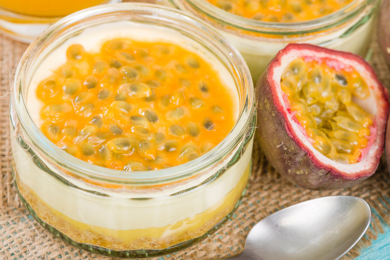

# Mousse de Maracujá

*Angolan passion-fruit mousse: condensed milk, fresh passion-fruit pulp and double cream whipped into a light tropical mousse, set cold.*

**Serves:** 6

**Prep Time:** 15 minutes (plus 4 hours setting)

**Cook Time:** None

## Overview
Mousse de maracujá is the easy, light Lusophone-Atlantic dessert shared between Angola, Brazil and Portugal, a three-ingredient mousse that comes together in fifteen minutes and sets in the fridge. The flavour hangs on the passion fruit: ripe fruit with wrinkled deep-purple skin, the pulp sharp and aromatic, balanced against the heavy sweetness of condensed milk and softened by whipped double cream. The trick is the texture, light but holding shape, which comes from folding (never stirring) whipped cream into the passion-fruit-and-condensed-milk base. A spoonful of fresh pulp scattered on top before serving gives a final layer of fragrance and visible seeds.

## Ingredients

- 8 ripe passion fruits (you need 200 ml of pulp; the seeds stay in for texture and look)
- 1 tin (397 g) sweetened condensed milk
- 300 ml double cream
- 1 tsp vanilla extract

### For the top
- 2 extra ripe passion fruits (for spooning over before serving)

## Method

### Stage 1 - Passion-fruit pulp
1. Halve the passion fruits; scoop the pulp (seeds and all) into a measuring jug; you want 200 ml.
2. Set aside 2 tbsp of pulp for the topping.

### Stage 2 - The base
1. Pour the remaining passion-fruit pulp into a wide bowl with the condensed milk.
2. Stir to combine; the mixture loosens as the acid of the passion fruit meets the milk.

### Stage 3 - Whip the cream
1. In a separate bowl, whip the double cream with the vanilla to soft peaks.
2. Do not over-whip; firm peaks will give a stiff mousse.

### Stage 4 - Fold
1. Add a third of the whipped cream to the passion-fruit base; stir to lighten.
2. Tip in the remaining cream; fold gently with a rubber spatula, lifting from the bottom and turning, until just combined.
3. Stop folding while a few cream streaks are still visible; over-folding deflates the mousse.

### Stage 5 - Set
1. Spoon into 6 glasses or ramekins.
2. Cover with cling film; refrigerate at least 4 hours, ideally overnight.

### Stage 6 - Serve
1. Spoon a teaspoon of fresh passion-fruit pulp over each portion just before serving.

## Notes
- **Ripe passion fruit only:** Smooth-skinned passion fruits are underripe and sharp. The wrinkled, deep-purple, slightly shrunken ones are at their best.
- **Fold, do not stir:** The lightness comes from keeping the air in the whipped cream. A rubber spatula and a slow turning motion is right; a whisk or vigorous stirring deflates it.
- **Seeds in:** The seeds are the texture and the look. Some cooks sieve out half for a smoother mousse and scatter the rest on top; both ways are common.

## Serving
- After a heavy meal. A small biscuit or a piece of shortbread on the side. A small glass of cold passion-fruit juice alongside.

## Storage
- Keeps 3 days refrigerated, covered.
- The texture softens slightly after day one but the flavour holds.
- Doesn't freeze; the cream separates on thaw.
