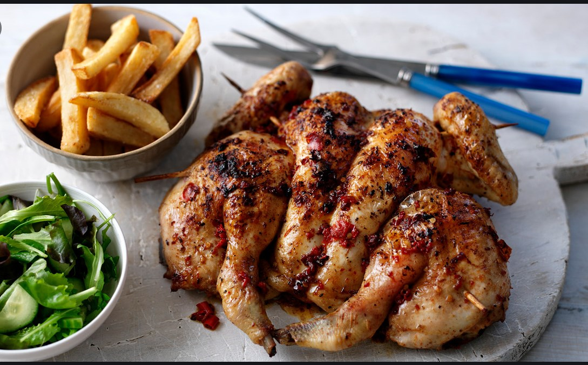

# Frango Piri-Piri Angolano (Angolan Piri-Piri Chicken)

*Angola's gift to the world: spatchcocked chicken marinated in crushed piri-piri chillies, garlic, lemon, paprika and olive oil, then charcoal-grilled till the skin lacquers black-red and the flesh stays juicy; the original of every piri-piri menu that followed.*

**Serves:** 4

**Prep Time:** 20 minutes (plus 4 hours marinade)

**Cook Time:** 35 minutes

## Overview
Frango piri-piri is the Angolan dish that travelled. Portuguese colonists in 15th-century Angola met the small fiery African bird's-eye chilli (which Angolans called "pili-pili", from the Bantu "pilipili") and began grilling marinated chicken over open coals. The dish became a Lusophone staple from Luanda to Lisbon, then to Mozambique, South Africa, and (via the Mozambican-Portuguese diaspora) onto British high streets through Nando's. The Angolan original is brighter and more lemon-forward than the South-African version: bird's-eye chillies are crushed with garlic, paprika, lemon and oil into a paste; a spatchcocked chicken is rubbed inside and out and rested four hours minimum; then charcoal-grilled flat, basted with extra marinade, till the skin lacquers and the juices run clear. Serve with chips, rice, and a salad of tomato-and-onion.

## Ingredients

### Piri-piri marinade
- 6-10 fresh bird's-eye chillies (piri-piri / pili-pili; remove seeds for milder heat, leave for fierce)
- 8 cloves garlic (peeled)
- 1 tablespoon sweet paprika
- 1/2 tablespoon hot paprika (optional)
- 1 teaspoon dried oregano
- 1 teaspoon fine sea salt
- 1 teaspoon coarsely cracked black pepper
- 2 tablespoons red wine vinegar
- Juice of 2 lemons
- 120 ml olive oil
- 1 small bunch fresh coriander (chopped, optional)

### Chicken
- 1 whole chicken (about 1.5 kg)

### To serve
- A piri-piri sauce dish for the table (extra marinade reserved)
- Chips (batatas fritas) or rice
- A salad of tomato, onion, parsley, lime
- A glass of chilled vinho verde or Cuca beer

## Method

### Stage 1 - Make the piri-piri marinade
1. Stem the chillies; halve lengthwise. (Wear gloves; piri-piri burns the skin and any cut.)
2. In a food processor or mortar, combine the chillies, garlic, paprika, hot paprika, oregano, salt and pepper.
3. Pulse (or pound) into a coarse paste.
4. Add the vinegar, lemon juice and olive oil; blend till smooth.
5. Stir in the chopped coriander if using.
6. Reserve 4 tablespoons of the marinade for basting and serving.

### Stage 2 - Spatchcock the chicken
1. Sit the chicken breast-down on a chopping board.
2. With kitchen scissors, cut along both sides of the backbone to remove it (save for stock).
3. Flip the bird breast-up; press down firmly with both hands to flatten.
4. Make 2-3 deep slashes across each thigh and breast (lets the marinade penetrate).

### Stage 3 - Marinate
1. Place the chicken in a large dish.
2. Pour the marinade over (minus the reserved 4 tablespoons); rub into every cut and the cavity.
3. Cover; refrigerate at least 4 hours (overnight is better).

### Stage 4 - Bring to room temperature
1. Lift the chicken out of the fridge 45 minutes before grilling.
2. Drain off and discard the used marinade (any marinade that touched raw chicken must not be reused on cooked food).

### Stage 5 - Grill
1. Heat a charcoal barbecue to medium-high (the coals should glow white-grey).
2. Sit the chicken bone-side down on the grill bars.
3. Grill 20 minutes with the lid closed (or covered with a sheet of foil), basting occasionally with the reserved marinade.
4. Flip the chicken skin-side down; grill another 12-15 minutes till the skin is deep mahogany-red and a thermometer in the thigh reads 75°C.
5. (Oven method: 220°C fan, skin-side up on a rack over a tray, 35-40 minutes, then 4 minutes under the grill to char the skin.)

### Stage 6 - Rest and carve
1. Lift the chicken onto a board; loosely tent with foil; rest 10 minutes.
2. Carve into 4 pieces (2 legs, 2 breasts) or into 8 (split legs, halve breasts).
3. Pour any resting juices over the carved chicken.

### Stage 7 - Serve
1. Spoon a little fresh reserved marinade over the chicken.
2. Serve with chips or rice, the tomato salad, and lime wedges.
3. Put the extra piri-piri sauce on the table for those who want more heat.

## Notes
- **Bird's-eye chilli is the dish:** the small fiery African chilli is what makes it piri-piri. Substitutes: Thai bird's-eye, scotch bonnet (use half), serrano (use double for similar heat).
- **Wear gloves when handling the chillies:** the oils burn for hours and ruin your eyes if you touch your face.
- **Don't skip the spatchcock:** the flat chicken cooks evenly in 35 minutes; a whole bird needs 75+ minutes and the breast dries while you wait for the thigh.
- **Reserve marinade BEFORE it touches raw chicken:** the table sauce is the reserved portion, not the leftover used marinade.
- **Charcoal not gas:** the smoke is the dish.

## Variations
- **Mild piri-piri:** seed and devein the chillies; reduce to 4 chillies.
- **Extra-fierce piri-piri:** double the chillies; add 1 tablespoon scotch bonnet sauce.
- **Angolan piri-piri prawns:** swap the chicken for 600 g large prawns; marinate 1 hour only; grill 4 minutes a side.
- **Piri-piri tofu:** for vegetarian, press a 400 g block of firm tofu 30 minutes; marinate 2 hours; grill in slabs.
- **With piri-piri sauce shortcut:** in a hurry, buy a quality piri-piri sauce, slather, and grill (Angolan home cooks won't approve, but it works).

## Serving
- At a Luanda churrasco (Angolan barbecue, the natural setting) · with chips, lemon and tomato salad · with Angolan funje on the side · on a Lisbon Sunday with the Lusophone diaspora · at a backyard summer grill in the Algarve · with a chilled Sagres or Cuca beer.

## Storage
- Refrigerates 3 days in a sealed container.
- Reheat in the oven at 160°C for 10 minutes; the microwave dries the chicken.
- Freezes well (cooked) for 2 months.
- The piri-piri marinade keeps 1 month in a sterilised jar in the fridge; use as a table sauce for other dishes.
- Don't store with the lemon-juice marinade longer than 36 hours (the acid starts to denature the chicken).
