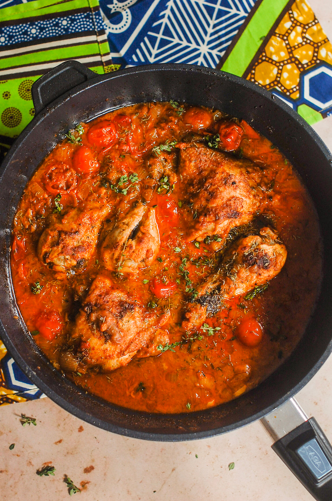

# Muamba de Galinha

*Angola's national dish: chicken slow-cooked in red palm oil with okra, garlic, onion and chilli, finished with a squeeze of lime and served over funje.*

**Serves:** 6

**Prep Time:** 20 minutes

**Cook Time:** 1 hour 15 minutes

## Overview
Muamba de galinha is the national dish of Angola and the centrepiece of every family Sunday lunch from Luanda to Huambo. The recipe runs on dendê (the deep-orange unrefined red palm oil pressed from the West African oil palm) which colours the stew a brick red and gives it a savoury, slightly earthy backbone unlike any other fat. Bone-in chicken pieces are browned, then simmered with onion, garlic, tomato, chilli and palm oil until the meat is falling tender. Okra goes in for the final twenty minutes, lending the sauce a glossy thickness, and the pot is finished with a squeeze of lime and a scatter of coriander. The stew is always eaten with funje (the stiff cassava porridge) which you pinch off in pieces and use to scoop sauce. Eat hot, with extra chilli sauce alongside.

## Ingredients

- 1.5 kg bone-in chicken pieces (thighs, drumsticks, breast on the bone)
- 1 lime, juiced (plus 1 lime in wedges to serve)
- 2 tsp salt
- 1 tsp black pepper
- 4 garlic cloves, crushed
- 100 ml red palm oil (dendê; vegetable oil with a tbsp of paprika is the substitute)
- 2 large onions, finely chopped
- 4 ripe tomatoes, chopped (or 1 tin chopped tomatoes)
- 1 red chilli, finely chopped (Scotch bonnet for heat; deseed for milder)
- 1 red pepper, sliced
- 500 ml chicken stock or water
- 300 g okra, topped and tailed, cut into thick rounds
- A small bunch of fresh coriander, chopped

## Method

### Stage 1 - Marinate the chicken
1. Toss the chicken pieces with the lime juice, salt, pepper and half the crushed garlic.
2. Leave to sit for 20 minutes while you prep the rest.

### Stage 2 - Build the base
1. Heat the palm oil in a wide heavy pan over medium heat until shimmering.
2. Add the onions; cook 8 minutes until soft and just colouring.
3. Add the remaining garlic and the chopped chilli; cook 1 minute.
4. Add the tomatoes and red pepper; cook 8-10 minutes until the tomatoes break down into a thick sauce.

### Stage 3 - Brown the chicken
1. Push the sauce to one side, add the chicken pieces in batches and brown on all sides (6-8 minutes per batch).
2. Return all the chicken to the pan and stir to coat in the sauce.

### Stage 4 - Simmer
1. Pour in the stock or water; it should just cover the chicken.
2. Bring to a gentle simmer; cover and cook 40 minutes, stirring once or twice.

### Stage 5 - Finish with okra
1. Stir in the okra rounds; cover and cook 15-20 minutes more until the okra is tender and the sauce has thickened to a glossy coat.
2. Taste and adjust salt.
3. Stir through most of the coriander.

### Stage 6 - Serve
1. Ladle into bowls over funje or rice.
2. Scatter the remaining coriander; serve with lime wedges and chilli sauce.

## Notes
- **Red palm oil is the dish:** Refined neutral oil makes a chicken stew, not muamba. The unrefined red dendê gives the brick colour, the savoury backbone and the authentic flavour. African and Brazilian shops stock it.
- **Okra at the end:** Adding okra at the start turns it slimy and grey. Twenty minutes is enough to cook through and thicken the sauce without breaking down.
- **Bone-in chicken:** Boneless breast goes dry in this stew. Thighs and drumsticks on the bone hold up to the long simmer and give the sauce body.

## Serving
- Always with funje (cassava porridge) or white rice. A small bowl of jindungo (Angolan chilli sauce) on the side, lime wedges, and a fresh tomato-and-onion salad for cutting through the richness.

## Storage
- Keeps 3 days refrigerated; the flavour deepens overnight.
- Freezes well for 2 months.
- Reheat gently with a splash of water to loosen.
