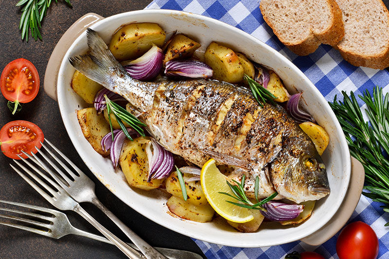

# Mufete

*Angolan grilled whole fish plated with palm-oil beans, boiled sweet potato, fried plantain and a sharp onion salad; the Luanda Sunday plate.*

**Serves:** 4

**Prep Time:** 25 minutes (plus overnight bean soaking)

**Cook Time:** 1 hour 15 minutes

## Overview
Mufete is the great Sunday plate of Luanda, an open-air seafood spread served along the Mussulo bay and at every coastal restaurant from Cabo Ledo to the Ilha. The centrepiece is a whole grilled fish (corvina, grouper or red snapper) cooked over charcoal until the skin crisps and the flesh stays juicy, but the plate is the dish: a generous spoon of feijão de óleo de palma (red kidney beans stewed in dendê with onion and garlic), boiled sweet potato, slices of fried sweet plantain (banana frita), boiled cassava, and a fierce raw onion salad sharpened with lime and chilli. Each element gives a different texture and a different temperature, and the combination is the recognisable Angolan coastal lunch. The sequence to eat in is yours; most people start with the fish and build forkfuls with the beans and salad.

## Ingredients

### Beans (feijão de óleo de palma)
- 300 g dried red kidney beans, soaked overnight, drained
- 1 onion, finely chopped
- 4 garlic cloves, crushed
- 60 ml red palm oil
- 1 bay leaf
- 1 tsp salt
- A pinch of black pepper

### Fish
- 2 whole sea bass, snapper or grouper (about 600 g each, scaled and gutted)
- 2 lemons, juiced (plus extra wedges to serve)
- 4 garlic cloves, crushed
- 2 tsp salt
- 1 tsp black pepper
- 3 tbsp olive oil

### Plate
- 4 medium sweet potatoes, peeled and cut into wedges
- 4 ripe sweet plantains (the yellow-black ones), peeled, sliced on the diagonal
- 4 tbsp vegetable oil (for frying)

### Onion salad
- 2 red onions, sliced very thinly
- 2 ripe tomatoes, sliced
- 1 lime, juiced
- 1 red chilli, sliced
- 2 tbsp olive oil
- A pinch of salt

## Method

### Stage 1 - Beans
1. Drain the soaked beans; cover with fresh water in a heavy pan.
2. Bring to a boil, skim, lower to a simmer; cook 45-60 minutes until tender.
3. In a second pan, heat the palm oil over medium heat; cook the onion 8 minutes until soft.
4. Add the garlic, bay and a ladleful of bean cooking liquid; simmer 5 minutes.
5. Stir in the drained beans, salt and pepper; simmer 10 minutes more until the beans are coated in glossy red sauce.

### Stage 2 - Marinate the fish
1. Score the fish twice on each side with a sharp knife.
2. Rub with the lemon juice, garlic, salt, pepper and olive oil; push some marinade into the cavity and the slashes.
3. Leave to sit for 20 minutes.

### Stage 3 - Sweet potato
1. Boil the sweet potato wedges in salted water 12-15 minutes until tender; drain and keep warm.

### Stage 4 - Plantain
1. Heat the vegetable oil in a wide pan over medium heat.
2. Fry the plantain slices 2-3 minutes per side until deep gold and caramelised at the edges.
3. Drain on kitchen paper.

### Stage 5 - Salad
1. Toss the red onions, tomatoes, lime juice, chilli, olive oil and salt in a bowl; leave to sit 10 minutes.

### Stage 6 - Grill the fish
1. Heat a grill, griddle or charcoal grill to high.
2. Grill the fish 6-8 minutes per side, until the skin is charred and crisp and the flesh flakes easily at the thickest point.

### Stage 7 - Plate
1. Set a fish on each plate (or two plates between four).
2. Spoon a generous mound of beans alongside, then sweet potato, then fried plantain.
3. Pile the onion salad in one corner.
4. Serve with lime wedges and a small pot of jindungo on the side.

## Notes
- **The plate is the dish:** Mufete is not just grilled fish; it is the deliberate combination of fish, palm-oil beans, sweet potato, plantain and sharp salad. Each element gives a different texture and temperature.
- **Score the fish:** Two diagonal slashes on each side help the heat penetrate and the marinade get into the flesh, and stop the skin curling on the grill.
- **Palm oil for the beans, olive oil for the fish:** The beans get the colour and savour from dendê. The fish gets the lift from lemon and olive oil. Don't swap them.

## Serving
- The traditional Luanda Sunday lunch, eaten outdoors. Cold Cuca beer alongside; lime wedges, jindungo chilli sauce and extra fried plantain on the table.

## Storage
- Best fresh.
- The beans keep 3 days refrigerated and freeze well.
- Grilled fish is poor reheated; eat the same day.
- Fried plantain goes soft within a few hours.
