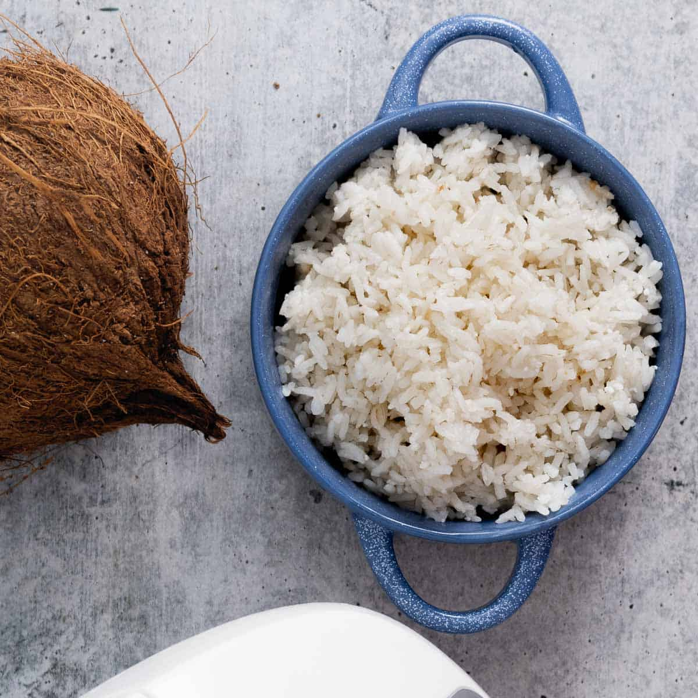

# Arroz de Coco Angolano (Angolan Coconut Rice)

*Angola's gently sweet rice side: long-grain rice toasted in palm oil with onion and garlic, then steamed in coconut milk till each grain holds its shape; the white-and-cream foil to muamba's red palm-oil stew.*

**Serves:** 4-6 as a side

**Prep Time:** 10 minutes

**Cook Time:** 25 minutes

## Overview
Arroz de coco angolano is the Angolan everyday rice side, the white-and-cream answer to the deep-red palm-oil stews that anchor the Luanda table. The construction folds two Lusophone-African staples into one pot: long-grain rice (Brazilian-Portuguese inheritance) and coconut milk (Bantu coastal tradition). Onion and garlic are sweated in a tablespoon of red palm oil (dendê) till translucent; the rice is added and toasted briefly till the grains turn glassy; coconut milk and water cover it; salt, a bay leaf and a clove or two perfume the pot. The lid stays on for the 18-minute steam, and the rice rests another 10 minutes off the heat before being fluffed. The finished plate is white-cream-coloured, lightly sweet, gently coconut-perfumed, and the perfect background to a red muamba or a piri-piri grilled chicken.

## Ingredients

### For 4-6 servings
- 400 g long-grain white rice (basmati or any long-grain)
- 1 tablespoon red palm oil (dendê) OR vegetable oil
- 1 medium onion (finely diced)
- 3 cloves garlic (finely chopped)
- 1 bay leaf
- 2 whole cloves
- 1 teaspoon fine sea salt
- 400 ml coconut milk (one tin)
- 400 ml water
- 1 small handful fresh coriander (finely chopped, to finish)
- 1 lime (cut into wedges, to serve)

### Optional adds
- 50 g desiccated coconut (lightly toasted)
- 1 green chilli (split, left whole)

## Method

### Stage 1 - Rinse the rice
1. Tip the rice into a fine sieve.
2. Rinse under cold running water 1-2 minutes till the water runs clear.
3. Drain thoroughly.

### Stage 2 - Aromatics
1. Heat the palm oil in a heavy lidded saucepan over medium heat.
2. Add the diced onion and a pinch of salt; sweat 5 minutes till soft and translucent (don't brown; the dish stays pale).
3. Add the chopped garlic, bay leaf and cloves; cook 30 seconds till fragrant.

### Stage 3 - Toast the rice
1. Tip the drained rice into the pan.
2. Stir constantly for 2 minutes till the grains are coated and start to look glassy at the edges.

### Stage 4 - Liquid
1. Pour in the coconut milk and the water.
2. Stir to combine; add the salt.
3. If using, drop in the whole split green chilli (perfumes without dominating).
4. Bring to a rolling boil over high heat.

### Stage 5 - Steam
1. Drop the heat to its lowest setting.
2. Clamp the lid on tightly (a tea towel between pot and lid traps extra steam).
3. Cook 18 minutes undisturbed.

### Stage 6 - Rest and fluff
1. Take the pot off the heat.
2. Leave covered another 10 minutes; the rice finishes steaming.
3. Lift the lid; fish out the bay leaf, cloves and chilli.
4. Fluff with a fork (don't stir vigorously, which breaks the grains).

### Stage 7 - Serve
1. Tip into a warm serving bowl.
2. Sprinkle the chopped coriander over.
3. Scatter the toasted coconut shavings over, if using.
4. Serve with lime wedges on the side.

## Notes
- **Long-grain rice, rinsed:** the rinse removes surface starch; without it the rice goes gluey.
- **Don't brown the onion:** arroz de coco is meant to be pale and gently sweet; browned onion gives it a savoury cast it shouldn't have.
- **Real coconut milk:** the canned tin variety with at least 60% coconut extract. The dilute "light" versions don't give enough body.
- **Resting 10 minutes after the heat is off:** non-negotiable; this is when the rice finishes by residual steam and the grains separate.
- **Palm oil colours the dish faintly orange:** that's correct; the dendê pigment gives the rice a buttery hue. Vegetable oil keeps it pure white.

## Variations
**With cinnamon:** add 1 small cinnamon stick with the bay and cloves; the Cape-Verdean-Angolan version.
**With ginger:** add 2 cm grated fresh ginger with the garlic.
**With raisins:** stir 50 g soaked raisins through before the rest stage; the wedding-table version.
**Vegan-friendly already:** the dish is plant-based by default.
**Arroz de coco com peixe:** lay 4 fillets of white fish on top of the rice for the last 8 minutes; one-pot dinner.

## Serving
Beside muamba de galinha (the traditional partner) · with frango piri-piri (the white-rice cooling foil to the chilli heat) · at an Angolan Sunday lunch · with calulu stew · for a Lusophone-African dinner alongside Mozambican prawns · with mufete grilled fish and beans.

## Storage
- Refrigerates 3 days in a sealed container.
- Reheat in a covered pan with a splash of coconut milk or water (the microwave dries it).
- Don't freeze (the rice texture suffers and the coconut fat separates).
- Best eaten warm; cold coconut rice loses the perfume.
