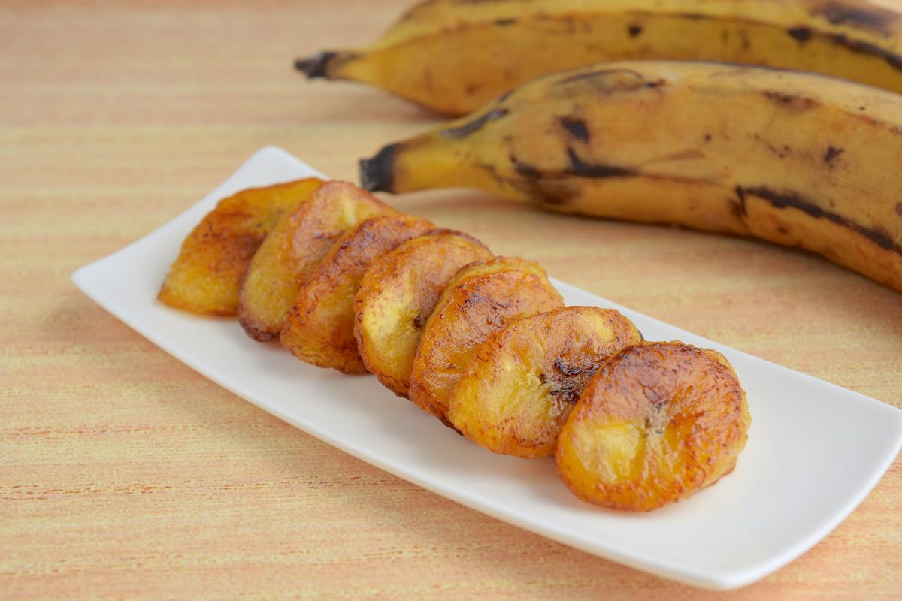

# Banana Frita

*Angolan fried sweet plantain: ripe yellow-black plantains sliced thick and pan-fried in vegetable oil until caramelised and edge-crisp.*

**Serves:** 4 (as a side)

**Prep Time:** 5 minutes

**Cook Time:** 10 minutes

## Overview
Banana frita is the everyday sweet side of the Angolan plate, a pile of caramelised plantain slices that goes with grilled fish, stewed chicken and palm-oil beans. The cook stands or falls on the ripeness of the plantain: yellow-black-skinned ones are right, the flesh soft and yellow, with the natural sugar high enough to caramelise in the pan. Green plantain stays starchy and gives a fried-banana that doesn't taste sweet; an underripe plantain just won't colour. The slices go in hot oil on the diagonal, fry two or three minutes per side until the edges go deep gold, and come out crisp on the edge and soft in the middle. A pinch of salt is the only seasoning.

## Ingredients

- 4 very ripe sweet plantains (yellow-black skin, soft to the squeeze)
- 4 tbsp vegetable oil (sunflower or groundnut)
- A pinch of salt

## Method

### Stage 1 - Slice
1. Peel the plantains.
2. Slice on the diagonal into 1.5 cm thick ovals (a long diagonal gives more surface area to caramelise).

### Stage 2 - Fry
1. Heat the oil in a wide heavy pan over medium heat until shimmering.
2. Lay the plantain slices in a single layer; do not crowd the pan.
3. Fry 2-3 minutes until the underside is deep gold.
4. Turn each piece carefully; fry 2-3 minutes more until the second side is gold and the edges caramelise.

### Stage 3 - Drain
1. Lift onto kitchen paper.
2. Sprinkle with the pinch of salt.

### Stage 4 - Serve
1. Pile onto a plate; serve immediately while crisp at the edges.

## Notes
- **Yellow-black plantains only:** Green or just-yellow plantains stay starchy and don't caramelise. The black-flecked, soft-to-the-squeeze ones are right.
- **Single layer in the pan:** Crowding drops the oil temperature and the plantain steams instead of caramelising. Fry in batches if needed.
- **Salt at the end:** A pinch of salt on top brings out the sweetness; salting earlier draws moisture and stops the caramelisation.

## Serving
- Alongside grilled fish (mufete), muamba de galinha, calulu or any palm-oil stew. A wedge of lime on the side cuts the sweetness.

## Storage
- Best fresh and hot.
- Loses its crisp edge within an hour.
- Reheats poorly; fry a fresh batch.
- Don't freeze.
