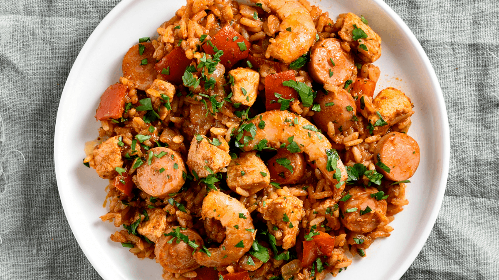

# Quiabos com Camarão

*Angolan okra simmered with prawns, onion, garlic and red palm oil; a glossy, savoury side that sits alongside funje or rice.*

**Serves:** 4 (as a side)

**Prep Time:** 15 minutes

**Cook Time:** 25 minutes

## Overview
Quiabos com camarão is one of the easy Angolan dishes to like, a pan of fresh okra, prawns, onion and garlic glossed with red palm oil and brought together with a squeeze of lime. The trick is to keep the okra firm and bright (cooked just until tender, never to a slime) and to add the prawns late so they stay sweet rather than going rubbery. Palm oil gives the colour and the savoury weight; without it the dish is fine but flat. It is usually served as a side alongside funje, white rice or grilled fish, but eaten with bread it makes a fast supper on its own.

## Ingredients

- 500 g okra, topped, tailed, sliced into thick rounds
- 400 g raw prawns, peeled (tails on or off)
- 1 lime, juiced
- 1 tsp salt
- 60 ml red palm oil (or 60 ml vegetable oil plus 1 tsp sweet paprika as a substitute)
- 1 large onion, finely chopped
- 4 garlic cloves, crushed
- 1 red chilli, finely chopped
- 2 ripe tomatoes, chopped
- 100 ml water
- A small bunch of fresh coriander, chopped

## Method

### Stage 1 - Prep the prawns
1. Toss the prawns with half the lime juice and a pinch of salt; set aside.

### Stage 2 - Build the base
1. Heat the palm oil in a wide pan over medium heat.
2. Add the onion; cook 6 minutes until soft.
3. Add the garlic and chilli; cook 1 minute.
4. Add the tomatoes; cook 5 minutes until they collapse.

### Stage 3 - Okra
1. Stir in the okra rounds and the remaining salt; cook 3 minutes, stirring occasionally.
2. Pour in the water; cover and simmer 6-8 minutes until the okra is tender but still bright green and firm.

### Stage 4 - Prawns
1. Stir in the prawns; cook 3-4 minutes until they turn pink and the sauce has thickened to a coat.
2. Squeeze the remaining lime juice over.
3. Taste; adjust salt.

### Stage 5 - Serve
1. Scatter the coriander; serve hot.

## Notes
- **Don't overcook the okra:** Six to eight minutes after the water goes in is plenty. Long simmering turns it slimy.
- **Prawns go in last:** Even another two minutes too long turns them rubbery; pull the pan off the heat the moment they are pink through.
- **Palm oil for the colour:** Vegetable oil with paprika gives a passable substitute but the real dendê flavour is unmatched.

## Serving
- Alongside funje, white rice or grilled fish. A bowl of jindungo on the side.

## Storage
- Best fresh, but keeps 2 days refrigerated.
- The okra goes softer on reheating; the flavour holds.
- Don't freeze.
