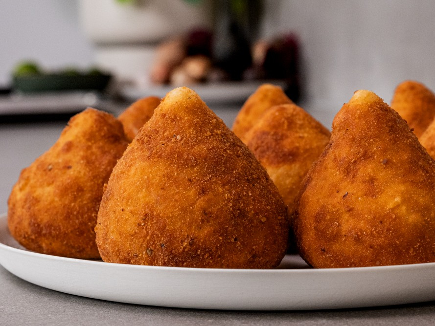

# Coxinhas Angolan

*Angolan chicken croquettes shaped like a tiny drumstick: shredded spiced chicken wrapped in a soft chicken-stock dough, breadcrumbed and deep-fried gold.*

**Serves:** Makes about 18 coxinhas

**Prep Time:** 1 hour 15 minutes

**Cook Time:** 30 minutes

## Overview
Coxinhas (the word means "little thighs") are the shared Lusophone-Atlantic snack of Brazil and Angola, sold at every street stall and bar in Luanda, Rio and Maputo. A handful of finely shredded chicken is spiced, bound in a small amount of stock-thickened tomato sauce, encased in a soft pliable dough made from flour cooked into chicken stock, shaped by hand into a teardrop with a pinched top to resemble a chicken drumstick, then breadcrumbed and deep-fried until deep gold and crisp. The Angolan version leans into more onion, garlic and a pinch of chilli in the filling, where the Brazilian one often goes for a creamy catupiry cheese centre. Eat hot, with a wedge of lime.

## Ingredients

### Chicken filling
- 500 g chicken thighs (boneless, skinless)
- 1 litre water
- 1 bay leaf
- 1 small onion, halved
- 1 tsp salt

### Sauce binder
- 2 tbsp olive oil
- 1 small onion, very finely chopped
- 3 garlic cloves, very finely chopped
- 2 tbsp tomato paste
- A pinch of chilli flakes
- 1 tsp paprika
- A small bunch of flat-leaf parsley, chopped
- A pinch of black pepper

### Dough
- 800 ml of the reserved chicken stock (from poaching the chicken)
- 2 tbsp butter
- 1 tsp salt
- 400 g plain flour, sifted

### Coating and frying
- 2 eggs, beaten
- 200 g fine dried breadcrumbs
- 1 litre vegetable oil for deep frying
- Lime wedges, to serve

## Method

### Stage 1 - Poach the chicken
1. Place the chicken thighs in a wide pan with the water, bay leaf, halved onion and salt.
2. Bring to a simmer; cook gently 25 minutes.
3. Lift out the chicken; cool slightly.
4. Strain the cooking liquid and reserve (you need 800 ml for the dough).
5. Shred the chicken finely with two forks.

### Stage 2 - The filling
1. Heat the olive oil in a wide pan over medium heat.
2. Cook the finely chopped onion 6 minutes until soft.
3. Add the garlic; cook 1 minute.
4. Stir in the tomato paste, chilli flakes and paprika; cook 1 minute.
5. Add the shredded chicken, a ladle of the reserved stock, the parsley and pepper.
6. Cook 5-6 minutes until the mixture is moist but holds shape on a spoon (not wet).
7. Spread on a plate; cool, then refrigerate.

### Stage 3 - The dough
1. Bring the 800 ml reserved stock, butter and salt to a hard boil in a heavy pan.
2. Take off the heat; dump in all the flour at once.
3. Beat hard with a wooden spoon until a smooth ball forms.
4. Return to low heat for 2 minutes to cook out the flour.
5. Tip onto an oiled board; knead with a spatula or your hands (the dough is hot) until smooth and elastic.
6. Let cool until just warm enough to handle.

### Stage 4 - Shape
1. Pinch off a piece of dough the size of a walnut.
2. Flatten in your oiled palm into a round, 8 cm across.
3. Place a heaped teaspoon of filling in the centre.
4. Bring the dough up and around the filling, pinching the top to seal into a teardrop with a pointed tip (the drumstick shape).
5. Repeat with the remaining dough and filling.

### Stage 5 - Coat
1. Dip each coxinha in beaten egg.
2. Roll in fine breadcrumbs.

### Stage 6 - Fry
1. Heat the oil to 170°C.
2. Fry in batches of 4-5, turning, 3-4 minutes total, until deep gold and crisp.
3. Drain on kitchen paper.

### Stage 7 - Serve
1. Pile on a plate while hot.
2. Serve with lime wedges and a small bowl of jindungo on the side.

## Notes
- **Shred fine, bind dry:** Long stringy shreds tear the dough as you wrap. A short fine shred binds into a paste that holds the shape. The filling should be moist but not wet.
- **Oil your hands:** The dough sticks to dry hands. Oil your palms lightly between shapes.
- **The pinch at the top:** The teardrop with a pointed tip is the recognisable shape. Pinch firmly to seal; a loose seal opens in the oil.

## Serving
- A party snack, a bar snack, a child's lunchbox treat. Lime wedges, jindungo chilli sauce, and a cold beer or fruit juice alongside.

## Storage
- Best fresh and hot.
- Uncooked breadcrumbed coxinhas freeze 2 months; fry from frozen for 6 minutes at 170°C.
- Cooked coxinhas re-crisp in a hot oven (200°C, 8-10 minutes).
