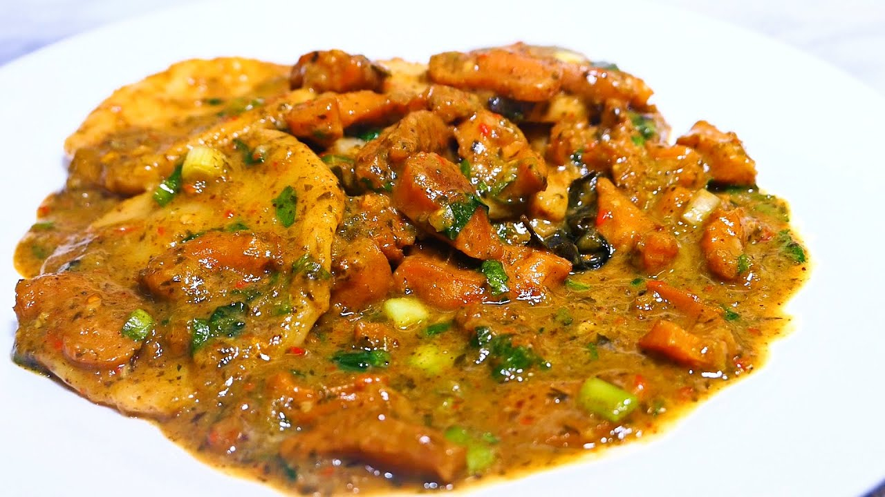

# Conch and Dumplings

*An Antiguan one-pot of tenderised conch simmered with onion, thyme and tomato, with flour dumplings dropped in at the end to thicken the gravy and soak up the broth.*

**Serves:** 4

**Prep Time:** 30 minutes

**Cook Time:** 1 hour 30 minutes

## Overview
Conch (pronounced conk) is the giant sea snail pulled from Antiguan reefs, sweet and meaty when prepared right, rubbery and unforgiving when not. The trick is the pre-pound: the conch is tenderised with a mallet before it ever touches the pan, then it goes into a slow simmer with onion, garlic, scallion, tomato and thyme until the meat softens enough to cut with the side of a fork. Halfway through, flour-and-water dumplings are dropped on top, the lid goes on, and they steam through the gravy. The result is the fisherman's plate of Long Bay and Half Moon Bay, a single pot that feeds a family without any side dish at all.

## Ingredients

For the conch:
- 800 g cleaned conch meat (or large squid as substitute)
- Juice of 2 limes
- 2 tbsp vegetable oil
- 1 large onion, sliced
- 4 garlic cloves, crushed
- 3 scallions, chopped
- 2 large tomatoes, chopped
- 2 tbsp tomato paste
- 1 tbsp fresh thyme leaves
- 1 Scotch bonnet pepper, whole
- 1 tsp salt
- 750 ml water or fish stock
- Black pepper

For the dumplings:
- 250 g plain flour
- 1 tsp salt
- 1 tsp baking powder
- 130 ml water

## Method

### Stage 1 - Pound and rinse the conch
1. Rinse the conch under cold water. Cut into 4 cm pieces.
2. Pound each piece firmly with a meat mallet until thinned to half its original thickness.
3. Toss with the lime juice and a pinch of salt; let it sit 15 minutes. Drain.

### Stage 2 - Build the pot
1. Heat the oil in a heavy pot. Soften the onion for 6 minutes.
2. Add the garlic, scallion, thyme and tomato paste. Cook 2 minutes.
3. Add the chopped tomato; cook 5 minutes until breaking down.
4. Add the conch and turn to coat. Pour in the water or stock with the whole Scotch bonnet.
5. Cover and simmer gently for 50 minutes, until the conch yields to a fork.

### Stage 3 - Make and add dumplings
1. Combine the flour, salt and baking powder. Add the water gradually, mixing to a stiff dough.
2. Tear off walnut-sized pieces, roll into 5 cm logs (the traditional Antiguan dumpling shape).
3. Drop onto the simmering conch. Cover tight and steam 20 minutes, no peeking.
4. Lift out the Scotch bonnet. Black pepper to finish.

## Notes
- **The pound:** Conch is muscle, and without the mallet it stays chewy. Aim for 4-5 mm thickness on each piece.
- **The lime soak:** A short lime soak removes any iodine smell and brightens the meat. Do not soak longer than 30 minutes or the meat starts to cook.
- **The dumplings:** Antiguan dumplings are long logs, not balls; they cook through more evenly that way.

## Variations
- **Spicy conch:** Add a teaspoon of chopped fresh Scotch bonnet to the pot in addition to the whole one.
- **Coconut conch:** Replace 250 ml of the stock with coconut milk for a richer gravy.
- **With provisions:** Add chunks of green banana and dasheen in the last 30 minutes, omit the dumplings.
- **Pressure-cooked:** 25 minutes high pressure on the conch, release, drop in dumplings, simmer 15 minutes.

## Serving
Serve in deep bowls · with hot pepper sauce · cold ginger beer or sorrel · a wedge of lime on the side.

## Storage
- Keeps 2 days refrigerated; the dumplings absorb the gravy
- Does not freeze well, the conch turns rubbery on thawing
- Reheat slowly with a splash of water to loosen the gravy
