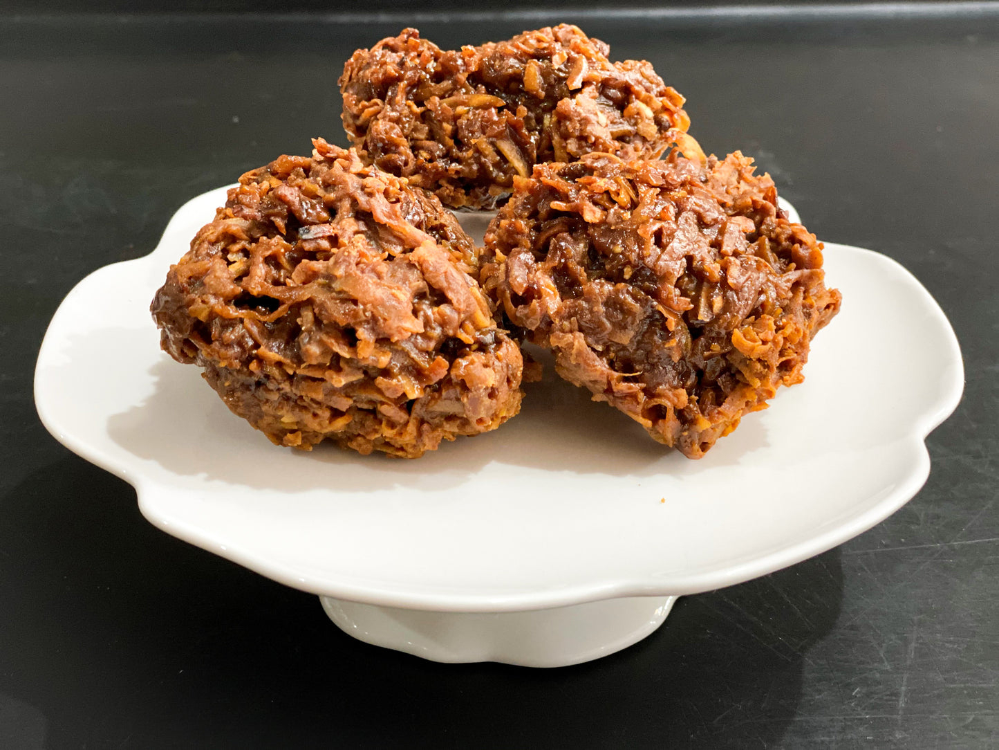

# Antiguan Sugar Cake

*Hard discs of grated coconut bound in caramelised brown sugar with a hit of fresh ginger, the school-gate sweet sold in waxed paper twists across Saint John's.*

**Serves:** 16 pieces

**Prep Time:** 10 minutes

**Cook Time:** 25 minutes

## Overview
Antiguan sugar cake is a no-bake confection: grated coconut, brown sugar, water, fresh ginger and a pinch of salt cooked in a single pot until the syrup thickens and pulls away from the side, then dropped in spoonfuls onto a tray to cool and harden. The fresh ginger is the local signature; without it the sweet is plain, with it the cake has a long lingering warmth. Antiguan grandmothers add a drop of pink food colouring on top of half the batch so the tray looks like a chessboard, but plain white is just as traditional. Eaten cold, snapped between teeth, the texture is somewhere between fudge and brittle, the sweetness softened by the chew of the coconut.

## Ingredients

- 300 g freshly grated coconut (or desiccated soaked in 60 ml warm water)
- 400 g dark brown sugar
- 200 ml water
- 30 g fresh ginger, finely grated
- 1/2 tsp salt
- 1 tsp vanilla extract
- A few drops of pink food colouring (optional)

## Method

### Stage 1 - Make the syrup
1. Combine the brown sugar, water, ginger and salt in a heavy pot over medium heat.
2. Stir until the sugar dissolves, around 4 minutes.
3. Bring to a gentle boil. Cook 6-8 minutes without stirring, until the syrup thickens and forms a thread when dropped from a spoon (soft ball stage, around 115 C).

### Stage 2 - Add the coconut
1. Stir in the grated coconut and vanilla.
2. Cook on a medium heat for 8-10 minutes, stirring constantly with a wooden spoon, until the mixture darkens and pulls away from the sides of the pot in a thick mass.

### Stage 3 - Shape and cool
1. Lay a sheet of greaseproof paper on a tray.
2. Drop heaped tablespoons of the mixture onto the paper, spaced apart.
3. If using food colouring, add a drop to the centre of half the discs and use the back of a teaspoon to swirl.
4. Cool 30 minutes until hard.
5. Lift off the paper and store in an airtight tin.

## Notes
- **The ginger:** Fresh, never powdered. Grate it fine so the heat distributes through the cake.
- **The set:** The soft ball stage is the marker. Drop a spot of syrup into cold water; if it forms a soft pliable ball, the stage is right.
- **The stir:** Once the coconut goes in, do not stop stirring. The sugar burns fast at the bottom of the pot.

## Variations
- **Tamarind sugar cake:** Add 30 g tamarind pulp to the syrup for a sharper Trinidadian-influenced version.
- **Lime sugar cake:** Add the zest of 2 limes with the coconut for a citrusy lift.
- **Spiced version:** Add 1 tsp ground cinnamon and a grate of nutmeg with the ginger.
- **White sugar version:** Use white sugar in place of brown for a paler firmer cake.

## Serving
- Eat cold as a sweet treat · with a cup of black tea or coffee · wrapped in waxed paper for lunchboxes · part of a tray of mixed Antiguan sweets at Christmas.

## Storage
- Keeps 3 weeks in an airtight tin at room temperature
- Do not refrigerate, the cake goes sticky
- Freezing is not necessary, the dry sugar preserves it
