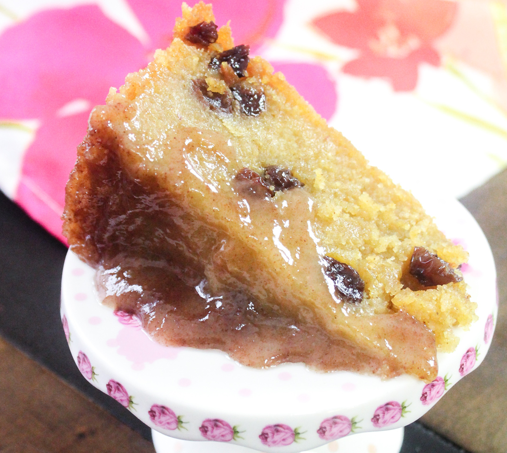

# Cornmeal Pone

*A baked Antiguan pudding of yellow cornmeal, coconut milk, raisins, nutmeg and brown sugar, dense and slightly chewy, sliced into squares and eaten warm with tea.*

**Serves:** 12 squares

**Prep Time:** 15 minutes

**Cook Time:** 1 hour 15 minutes

## Overview
Cornmeal pone is the Antiguan cousin of the Bajan cassava pone and the Jamaican cornmeal pudding, a slow-baked dense pudding built from cornmeal, coconut and spice. It bakes in a wide shallow tin until the top sets dark golden and the inside stays moist with the coconut and the soaked raisins. Each slice has the slightly grainy chew of cornmeal balanced by the creaminess of coconut milk and the warmth of nutmeg, cinnamon and vanilla. Sold by the square at school fairs and church bake sales, it is eaten warm in the afternoon with a strong cup of bush tea or coffee, or cold the next morning straight from the fridge. A pudding that grows on you.

## Ingredients

- 300 g fine yellow cornmeal
- 100 g plain flour
- 250 g dark brown sugar
- 400 ml coconut milk
- 200 ml water or evaporated milk
- 100 g desiccated coconut
- 100 g raisins
- 60 g butter, melted
- 1 tsp ground cinnamon
- 1 tsp grated nutmeg
- 1 tsp [mixed spice](../../../base-ingredients/spices/mixed-spice.md)
- 1 tsp vanilla extract
- 1/2 tsp salt
- 1 tsp baking powder

## Method

### Stage 1 - Plump the raisins
1. Soak the raisins in 4 tablespoons of warm water (or rum) for 15 minutes.

### Stage 2 - Mix the batter
1. Preheat the oven to 170 C. Butter and line a 25 x 20 cm baking tin.
2. Whisk the cornmeal, flour, baking powder, salt, cinnamon, nutmeg and mixed spice in a large bowl.
3. Stir in the brown sugar, desiccated coconut and soaked raisins.
4. In a jug whisk the coconut milk, water (or evaporated milk), melted butter and vanilla.
5. Pour the wet into the dry and mix to a thick pourable batter.

### Stage 3 - Bake
1. Tip the batter into the prepared tin and level the top.
2. Bake 1 hour to 1 hour 15 minutes, until the top sets dark golden and a skewer comes out clean (it will look dark by the end).
3. Cool 20 minutes in the tin, then lift out using the paper.
4. Slice into 12 squares.

## Notes
- **The cornmeal:** Fine yellow cornmeal is what gives pone its texture. Coarse stays gritty; polenta works as the substitute.
- **The bake:** Pone wants a long slow bake. The top should be visibly dark, almost on the edge of burnt, before the centre sets fully.
- **The cool:** Slicing too soon makes the squares fall apart. Wait the full 20 minutes.

## Variations
- **Cassava pone:** Replace half the cornmeal with grated cassava for the Bajan-leaning version.
- **Pumpkin pone:** Stir in 200 g grated pumpkin or sweet potato for extra moisture and colour.
- **Sweet rum pone:** Soak the raisins in dark rum and add 2 tbsp of the rum to the batter.
- **Mixed dried fruit:** Use 50 g raisins and 50 g currants or chopped dried mango.

## Serving
- Eat warm with a cup of strong tea · cold from the fridge for breakfast · with a scoop of coconut ice cream as a dessert · packed into lunch tins for the week.

## Storage
- Keeps 5 days in an airtight tin at room temperature
- Refrigerate after day 5, lasts 2 weeks
- Freezes 2 months wrapped tight, thaw at room temperature
